# Glimblehop Диздок демо v0.1

# Glimblehop Диздок демо на шесть уровней

**Версия 0.1. 6 октября 2026. Статус: пакет для обсуждения и производства.** Уютная сказка с юмором и свадьбой — подтверждённый тон. Имена, сюжетные детали и числовой баланс остаются рабочими. Игровая сборка ещё не реализует новый сценарий; этот пакет определяет, что следует собрать перед релиз-кандидатом.

## Приключение

Накануне свадьбы Тиша и Лумы сорока Клоч уносит янтарную линзу общего фонаря. Тиш хочет быстро вернуть вещь и доказать, что способен справиться один. На короткой лесной тропе он находит подругу, принимает помощь добряка Бума, учится обходить занятые места и распределять шаги. Встреча с Клочем раскрывает причину кражи: тот хотел, чтобы гости нашли его одинокий чайный стол. Команда возвращает общую линзу и дарит ему небольшой фонарь. Все приходят на поляну, свет зажигается, свадьба состоялась, за столом хватает места каждому.

Путь героя показан через действия игрока: сначала вести себя, затем вести двух друзей, потом всю команду. Тиш меняет цель «успеть первым» на «дойти всем». Лума самостоятельно обследует мост и становится равным участником приключения. Бум помогает делом и задаёт конкретные вопросы; комизм рождается из его размеров и заботы.

## Основные решения версии

| Область | Решение |
|---|---|
| Формат | Короткое приключение с пошаговыми головоломками, шесть линейных уровней |
| Поле | Восемь логических клеток 0..7 и выход за ними; шесть вариантов оформления |
| Управление | Выбрать значение шага, затем конкретного героя; правила показывают допустимость заранее |
| Рост команды | L1–L2 Тиш; L3 Тиш и Лума; L4–L6 Тиш, Лума и Бум |
| Рост сложности | Шаг 1; затем выбор 1/2 для одного действия; затем два отдельных действия 1 и 2 |
| Препятствия | Жук блокирует посадку на 4; Рыж движется только на L5 и уступает команде |
| Победа | Все активные друзья вышли; выход каждого независим |
| Финал | Полноценное завершение: общий свет, свадьба и примирение с Клочем |
| Время | Первое прохождение 12–18 минут с чтением — проверяемая цель, не измеренный результат |
| Ограничение объёма | Три игровых героя, девять других образов в истории/окружении; без новых HP, способностей и экономического гринда |

## Материалы пакета

- **Геймдизайн:** правила, конфиги, баланс, точные воспроизводимые маршруты, ограничения текущего кода и критерии RC.
- **История и персонажи:** мотивация, путь героя, отношения, голоса и двенадцать подробных карточек.
- **Сценарий:** шесть игровых сцен и семь переходов S00–S06 по три кадра: всего 21 постановочный кадр.
- **Диалоги:** 138 игровых событий, из них 72 учебных,36 сюжетных,12 возврата/рестарта и 18 глобальных. Комиксные реплики оформлены отдельно в сценарии.
- **Арт:** четыре листа с полным ростом/эмоциями всех 12 персонажей, два листа шести локаций и семь листов раскадровок. Всего 13 концептуальных изображений.
- **Производство:** сохранение, локализация, интерфейс, звук, доступность, риски, зависимости и план проверки перед RC.
- **Данные:** авторские JSON уровней и диалогов плюс воспроизводимые промпты арта. JSON описывает будущее поведение и требует адаптера/ScriptableObject-импорта.

## Что уже существует и что предстоит внедрить

Текущий репозиторий DiceForge/Unity содержит восьмиклеточную лесную диораму, ядро передвижения, независимый выход в SoloTrail, выбор шагов, карту, результат и сохранение профиля. Существующая кампания L1–L6 всё ещё использует Long и встречные команды. Новый состав 1/1/2/3/3/3 и последовательность уроков пока являются спецификацией.

Первые задачи внедрения: перейти на кампанийный SoloTrail; параметризовать 1–3 именованных героя; реализовать смысл «1 или 2» для одного действия; добавить предсказуемого Рыжа; связать событийное обучение и сюжетные флаги с сохранением. Неверная попытка не должна выглядеть успешным ходом или расходовать шаг. Эти изменения перечислены подробнее в геймдизайне.

Проверены текстовая согласованность, структура JSON, составы уровней и прохождения по авторской модели. Проверка будущего поведения в Unity и плейтест должны состояться после реализации. Концепты задают внешний вид; они не являются моделями, ригами, портретными спрайтами или готовой игровой геометрией.

## Следующее обсуждение

Первым стоит просмотреть персонажей и комиксы, затем решить, насколько близки Тиш, Лума и свадебная история представлению автора игры. Можно уточнить имена, образы и реплики без изменения простой учебной основы. Баланс правится по наблюдениям игроков: цель — понятная первая попытка, интерес к друзьям и спокойный финал, а не искусственное увеличение числа ходов.

# Glimblehop — геймдизайн демо на шесть уровней

Версия 0.1 · 6 октября 2026 · авторская спецификация для обсуждения и последующего внедрения. Тон, подтверждённый пользователем: уютная сказка, юмор и свадьба. Имена и числовой баланс рабочие. **Игровой код и Unity-ассеты в этой задаче не менялись.** Таблицы ниже описывают предлагаемое демо, а не уже собранный релиз-кандидат.

Связанные материалы: [общий бриф](TEAM_BRIEF.md), [история и персонажи](02_STORY_CHARACTERS.md), [сценарий и раскадровки](03_LEVEL_SCRIPT_STORYBOARDS.md), [диалоги и обучение](04_DIALOGUE_TUTORIAL.md), [авторские данные уровней](data/levels.json). JSON не является Unity-импортом: полей `stepOfferMode`, `hazards`, `guidedMoves` и именованных героев в текущих пресетах нет.

## 1. Что игрок должен получить

Тиш выходит из дома вернуть линзу свадебного фонаря. Сначала игрок учится одному понятному действию, затем выбирает длину шага, ведёт двух друзей, принимает третьего, обходит препятствие и распределяет два действия. В конце он возвращает домой всю команду с общим светом. Лума сопровождает обучение, а Тиш перестаёт считать, что должен справиться один.

Игровое обещание: «Выбери шаг, выбери друга и найди путь, на котором никто не останется позади». Это компактная пошаговая головоломка на деревянной лесной тропе. Логических клеток восемь, визуальные локации меняются через декор, освещение и фон. Игрок видит результат выбора до подтверждения. Ошибка помогает понять правило, не причиняет вреда героям.

Демо проверяет четыре качества: понятно ли управление без внешнего объяснения; читается ли направление и выход; хочется ли сопровождать именно этих друзей; поддерживает ли короткий сюжет интерес до свадьбы. Целевое время первого прохождения — **12–18 минут вместе с чтением**, повторного — 5–8 минут. Это гипотезы для плейтеста, не измеренные показатели.

### Объём версии

| Включаем в демо | Оставляем за пределами версии 0.1 |
|---|---|
| Шесть линейных уровней, три управляемых героя, два вида препятствия, семь сюжетных переходов S00–S06 | Здоровье, оружие, боевые способности и прокачку героев |
| Один узнаваемый фонарь, сбор друзей, завершённую свадьбу | Таймер свадьбы, похищение невесты и наказание за чтение |
| Именованные портреты, понятный прогресс «Дошли X / N», рестарт и возврат на карту | Новые валюты, обязательные сундуки, магазины и экономический гринд |
| Детерминированные учебные шаги 1 и 2 | Случайный подбор сложных шагов и реролл в обучении |

Пип, Фика, Корень, Мира, Уна, Шал и Клоч присутствуют в комиксах, портретах и карточках. Они не создают дополнительных управляемых фишек. Рыж занимает тропу только на L5; после примирения он NPC у выхода L6. Статус «враг» у Жука и Рыжа означает помеху выбору клетки, а не объект насилия.

## 2. Проверенная основа проекта

Проверены исходники `MoveGenerator.cs`, `BoardPathRules.cs`, `BattleRunner.cs`, `GameState.cs`, `DiceBagRuntime.cs`, `FirstTrailPlayController.cs`, `BattleDebugController.cs`, `DioramaHud.cs`, `MatchService.cs`; сохранённые `GM_Level_01..06`, `Ruleset_Level_01..06`, `DiceBag_Level_01..06`, `Setup_Level_01..06`; `FirstTrailPlayHud.uxml` и `docs/Art/WoodlandDiorama/CAMPAIGN_ROLLOUT.md`. Проверка по исходникам не заменяет запуск будущей версии в Unity.

| Аспект | Сейчас в коде/ассетах | Предлагаемая версия |
|---|---|---|
| Кампания L1–L6 | `GameMode.Long`; 8 клеток; home=2; A=0, B=7; направления +1/−1; 2/2/2/3/3/4 фишки **на каждой стороне** | `GameMode.SoloTrail`; только герои A: 1/1/2/3/3/3 |
| Число действий | Во всех rulesets записано `actionsPerTurn=2`, но Runner не ограничивает действия этим полем | Явная семантика альтернатив на L2–4 и отдельных действий на L5–6 |
| Фактические выдачи | L1–4: **одно** значение в каждом outcome; L5–6: два значения | L1: [1]; L2–4: альтернативы [1,2] для одного действия; L5–6: оба [1,2] |
| Длины шагов | В мешках L1 есть 1/2/3, L2 — 1..4, L3–4 — 1..5; правила кампании ограничивают значения через clamp при сборке мешка | Только 1 и 2, без случайной выдачи |
| Столкновения | Проверяется только клетка назначения; занятые промежуточные клетки не мешают; друзья могут стоять вместе | Сохраняем это правило и показываем дугу прыжка |
| Выход в Long | Все свои фишки должны быть в home; overshoot имеет дополнительные ограничения | В SoloTrail герой выходит независимо при достижении/перелёте за конец |
| SoloTrail | Уже реализован в ядре: B не стартует, ход всегда A, Tick бота выключен, выход упрощён | Используем как единую основу всех шести уровней |
| Отдельная FirstTrail-сцена | Контроллер жёстко ожидает ровно двух друзей, два элемента массивов и строку «/ 2»; мешок 1/2,1/3,2/3 | Параметризуем героями/уровнем; 1–3 друга и счётчик по конфигу |
| Враги | Встречные стороны и BotEasy существуют в Long; в SoloTrail двигающегося B нет | Жук — static B-occupancy; Рыж — короткое заданное движение, без B-ходов |
| Завершение | SoloTrail timeout возвращает Winner=null; счёт B и сдача есть в обычном HUD | Победа только по выходу всех A; timeout — мягкий повтор; одно сохранение результата |

В обоих путях сборки мешков — `MatchService.BuildBagConfig` и `BattleDebugController.BuildBagConfig` — значения зажимаются диапазоном `dieMin..dieMax`. В текущих L1–L6 максимумы равны 3/4/5/5/3/4 и соответствуют мешкам. При будущих правках диапазон и мешок должны совпадать: например, метка «4» при dieMax=3 фактически даст 3. Это риск интеграции, а не обнаруженная ошибка текущего L2.

## 3. Единые правила демо

### Геометрия и победа

- Внутренние ID плит: **0..7**. Для игрока номера плит необязательны; в учебной подсказке можно показать точки пути. Выход обозначен отдельным тёплым кольцом **за плитой 7**.
- Все друзья начинают на 0. Движутся только вперёд. `target=from+step`.
- Если target<8 и клетка свободна от препятствия, герой приземляется на target. Клетки своей команды доступны, включая несколько друзей на одной плите.
- Если target>=8, герой выходит и увеличивает счётчик. Из 7 можно выйти шагом 1 **или** 2. Из 6 — шагом 2. Из 5 шагом 2 герой ещё попадает на 7.
- Каждый герой выходит независимо. Тиш может ждать у фонаря, пока Лума или Бум находятся в начале. Победа наступает только при `BorneOffA == activeHeroes.Count`.
- Нет необходимости собирать всех в двух последних клетках. `homeSize=2` оставляем для совместимости; в SoloTrail оно не ограничивает выход.
- Путь не заворачивается обратно на старт. Ядро поддерживает циклические пути в других режимах, но конфигурация A=0/+1 делает демо прямой тропой.

### Ход и расход

L1 выдаёт одну кнопку «1». L2–4 показывают **две альтернативы** «1» и «2», но над ними написано «Один шаг на ход». После одного успешного действия весь набор обновляется. Невыбранная кнопка не является потраченным действием и не переходит в следующий ход. В журнале сохраняем выбранный шаг; обе кнопки не складываем в 3.

L5–6 показывают «Два шага на ход». Значения 1 и 2 — отдельные действия, их можно использовать в любом порядке, на одного друга или на разных. Успешный ход расходует только выбранную кнопку. Например, Тиш: 0→1 шагом 1, затем 1→3 шагом 2. После обеих кнопок начинается следующий ход. Остаток не переносится.

Проверка запретного назначения, нажатие на декор, уже вышедшего друга или пустую плиту **не расходуют действие и не заканчивают ход**. Выбор другой длины бесплатен. Если выбранная длина недоступна, но другая доступна, она остаётся для выбора. Если в остатке нет ни одного допустимого хода, показать «Дальше пока не пройти. Начнём новый ход», затем один раз выполнить явный пропуск. Пропуск двигает Рыжа на L5; он не телепортирует героев. В нормальном старте любого нового хода один блокер не может закрыть одновременно шаги 1 и 2 одного живого героя.

Реролл выключен. Нет HP, штрафа за время, урона от Жука, сбрасывания на старт, обязательных оценок ходов и звёзд. Лимит ходов — техническая защита от некорректных конфигов; игрок не видит тревожный обратный отсчёт.

Прямой рестарт сбрасывает текущую доску и показывает короткую реплику R02; сцена поражения F01/F02 перед ним не нужна. Мягкий результат незавершённой попытки используется только при явном таком результате или техническом timeout. Изученные навыки и выбранный режим помощи сохраняются.

### Препятствия

**Жук-коряжник, L4 и L6:** стоит на 4 весь уровень. На 4 приземляться нельзя. Пройти через 4 прыжком 3→5 шагом 2 можно. Из 2 шагом 2 посадка запрещена, из 2 шагом 1 посадка на 3 разрешена. Выбивание отключено.

**Рыж, L5:** начинает на 3, движется в том же направлении +1. После завершения полного хода героев переходит на следующую плиту: 3→4→5→6→7→за тропу. До этого момента блокирует только своё текущее место. Если его следующее место уже занято героем, Рыж уступает, отходит за край дорожки и **до конца уровня не возвращается**. Он не двигает, не толкает и не захватывает героя. Его уход за тропу не изменяет `BorneOffA`, не вызывает B-победу и не завершает уровень. Стрелка показывает следующий шаг; анимация Рыжа идёт после анимации последнего действия игрока.

Это заданное событие уровня, а не полноценная AI-система. Никакого случайного встречного патруля в 0.1. На L6 Рыж уже ждёт у фонаря вне логического поля: он поддерживает команду и не блокирует клетку.

### Почему не оставляем встречную гонку

При A на 3, B на 4, мешках [1], блокировке любого противника и запрете выбивания обе стороны навсегда лишаются ходов: A не может в 4, B — в 3. Timeout завершает матч по остаточному расстоянию, но не обучает решению. При нескольких фишках правило «все должны быть в home» добавляет менее очевидные остановки.

Шаг 2 позволяет перепрыгнуть одиночного противника, но случайная встречная игра с 2–4 одинаковыми фишками с каждой стороны противоречит первым урокам и заданному составу персонажей. Поэтому в демо **A — команда, B — среда**, асимметрия задана явно. Не создаём невидимые B-фишки ради равенства счётчиков. Равные правила и честность симметричной гонки проверяются отдельно для Long; новая демо-кампания не является такой гонкой.

## 4. Конфигурация шести уровней

Общие значения: boardSize=8, homeSize=2, startCellA=0, moveDirA=+1, allowHitSingleStone=false, blockIfOpponentAnyStone=true, allowReroll=false, restrictHeadMoves=false, mode=SoloTrail. `totalStonesPerPlayer` в новой демо-ветке означает число A-героев; B не является полноценной стороной. `startCellB=7` и `moveDirB=-1` можно оставить неиспользуемыми значениями совместимости; движение Рыжа определяется hazard-конфигом +1, а не правилами B.

| Уровень | Новое знание | Герои | Предложение шагов | Препятствие | Победа | Технический maxTurns | Первый проход |
|---|---|---|---|---|---|---:|---|
| L1 Калитка у дома | Выбрать шаг, выбрать Тиша, увидеть выход | Тиш | single [1], 1 действие | Нет | 1/1 | 16 | 60–90 с |
| L2 Ручей коротких шагов | Длина шага и предпросмотр | Тиш | alternatives [1,2], 1 действие | Нет | 1/1 | 24 | 60–100 с |
| L3 Мост двух друзей | Выбрать друга; вывести обоих | Тиш, Лума | alternatives [1,2], 1 действие | Нет | 2/2 | 40 | 90–140 с |
| L4 Мастерская у корней | Третий друг, занятое назначение, прыжок через него | Тиш, Лума, Бум | alternatives [1,2], 1 действие | Жук на 4 | 3/3 | 64 | 150–210 с |
| L5 Старая переправа | Два отдельных действия, порядок, предсказуемый соперник | Та же троица | sequential [1,2], 2 действия | Рыж с 3, +1 после хода | 3/3 | 64 | 150–210 с |
| L6 Поляна общего света | Самостоятельно применить знакомые правила | Та же троица | sequential [1,2], 2 действия | Жук на 4 | 3/3 | 64 | 100–160 с |

### L1 — Калитка у дома

**Зачем идём:** без общей линзы нельзя осветить поляну свадьбы; Тиш проверяет тропу и ищет первый след. S00 даёт личный повод, L1 — безопасное действие вместо экспозиции.

**Постановка:** видимые 0..7 от дома к калитке; одна фишка, одна кнопка, никаких соперников, счёта B и закрытых ресурсов. Лума сопровождает Тиша портретной подсказкой по рисунку Фики, оставленному перед уходом в S00. Подпись — «Совет Лумы»: это запомнившийся совет, а не живой разговор через лес. Лума физически проверяет мост и не является фишкой L1–L2.

**Учебные события:** вход → подсветить «1» → выбор кнопки → подсветить Тиша → успешное 0→1 → краткая похвала → открыть остальные действия → на 7 показать выход → успешный выход → S01. Первое действие может быть подсказано, следующие семь не требуют семи реплик.

**Проверка понимания:** игрок делает второй ход без повтора инструкции; не пытается завершить уровень простым попаданием на 7. Ошибочные клики игнорируются с одной короткой подсказкой. Пип и Фика встречают Тиша в S01 с найденным пером; дети остаются в безопасной деревне.

### L2 — Ручей коротких шагов

**Зачем идём:** пройти сухие камни к мосту и не потерять след сороки. Вода — визуальный мотив, не скрытые клетки урона.

**Постановка:** только Тиш, кнопки 1 и 2, дуга от текущей клетки до назначения. Ни одна обычная плита не опасна.

**Учебный пример:** сначала 1: 0→1, затем выбрать 2: 1→3. Запомнившийся «Совет Лумы» на рисунке Фики объясняет, что считать нужно переходы между плитами. Остальная часть свободная; 3→5→7→выход шагами 2. Учебный маршрут занимает 5 действий, свободный оптимум — 4.

**Проверка понимания:** игрок меняет длину до действия и предсказывает место посадки. Отмена выбора не тратит ход. S02 показывает Луму у моста: она уже прочла следы и предлагает идти вместе.

### L3 — Мост двух друзей

**Зачем идём:** они договорились о совместном пути; Тиш учится вести пару, Лума не становится предметом спасения.

**Постановка:** обе фишки на 0, различимые шарф/платок и имена при наведении. Один ход — одно действие одному другу. Новых особых способностей нет.

**Учебный пример:** Тиш 2: 0→2; затем Лума 2: 0→2. Оба видимы, стоя рядом на одной плите. Далее игрок может чередовать или вывести одного раньше. У выхода первого подсказка подчёркивает оставшегося друга, без упрёка.

**Проверка понимания:** игрок сознательно переключает героя, различает «один дошёл» и победу 2/2. S03 вводит Корня и Бума; ремесленник даёт небольшой запасной фонарь, важный для мирной развязки.

### L4 — Мастерская у корней

**Зачем идём:** доставить запасной фонарь через корневую тропу; Бум присоединяется как надёжный друг, а не герой с новой силовой кнопкой.

**Постановка:** троица на 0; Жук на 4 с ясной позой «занято». Он не реагирует агрессией. Выход и кнопки прежние.

**Учебный пример:** Тиш 2: 0→2. При выборе 2 дуга заканчивается на Жуке (4): запретить посадку, сохранить кнопки. Из 2 выбрать 1→3, затем 2→5: промежуточная 4 безопасно перепрыгнута. Это предпросмотр, не обязательное нажатие ошибочного хода.

**Проверка понимания:** игрок проводит ещё одного друга через 3→5 без очередной инструкции; третий не забывается в стартовой стопке. Добрый юмор Бума строится на буквальном счёте и хорошем конкретном решении. S04: Шал показывает переправу, Рыж устраивает шумный вызов.

### L5 — Старая переправа

**Зачем идём:** получить доступ к гнездовой тропе; команда отвечает гонщику спокойной взаимопомощью. Задача игрока — довести друзей, а не первым победить Рыжа.

**Постановка:** троица на 0, Рыж на 3, две отдельные кнопки 1/2 и счётчик оставшихся действий. У Рыжа видна короткая стрелка вперёд.

**Учебный пример:** ход 1 — Тиш 2: 0→2, Лума 1: 0→1; только теперь Рыж 3→4. Ход 2 — предпросмотр Тиш 2: 2→4 показывает запрет; Тиш 1: 2→3, Лума 2: 1→3; Рыж 4→5. Действия можно распределять иначе после первого примера.

**Проверка понимания:** Рыж не движется между первой и второй кнопками; игрок знает, что оставшееся действие ещё его. Уступание Рыжа показывает, что соперничество безопасно. В S05 он признаёт достоинство команды, Клоч добровольно меняет линзу на запасной фонарь.

### L6 — Поляна общего света

**Зачем идём:** вернуть всех домой с линзой и зажечь фонарь. Раньше Тиш шёл ради личного доказательства, теперь — ради людей, с которыми празднует.

**Постановка:** вечерний свет, та же троица, известный Жук на 4, знакомые два действия. Рыж и деревня ждут за выходом; они не занимают плиту 7. Ни финального босса, ни неожиданного нового правила.

**Обучение:** одна короткая стартовая реплика «Ты уже знаешь путь». Проактивные подсказки выключены; контекстная помощь и «Показать подсказку» доступны. Это проверка понимания, а не скачок сложности.

**Успех:** после последнего выхода завершить анимацию, показать 3/3 и S06 со свадьбой. Результат/карта отмечают демо пройденным; сохранение однократное. Предлагаемый опрос — существующий необязательный экран обратной связи после кампании, не преграда перед свадьбой.

## 5. Ручные воспроизводимые прохождения

В таблицах T=Тиш, L=Лума, B=Бум, OUT=за тропой. Нумерация ходов в документации начинается с 1; `GameState.TurnIndex` начинается с 0. «2: 0→2» означает действие длиной 2, а не номер кнопки.

Учебные примеры и `guidedMoves` — рекомендуемые демонстрации, не запрет других легальных действий. Автоматические инструкции ограничены `automaticInstructionIds` из сценария обучения; остальные примеры доступны по ситуации или запросу. Если игрок выбирает другой разрешённый ход, не возвращать героя назад и не блокировать продолжение: снять устаревшую подсказку и выбрать следующую по реальному состоянию. Пропуск реплики не подтверждает освоение навыка.

### L1–L4

| Уровень | Воспроизводимая последовательность | Проверяет |
|---|---|---|
| L1 | T: 0→1→2→3→4→5→6→7→OUT, каждый раз 1; 8 действий | На 7 ещё не победа; выход расходует последнюю кнопку |
| L2 | T: 1:0→1, затем 2:1→3, 2:3→5, 2:5→7, 1:7→OUT; 5 действий | Выбор альтернатив, точный выход |
| L3 | Чередовать T/L. Каждый проходит 0→2→4→6→OUT шагами 2; 8 действий | Совместные клетки и победа только 2/2 |
| L4 | Каждый проходит 2:0→2, 1:2→3, 2:3→5, 2:5→7, 1:7→OUT; суммарно 15 действий | Не приземляемся на 4, перепрыгиваем 4; все 3/3 |

Отдельный крайний случай L3: Тиш 7, Лума 0; выбрать T шагом 2. Тиш выходит, Лума остаётся на 0, счёт 1/2, матч продолжается. Выход шагом больше остаточного расстояния разрешён в SoloTrail.

### L5 — 8 ходов / 16 действий

| Ход | Первое действие | Второе действие | Рыж после полного хода |
|---:|---|---|---|
| 1 | T 2: 0→2 | L 1: 0→1 | 3→4 |
| 2 | T 1: 2→3 | L 2: 1→3 | 4→5 |
| 3 | T 1: 3→4 | B 2: 0→2 | 5→6 |
| 4 | L 2: 3→5 | B 1: 2→3 | 6→7 |
| 5 | T 2: 4→6 | L 1: 5→6 | 7→за тропу |
| 6 | T 2: 6→OUT | B 1: 3→4 | Вне поля |
| 7 | L 2: 6→OUT | B 1: 4→5 | Вне поля |
| 8 | B 2: 5→7 | B 1: 7→OUT | Победа 3/3 |

В начале хода 2 предпросмотр T шагом 2 должен показывать 4 как занятое место без расхода действия. Тест уступания: в конце хода 1 герой находится на 4 → Рыж с 3 снимается с логического поля и ждёт сбоку до завершения уровня.

### L6 — 8 ходов / 16 действий, Жук на 4

| Ход | Первое действие | Второе действие | Счёт после хода |
|---:|---|---|---|
| 1 | T 2: 0→2 | L 1: 0→1 | 0/3 |
| 2 | T 1: 2→3 | L 2: 1→3 | 0/3 |
| 3 | B 1: 0→1 | T 2: 3→5 | 0/3 |
| 4 | T 1: 5→6 | L 2: 3→5 | 0/3 |
| 5 | B 1: 1→2 | T 2: 6→OUT | 1/3 |
| 6 | B 1: 2→3 | L 2: 5→7 | 1/3 |
| 7 | L 1: 7→OUT | B 2: 3→5 | 2/3 |
| 8 | B 1: 5→6 | B 2: 6→OUT | 3/3 |

После последнего действия не создаётся новый ход и не запускается лишняя реплика. Полёт над Жуком визуально соответствует правилу «занята посадка», а не проход насквозь через живое существо.

## 6. Баланс и расчёты

Суммарная исходная дистанция до выхода `D=8×N`: 8,8,16,24,24,24 для L1–L6. Для каждого успешного действия `D` уменьшается минимум на 1; при overshoot вычитается только оставшаяся дистанция. Занятые союзниками клетки не уменьшают число маршрутов. Поэтому без неверных кликов любой легальный путь достигает победы не более чем за D действий; застрять на Жуке можно только пытаясь игнорировать доступный обход.

| Уровень | Нижняя граница | Найденное прохождение | Обоснование |
|---|---:|---:|---|
| L1 | 8 действий/ходов | 8 | Максимальный шаг 1 |
| L2 | 4 действия/хода | 4 свободно / 5 по уроку | ceil(8/2); первый учебный шаг 1 добавляет действие |
| L3 | 8 действий/ходов | 8 | Два героя, минимум 4 действия каждому |
| L4 | 15 действий/ходов | 15 | До 3 нужно >=2 действий, обязательный 3→5, от 5 до выхода >=2: 5 на героя |
| L5 | 8 полных ходов | 8, 16 действий | Доступно не более 1+2=3 единиц пути за ход; ceil(24/3)=8 |
| L6 | 8 полных ходов | 8, 16 действий | Та же дистанция; ручной маршрут доказывает достижимость границы при Жуке |

Числа получены из правил и проверены отдельной переборной моделью предложенной спецификации в памяти: найдено 9/9/81/512/960/676 состояний до первых решений для L1–L6. Это **не исполнение BattleRunner и не Unity-тест**. Модель использует разрешённый overshoot, совместные клетки, альтернативы/отдельные действия и уступание Рыжа; ручные таблицы выше дают независимые понятные примеры.

Дополнительно прочитан сохранённый `data/levels.json`: валидный JSON, шесть уровней, все 12 маршрутов (учебный и минимальный на каждый уровень) проверены по позициям героев, доступным шагам, расходу действий, клеткам Жука/Рыжа и завершению всех героев. Ошибок в этих авторских данных не найдено.

Технические лимиты имеют запас >=2× нижней границы и не задуманы как испытание. Обычный игрок не должен достигать timeout: запрещённые клики не увеличивают TurnIndex; на каждом новом ходу 1/2 хотя бы одна альтернатива обходит одиночный блокер.

### Что менять по плейтесту

| Сигнал | Первое изменение | Чего не делать первым |
|---|---|---|
| L1 игрок не понимает кнопку/героя | Подсветка, порядок реплик, область клика | Добавлять случайные шаги |
| L2 путает расстояние/плиту назначения | Дуга и 1–2 точки между клетками, один пример 1→3 | Укорачивать путь до скрытого правила |
| L3 забывает Луму | Именной индикатор оставшегося героя и мягкая подсказка при выходе T | Запрещать независимый выход |
| L4 >210 с или много кликов по Жуку | Показать запрещённую посадку и дугу 3→5; выделить последнего друга | Добавлять силу/HP Бума |
| L5 не замечает второй шаг | Оставшаяся кнопка и «Ещё одно действие», пауза до движения Рыжа | Ускорять Рыжа |
| L6 >160 с при верном знании | Ускорение анимаций / меньше повторных реплик | Новые враги и финальный босс |

Если после проверки читабельности L4 остаётся длинным, допустимая правка 0.2 — начальная позиция Бума 1 (D=23) или сокращённая неинтерактивная входная анимация. Не менять в той же итерации число героев, место Жука и длины шагов: иначе неизвестно, что помогло. Для 0.1 все начинают на 0.

## 7. UI, доступность и события обучения

Минимальный экран: название локации; «Дошли X / N»; портреты ещё идущих друзей; 1–2 кнопки шага; короткая подсказка; пауза. Счёт B, индикатор мешка и надпись «Ход противника» скрыты в SoloTrail. Доступна кнопка «Показать подсказку». Текстура, форма маркера и имя различают героев дополнительно к цвету.

На наведении/выборе показываем дугу и место посадки для выбранного друга. Доступный выход должен подсвечиваться даже при отсутствии обычной клетки назначения. Запрет обозначается знаком и текстом, а не только красным цветом. В стопке из трёх видны все именные фигуры; нажать можно на конкретного друга или его портрет. Общая плита может открыть выбор доступных имён; она не должна молча подменять Луму или Бума первым найденным героем. Событие `hero_selected` и свидетельство освоения содержат ID реально выбранного/перемещённого друга, а не только исходную клетку.

Прогресс и портреты обновляются после соответствующей анимации; следующий набор действий не вспыхивает до окончания предыдущего. Reduced motion заменяет прыжки коротким перемещением/затуханием, сохраняет правила и очередность. Для нового адаптера нужны клавиатурный выбор кнопки/героя, закрытие справки Escape, читаемый размер текста и сохранение масштаба интерфейса. Проверить mouse/touch; подробная схема gamepad — отдельная задача после выбора целевых платформ.

Контракт событий для авторов диалогов: `level_entered`, `story_finished`, `step_offer_ready`, `step_selected`, `hero_selected`, `move_previewed`, `illegal_destination_previewed`, `legal_move_applied`, `action_remaining`, `hero_exited`, `all_heroes_exited`, `turn_completed`, `hazard_moved`, `hazard_yielded`, `no_legal_moves`, `input_rejected`, `help_requested`, `tutorial_skip_requested`, `restart_requested`, `level_reentered`, `resume_failed`, `dialogue_line_advanced`, `attempt_ended_unfinished`, `learning_evidence_updated`, `pause_opened`, `language_changed`. Эти имена — авторские события; часть нужно связать с существующими событиями Runner/HUD. JSON диалогов уточняет `authoringSubtype`, `phase` и описательные предикаты, которые разработчик должен превратить в типизированные условия.

`legal_move_applied` требует `MoveRecord.Move.HasValue`, результата без Illegal и фактического изменения позиции/числа вышедших; одного true от `TryApplyHumanMove` недостаточно. Реплики с `phase=after_presentation` показываются после соответствующей анимации. Проверка отсутствия legal у выбранного шага включает **оба** условия: выбранный шаг не имеет допустимой исходной клетки, другой актуальный шаг имеет. Наличие другого legal шага само по себе не является ошибкой.

Диалог не проверяется по фиксированному номеру хода после свободного выбора. Он проверяет состояние/ID героя/назначение и случившееся событие. Пример `bark_bypassed`: успешный ход from=3, step=2, to=5 при static blocker=4. Повторный вход продолжает сохранённые знания, рестарт сбрасывает только текущий уровень; изученные карточки не исчезают. Подсказка реагирует на явный запрос или несколько одинаковых неправильных действий. Акценты и затухание обучения меняются по успешным действиям и явным событиям, без таймера ожидания; спокойное чтение не считается ошибкой.

## 8. Минимальное внедрение после согласования документа

1. **Один DemoLevelDefinition/адаптер данных.** Шесть конфигов сопоставляются существующим map-node/GM ID; SoloTrail, число героев, stepOfferMode, мешок, hazards, story IDs. JSON переводит разработчик, не Unity автоматически. Не менять глобальные Long/Short.
2. **Параметризовать представление.** Убрать жёсткие два элемента FirstTrailPlayController и `1-i`; 1–3 именных визуальных героя, positions/exited по конфигу, любое количество друзей на плите, отдельные портреты выбора. Ядро агрегирует фишки по клеткам, потому идентичность Тиша/Лумы/Бума хранится в адаптере и сверяется с aggregate state.
3. **Явно реализовать режим альтернатив.** L2–4 после успешного действия завершают ход и заменяют весь набор; L5–6 расходуют один token и продолжают. Не пытаться получить это записью `actionsPerTurn=1`: сейчас она не работает. Подойдёт узкий turn-policy для демо или осмысленное ограничение Runner с защитой старых режимов.
4. **Преграда B без симметричной стороны.** Setup размещает A-героев и 1 B-occupancy Жука/Рыжа. В SoloTrail проверять точное число A, допустимость B-оккупации и отсутствие пересечения на старте; текущая проверка ожидает одинаковое число A/B и выдаст предупреждение. Не добавлять лишние B ради погашения предупреждения. Вынести среду в отдельный mask можно позже, но не смешивать два источника истины.
5. **Движение Рыжа.** Детерминированный hazard-step после полного хода A и до доступности следующего; B не получает обычного хода. Обновить occupancy один раз, затем проиграть анимацию после героя. При занятом A назначении снять Рыжа с поля навсегда. После победы/рестарта старый отложенный шаг не исполняется.
6. **Валидация клика без ложного движения.** Сейчас `TryApplyHumanMove` при отсутствии legal у выбранной длины вызывает EndTurn и возвращает true. FirstTrail-контроллер воспринимает true как реальное движение и запускает AnimateMove. Для демо нужно проверять наличие конкретного legal Move до вызова; разделить «движение применено» и «явный пропуск», не анимировать pass. При legal у другого token не терять остаток. Это P0 для L4–L6.
7. **HUD и события.** Режим SoloTrail скрывает B, локализует новые строки, показывает смысл одного/двух действий и 1/2/3 героя. Показывать подсказки после анимаций; не перезаписывать диалог стандартным «Выбери гоблина».
8. **Связать с существующим результатом/картой.** Победа A завершает узел и открывает следующий после сохранения; timeout с null не завершает узел и не выдаёт награду; выход через паузу не превращает NPC B в победителя. Рестарт безопасен во время анимации. После L6 больше не запускаются L7–9: они сейчас есть в проекте, но не входят в демо.
9. **Подставить сцены/комиксы и звук.** S00 перед L1; S01..S05 между соответствующими уровнями; S06 после победы L6. Пропуск комикса разрешён; необходимые механические правила остаются на HUD/в помощи. Без новых систем наград ради сюжетного предмета.

Если ресурсов на эти изменения нет, честный запасной вариант — выпуск существующей двухсторонней кампании **как технического прототипа**, с отдельным ярлыком и без утверждения, что это описанное сюжетное демо. Менять сценарий, чтобы назвать 2/2 фишки «одним Тишем», нельзя: управление и художественная цель станут противоречить друг другу.

## 9. План плейтеста

Первый раунд: 6–8 новых игроков, половина без опыта пошаговых настольных игр; второй — 4 новых человека после одной итерации; дополнительно 2 проверки повторного прохождения. Проводящий не объясняет правила, отмечает события и спрашивает впечатления после L2, L4 и финала. Маленькая выборка выявляет проблемы, не даёт статистически надёжных маркетинговых прогнозов.

| Метрика/вопрос | Предлагаемый порог RC |
|---|---|
| Первое самостоятельное действие L1 | >=7 из 8 без голосовой помощи, <=20 с после окончания стартовой реплики |
| Распознавание выхода за плитой 7 | >=7 из 8 объясняют правильно после L2 |
| L3: переключение на второго героя | >=7 из 8 без подсказки проводящего |
| L4: самостоятельный обход вторым другом | >=6 из 8 применяют 3→5 после первого примера |
| L5: понимание двух отдельных действий | >=7 из 8 знают, почему Рыж ещё не движется после первой кнопки |
| L6: самостоятельное завершение | >=6 из 8 без проактивного туториала |
| Весь сюжет | >=6 из 8 могут сказать, зачем вернуть линзу и почему помогли Клочу |
| Эмоциональное качество | Спросить: кому сопереживали, какой момент улыбнул, хотелось ли свадьбы |
| Пейсинг | Медиана 12–18 мин; проверить причины отклонения отдельно от скорости чтения |
| Критические проблемы | 0 зависаний, ложных побед, пропавших героев, потерь прогресса |

Лог плейтеста: время до первого действия, выбранные шаги/герои, просмотр запрета, подтверждённые успешные Move, выходы, время на каждом уровне/комиксе, help/restart/exit, состояние при timeout, ошибки ввода, потеря внимания к персонажу. Данные должны иметь level_id и build_version; не собирать лишние личные данные.

## 10. Критерии релиз-кандидата и регрессии

**P0 — должно быть исправлено перед названием RC:**

- Все шесть авторских конфигов реально запускаются с карты в SoloTrail; состав 1/1/2/3/3/3 соответствует картинке, state и счёту.
- Ручные примеры из раздела 5 проходят; L4 и L6 не приземляются на 4; 3→5 проходит; друзья могут стоять вместе.
- Invalid click/preview не потребляет token, не двигает героя и не завершает ход при других legal вариантах.
- L2–4 выполняют ровно одно успешное действие на ход, L5–6 — два отдельных. Рыж движется один раз после полного хода, уступает и не возвращается.
- OUT не является обычной плитой 7; overshoot из 7 шагом2 работает; ранний выход Тиша при Луме на0 не завершает уровень.
- Победа после последнего героя и окончания анимации; одно OnMatchEnded, одно сохранение/открытие следующего узла; timeout не открывает узел.
- Перезапуск в середине прыжка/движения Рыжа/комикса не оставляет старые coroutine, B-occupancy, скрытого героя или дубликаты наград.
- Мягкий пропуск при нуле legal не рекурсивно прокручивает бесконечные ходы; последний разрешённый ход остаётся доступным, победа на нём важнее timeout.
- S00–S06 идут в нужных местах; финал достижим без чтения всех необязательных реплик; в демо нет старого Wombat-сюжета.

**P1 — качество сборки:**

- Русские тексты и английские короткие строки согласованы с реальными правилами; никакой кнопки способности Бума, которой нет.
- Имена, портреты, силуэты и цветовые признаки узнаваемы; 3 героя в стопке кликабельны и видимы.
- Дуга/выход/запрет читаются в выбранных разрешениях и масштабе интерфейса; диалоги не закрывают шаги.
- Пауза, настройки звука, reduced motion, возврат на карту, повторный запуск и прерывание сохранения проверены.
- Старые Long/Short сохраняют симметрию: зеркальные старт/направления дают зеркальный legal набор и одинаковую дистанцию; действия демо не меняют их поведение.
- Проверены mouse/touch на реально объявленных платформах; бюджет производительности устанавливается после выбора устройства, а не выдумывается по дизайну.
- UI не показывает соперника/таймер как обязательную угрозу; сюжетная линза не меняет экономику.

Результаты перечисленных проверок в этой документации **не заявлены пройденными**. Сейчас подтверждены анализ исходников, арифметика и проходимость авторской модели. Для RC нужны внедрение, реальные Unity-прохождения и плейтест.

## 11. Открытые решения следующего обсуждения

Платформы и способ управления; финальное название/имена; язык основного релиза и наличие озвучки; длительность комиксов; формат финального опроса; нужно ли после демо показывать тизер полного приключения; допустима ли будущая сложная симметричная гонка. Эти решения не мешают использовать текущие карты, сюжет и арт как рабочую основу. До их уточнения держим шесть уровней, три одинаковых по механике героя, два безопасных препятствия и законченный праздник.

# Glimblehop — история и персонажи демо

Версия 0.1 · 6 октября 2026 · авторское предложение для обсуждения. Имена, возрастные диапазоны и биографии рабочие. Демо состоит из шести уровней и имеет законченный эмоциональный финал. Правила и баланс описаны в `01_GAME_DESIGN.md`, постановка — в `03_LEVEL_SCRIPT_STORYBOARDS.md`, игровые реплики — в `04_DIALOGUE_TUTORIAL.md`.

## 1. Обещание истории

**Логлайн.** Перед свадьбой лесных гоблинов Тиша и Лумы сорока уносит линзу общего фонаря. Тиш отправляется вернуть свет и доказать, что справится сам. На старой тропе он учится выбирать шаги вместе с друзьями, узнаёт, зачем птице чужой фонарь, и возвращает на праздник не только линзу, но и нового гостя.

**Тема.** Забота становится действием, когда слышишь чужую нужду и оставляешь место рядом с собой.

**Игровое выражение темы.** Вначале игрок ведёт одного героя, затем двоих и троих. Выход отдельного героя ещё не заканчивает уровень. Успех — вывести всех. В финале это уже понятный навык и личное решение Тиша: никто не остаётся позади.

**Тон.** Уютная сказка с человеческими маленькими слабостями, лесным бытом и добрым юмором. Ошибки поправимы. Встреченные существа мешают дороге, но не становятся мишенями для наказания. Свадьба даёт приятную конкретную цель, а не отсчёт до катастрофы.

**Эмоциональная траектория игрока:** любопытство → первые уверенные шаги → удовольствие от пары → тепло от команды → напряжение от чужого темпа → понимание → домашний праздник.

## 2. Мир и завязка: что именно произошло

Деревня Листовой Круг стоит у короткой лесной тропы, соединяющей дома, мастерскую и общую поляну. Дома вырезаны в корнях и старых пнях; перила перевязаны тканью; чашки не одинаковые, но у каждой есть хозяин. Для свадьбы жители готовят длинную гирлянду и стол, за которым найдётся место гостю любого размера.

Общий фонарь — деревянная рама с небольшой **янтарной круглой линзой в оправе с тремя округлыми выступами**. Он освещает вечернюю поляну; его направленный свет помогает видеть знакомые отражающие метки у старой тропы. Это объяснение мира, а не головоломка с лучами: в демо линзу нельзя экипировать, применять или терять. Она не меняет правила движения и занимает только место в сюжете.

В день подготовки Тиш пытается одновременно расправить гирлянду, починить калитку и обещать всем, что свадьба получится идеальной. Лума помогает со своим списком дел: проверяет тропу, выбирает место для музыкантов и убеждается, что пожилому Корню удобно пройти к столу. Это их общий праздник, у обоих есть планы и ответственность.

Клоч прилетает к фонарю, пока все заняты. Он знает, что линза собирает тёплый свет, и забирает её для своего низкого гнезда у поляны. Птица хочет осветить чайный столик и дождаться гостей. Клоч оправдывает поступок словами «верну после праздника», но разрешения не спрашивает и оставляет деревню без общего света. Его нужда понятна; чужая вещь всё равно должна вернуться.

Тиш видит улетающую птицу и вызывается идти. Его первая мысль: «Если всё исправлю один, никто не заметит, как я волнуюсь». Перед уходом Лума поясняет маршрут на листе, который Фика заранее нарисовала, и отдаёт этот лист Тишу. Лума не ждёт спасения: она решает закрыть две ближайшие задачи у дома, сама обследовать мост и встретиться там с Тишем, пройдя по своей знакомой тропинке. Она говорит об этом до его ухода. Поэтому одиночные L1–L2 не означают, что невесту оставили вне приключения. После L1 Фика добавляет на уже переданный лист сорочье перо и отметку найденного следа к ручью.

### Почему герои продолжают путь

| Участник | Конкретная личная причина | Общая причина | Решение, видимое игроку |
|---|---|---|---|
| Тиш | Хочет красивую свадьбу с Лумой и боится подвести близких | Видит, что по тропе ходят дети, Корень и соседи; общий свет нужен каждый вечер | Принимает помощь Лумы, затем Бума; выводит всю команду; предлагает Клочу решение |
| Лума | Хочет прожить этот день рядом с Тишем и сохранить собственный голос | Проверенная тропа должна быть удобной для всех гостей | Сама приходит на мост, задаёт план, спрашивает птицу о нужде |
| Бум | Обещал доставить гирлянду и маленький фонарь, хочет быть полезен друзьям | Понимает заботу через конкретные задачи: донести, подождать, пропустить | Присоединяется добровольно; в финале бережно держит фонарь |
| Корень | Когда-то сделал общий фонарь и любит видеть работу в деле | Понимает, что вещи служат людям, а не наоборот | Даёт простую рамку задачи и запасной маленький фонарь, доверяет молодым |
| Клоч | Хочет свет, внимание и гостей у своего чайного столика | Учится, что общее место можно разделить, не присваивая общую вещь | Признаёт ошибку, возвращает линзу, приходит на свадьбу как приглашённый гость |

### Ставки, которые подходят уютной истории

- Без линзы праздник можно перенести или провести днём; никто не погибнет. Герои предпочитают восстановить привычную вечернюю поляну и тропу.
- Нет таймера до свадьбы, угрозы разрыва пары, похищения невесты, пропавших детей или потери здоровья.
- Ошибка игрока означает ещё один понятный выбор. Персонажи не ругают игрока и не предсказывают беду.
- Тиш меняется не после поражения в драке, а после нескольких конкретных совместных решений.
- Жук-коряжник и Рыж не «исправляются» силой. Жук остаётся жуком; Рыж учится уступать дорогу и уважать общий темп.

## 3. Путь героя, привязанный к событиям

Структура нужна для причинности и перемены персонажа. Двенадцать ступеней не превращаются в двенадцать отдельных сцен.

| Ступень | Где в демо | Событие и его последствие |
|---|---|---|
| Обычный мир | S00, кадр 1 | Свадебная подготовка показывает семью, юмор и чрезмерную ответственность Тиша |
| Зов | S00, кадр 2 | Клоч забирает линзу; Тиш видит конкретную проблему, которую может решить |
| Внутренний отказ | S00, кадр 3 и L1 | Тиш не отказывается идти. Он отказывается признать волнение и принять помощь: «Я быстро» |
| Наставник | Лума в первых подсказках; позже Корень в S03 | Наставничество делится: Лума учит выбирать понятный шаг, Корень связывает маленькую задачу с общей нуждой |
| Порог | L1 и S01 | Тиш выходит из домашней калитки; дети передают настоящий след, путешествие становится исследованием |
| Испытания и союзники | L2–L4 | Сначала выбор расстояния, затем общий ход с Лумой и команда с Бумом; жук требует наблюдать назначение шага |
| Приближение | S04 и L5 | На переправе появляется Рыж. Его быстрый темп будит старую привычку Тиша доказывать себя |
| Главное испытание | L5 и S05, кадр 1 | Тиш выбирает закончить путь со всеми друзьями. Он не делает свадьбу наградой за личную гонку |
| Обретение | S05, кадры 2–3 | Разговор объясняет поступок Клоча. Команда предлагает маленький фонарь и приглашение; линза возвращена |
| Обратная дорога | L6 | Все трое доставляют линзу через знакомые препятствия. Новая уверенность проявляется в знакомой игре |
| Подтверждение перемены | S06, кадр 1 | Тиш даёт друзьям место у фонаря и благодарит команду; не приписывает заслугу себе |
| Возвращение с даром | S06, кадры 2–3 | Восстановлен общий свет, состоялась свадьба, Клоч принят за стол. Герой вернул деревне вещь и расширил круг гостей |

### Чего добивается каждый уровень в истории

| Уровень | Сюжетная цель | Перемена Тиша | Самостоятельное действие Лумы | Итог |
|---|---|---|---|---|
| L1 «Калитка у дома» | Начать путь и найти направление | Превращает обещание «я быстро» в первый спокойный шаг | Перед выходом поясняет и отдаёт лист Фики, выбирает точку встречи | Тиш покидает калитку; дети дополняют его рисунок пером и следом |
| L2 «Ручей коротких шагов» | Пройти по следу к мосту | Учится смотреть на доступное расстояние | Самостоятельно обследует мост, приходит с проверенным направлением | Тиш встречается с Лумой |
| L3 «Мост двух друзей» | Довести обоих до мастерской | Принимает, что помощь не делает его менее надёжным | Присоединяется по собственной воле, предлагает порядок движения | Двое приходят к Корню; Бум выбирает идти с ними |
| L4 «Мастерская у корней» | Провести троих мимо отдыхающего жука | Объясняет задачу просто, учитывает Бума | Проверяет свободную посадку, помогает назвать следующий шаг | Команда выходит к старой переправе с маленьким фонарём |
| L5 «Старая переправа» | Провести троих в своём темпе среди движущегося Рыжа | Отказывается от личного доказательства скоростью | Поддерживает общий план, затем первая спрашивает Клоча о нужде | Рыж признаёт команду; Клоч отдаёт линзу |
| L6 «Поляна общего света» | Вернуть всех с линзой на поляну | Ведёт через сотрудничество; благодарит всех | Выбирает вместе с ним и остаётся равной участницей финала | Свет возвращён; свадьба и завершение демо |

## 4. Состав: двенадцать персонажей

Все перечисленные ID постоянные для документации, портретов, диалогов и арта. В демо управляются **только Тиш, Лума и Бум**; они добавляются в L1, L3 и L4 соответственно. Остальные персонажи — NPC, сюжетный соперник или нейтральный блокер. Портрет в диалоге не создаёт дополнительную игровую фишку.

| ID | Имя | Роль | Главное визуальное различие | Первый сюжетный выход |
|---|---|---|---|---|
| `tish` | Тиш | Главный герой, жених | Коралловый шарф, одно асимметричное ухо | S00 |
| `luma` | Лума | Следопытка, невеста, голос обучения | Бирюзовый платок, короткая коса, листовая застёжка | S00 |
| `bum` | Бум | Большой добрый друг, третий герой | Широкий округлый силуэт, охра, мягкий рюкзак | S03 |
| `koren` | Дед Корень | Ремесленник, наставник | Кремовые усы, большие круглые очки, фартук | S03 |
| `pip` | Пип | Племянник Тиша | Медовый капюшон, компас | S00 |
| `fika` | Фика | Племянница Тиша | Сливовая курточка, альбом рисунков | S00 |
| `mira` | Мира | Подружка невесты, организатор | Ягодный жилет, большой цветочный венок | S00 в общем плане |
| `una` | Уна | Подружка невесты, музыкантка | Небесная накидка, деревянная свирель | S00 в общем плане |
| `shal` | Шал | Паромщик, хранитель местных историй | Широкая соломенная шляпа, короткое весло | S04 |
| `kloch` | Клоч | Комический антагонист, будущий гость | Чёрно-белая сорока, листовая шапочка, мешочек блестяшек | S00 |
| `ryzh` | Рыж | Быстрый соперник | Рыжий хохолок, красный жилет, знак желудя | S04 |
| `bark` | Жук-коряжник | Нейтральное препятствие | Круглый панцирь-коряжка, янтарные глаза | L4 |

### CHAR-tish — Тиш

**Возрастная роль и масштаб.** Молодой взрослый, ориентир 25–30 лет. Базовый рост 1,00; крупная голова, длинные уши, небольшие ладони. Взрослость читается осанкой, самостоятельным бытом и отношениями, а не бородой.

**Силуэт, одежда, палитра.** Компактная подвижная фигура: верх корпуса чуть наклонён вперёд, шарф даёт отчётливую диагональ. Левое ухо имеет маленький неровный верхний край, правое целое. Простая льняная рубаха, тёмные короткие штаны, мягкие ботинки, небольшая дорожная сумка через плечо. Кожа шалфейная `#7D9E69`, шарф коралловый `#D66F5A`, ткань овсяная `#DDD0AC`, сумка землистая `#766048`. Сумка и шарф не меняют сторону между кадрами.

**Желание.** Вернуть линзу и устроить идеальный праздник для Лумы. **Нужда.** Понять, что надёжность — слышать, просить помощь и доводить всех, а не делать всё самому. **Страх.** Близкие заметят его растерянность и решат, что на него нельзя положиться. **Изъян.** Берёт лишние задачи, торопит себя и обещает ответ раньше, чем понял вопрос.

**Отношения.** Лума — равная партнёрша и человек, перед которым можно перестать играть героя. Бум — старый друг: Тиш умеет объяснять ему конкретно, но должен научиться спрашивать, а не решать за него. Корень доверяет Тишу работу. Пип и Фика считают дядю находчивым и имеют право его поправить. С Рыжом возникает привычное сравнение «кто быстрее». В Клоче Тиш узнаёт собственную ошибку: желание доказать ценность одному.

**Дуга.** S00: «я всё исправлю» → S02: допускает помощь → S03–S04: учится простому общему плану → L5: выбирает команду → S05: слушает птицу → S06: «это сделали мы». Рост не отменяет его живость и упрямство.

**Голос.** Короткие живые фразы; сначала слишком много обещаний, позже конкретные предложения и вопросы. Пример: «Я уже почти придумал. Осталось спросить вас». Не говорить речами об истинной дружбе.

**Роль в демо.** Управляемый герой L1–L6; эмоциональная точка зрения. **В будущей игре.** Центральный путешественник, который организует друзей; расширение мира продолжает его навык слушать, а не возвращает к исходной самоуверенности. Новые способности этой карточкой не обещаются.

**Появления.** Игровая фишка L1–L6; комиксы S00–S06; портреты открытия, завершения и реакций. Для концепта нужны спокойная улыбка, тревога под улыбкой, заинтересованность, облегчение; позы «рвётся вперёд» и «повернулся к друзьям».

### CHAR-luma — Лума

**Возрастная роль и масштаб.** Молодая взрослая, ориентир 25–30 лет. Рост 1,00–1,03 относительно Тиша; уверенная устойчивая осанка, без визуального уменьшения рядом с женихом.

**Силуэт, одежда, палитра.** Плащ-платок образует спокойный треугольник, короткая коса видна сбоку. Листовая застёжка крупная и простая, не драгоценность. Практичная льняная туника с поясом, штаны для тропы, мягкие сапоги; свадебная ленточка добавляется к обычному костюму в S06. Кожа оливковая `#85A56E`, платок бирюзовый `#63AFA4`, ткань светлая `#E7DBB9`, коса тёмно-коричневая `#58442F`.

**Желание.** Разделить путешествие и свадьбу с Тишем так, чтобы оба оставались собой. **Нужда.** Позволять другим выбирать и ошибаться, не превращая заботу в полное управление. **Страх.** Её начнут считать только «невестой, которую берегут», или она сама возьмёт на себя все решения. **Изъян.** Когда волнуется, быстро выдаёт готовый план и забывает сначала спросить.

**Отношения.** Тиш — любимый партнёр, с которым можно спорить мягко и по делу. Мира — подруга, способная взять на себя праздник; Уна — подруга, возвращающая спокойный ритм. Буму объясняет один шаг за раз, затем слушает его точные наблюдения. Уважает Корня, но уточняет непонятные советы. Клоча не оправдывает автоматически: выясняет причину и предлагает вернуть общую вещь.

**Дуга.** В S00 сама назначает точку встречи; в S02 приходит со своим выполненным делом; в L3 даёт игроку выбрать порядок, а не диктует всю партию; в S05 задаёт открытый вопрос; в S06 подтверждает, что свадьба — решение двоих. Её взросление маленькое, но видимое: вместо «я знаю весь план» — «давай проверим вместе».

**Голос.** Спокойная, конкретная, наблюдательная; одна идея на фразу. Уважительный юмор. Пример: «План хороший. Добавим в него место для Бума?» Учебные инструкции сообщают действие, а не проверяют сообразительность игрока.

**Роль в демо.** Портретный голос обучения с L1, управляемый герой с L3. В L1–L2 подсказка подаётся как запомнившийся совет Лумы на маршрутном рисунке Фики, отданном Тишу ещё в S00; физически рядом она не стоит. **В будущей игре.** Соавтор путешествия и следопытка с собственными сюжетными решениями. У неё могут быть отдельные линии про выбор маршрута и обязанности дома; они не требуют похищения или спасения невесты.

**Появления.** S00, S02–S06; на S01 допускается только маленькая подпись на оставленной карте без нового портрета в рисунке. Игровая фишка L3–L6. Концепт: уверенный взгляд, улыбка с лёгким поднятием брови, внимание к собеседнику, радость без свадебной «идеальной позы».

### CHAR-bum — Бум

**Возрастная роль и масштаб.** Взрослый, ориентир 30–40 лет. Рост 1,30; ширина плеч 1,65 от Тиша. Большие мягкие ладони, округлая голова, нет угрожающего силуэта.

**Силуэт, одежда, палитра.** Округлый прямоугольник, короткая шея, широкие ступни. Охристая безрукавка поверх кремовой рубахи, удобные штаны, большой мягкий рюкзак с пришитой заплатой. Кожа моховая `#849A62`, охра `#C49A4B`, ткань кремовая `#E5D7AF`, рюкзак коричневый `#8B7050`. Рюкзак выглядит лёгким и тканевым, не как броня.

**Желание.** Помочь друзьям довезти нужные вещи и успеть вместе на праздник. **Нужда.** Понимать, что можно попросить короткое объяснение и самому предложить наблюдение. **Страх.** Быть обузой или случайно смять то, что поручили беречь. **Изъян.** Молча кивает на слишком сложный план, чтобы не задержать других; потом делает лишнее.

**Отношения.** Тиш — друг, который знает его доброту. Лума уважает его вопросы. Корень доверяет Буму хрупкие вещи именно из-за терпения. Дети обожают сидеть рядом с его рюкзаком, но в демо он их не переносит по опасной тропе. Рыж сперва ошибочно считает его задержкой, затем замечает, что Бум никого не бросает.

**Дуга.** В S03 добровольно предлагает помощь и спрашивает, что нести; в L4 перестаёт изображать, что понял длинную инструкцию; в L5 получает уважение команды за спокойный темп; в S06 держит важную вещь и открыто радуется. Он не становится внезапно хитрым или сильнее: меняется уверенность в собственной полезности.

**Голос.** Небольшие прямые фразы, конкретные существительные, буквальные уточнения. Пример: «Я могу донести. Только скажите: держать ровно или крепко?» Юмор строится на масштабе, нежности, смешном совпадении слов. Запрещены реплики «ну ты тупой», оценка интеллекта, постоянное непонимание очевидного и инфантильная речь.

**Роль в демо.** Третий управляемый герой L4–L6. Не танк, не атакует, не разбивает препятствия и не получает особое здоровье. **В будущей игре.** Друг с собственными обещаниями и ремесленными интересами; возможны истории, где его терпение оказывается полезнее скорости.

**Появления.** S03–S06, игровая фишка L4–L6, портреты коротких реакций. Концепт: осторожно держит крошечный фонарь, протискивается в дверь, смеётся, вытирает слезу маленьким платком. Большое лицо всегда тёплое.

### CHAR-koren — дед Корень

**Возрастная роль и масштаб.** Пожилой, ориентир 65–80 лет. Рост 0,90; лёгкая сутулость, устойчивые руки. Не беспомощен и не скрытый всезнающий волшебник.

**Силуэт, одежда, палитра.** Низкий округлый силуэт с широкой зоной усов и очков. Кремовые усы, большие круглые очки с деревянными дужками, льняной фартук с карманом для карандаша. Деревянный ручной фонарь — его основной предмет. Кожа приглушённая зелёная `#8F9C73`, усы `#E7DFC4`, фартук `#A9845C`, рубаха `#C6B59A`. Возраст выражен складками и посадкой, без устрашающего грима.

**Желание.** Вернуть сделанный им общий фонарь в работу. **Нужда.** Доверять новым хозяевам вещей и объяснять смысл без длинной лекции. **Страх.** Его тропа и ремесло перестанут быть нужны. **Изъян.** Уходит в историю каждой доски, когда собеседнику нужен следующий шаг.

**Отношения.** Тиш привык приносить ему сломанные мелочи; Корень видит его волнение. Лума умеет бережно остановить затянувшийся рассказ. Буму доверяет запасной фонарь. Шал помнит, как они вместе размечали старую тропу. Клоч однажды помог найти блестящий винтик; этот факт объясняет, почему Корень допускает разговор, а не объявляет птицу чудовищем.

**Дуга.** В S03 начинает готовить длинную речь, видит лица друзей и выбирает одно объяснение: «Большой фонарь нужен всем. Маленький можно отдать гостю». В S06 принимает выполненную работу и благодарит молодую команду, вместо того чтобы забирать всю заслугу.

**Голос.** Спокойные ремесленные сравнения, короткие тёплые смешки. Пример: «Хорошая вещь держит свет. Хорошая компания — дорогу». Не использовать каждую реплику как мораль.

**Роль в демо.** NPC-наставник S03 и финала, источник приготовленного запасного фонаря. Игровой крафт, ремонт на клетки и новые предметные действия не вводятся. **В будущей игре.** Повторяющийся ремесленник, память места и заказчик небольших историй про полезные вещи.

**Появления.** S03, S06; портрет наставника в L4. На дальнем фоне S00 допустим возле общего фонаря, если позволяет размер. Концепт: показывает два фонаря, смотрит поверх очков, устанавливает линзу.

### CHAR-pip — Пип

**Возрастная роль и масштаб.** Ребёнок, племянник Тиша, ориентир 8 лет. Рост 0,62; большая голова, маленькие руки. Взрослые не посылают его на дальнюю тропу.

**Силуэт, одежда, палитра.** Медовый капюшон с торчащими ушами, короткая курточка, крупные мягкие ботинки. Круглый компас на шнурке; инструмент явно бытовой, не волшебный. Кожа светло-моховая `#99B37B`, капюшон медовый `#DDB45B`, штаны оливковые `#7E8A54`, компас деревянный `#9E7949`.

**Желание.** Стать полезным участником «настоящего похода». **Нужда.** Сначала посмотреть и проверить, потом громко объявлять открытие. **Страх.** Взрослые сочтут его слишком маленьким, чтобы слушать. **Изъян.** Называет первую догадку доказательством и торопится показать.

**Отношения.** Тиш — любимый дядя; Лума принимает его наблюдения всерьёз. Фика дополняет его азарт рисунком, а не постоянно высмеивает. С Бумом легко смеётся над разницей размеров. На свадьбе помогает Мире раскладывать ленточки.

**Дуга.** В S01 сначала указывает компасом «туда», затем с Фикой проверяет перо и след. Получает честную благодарность и остаётся у дома помогать празднику. В S06 отвечает за одну реальную небольшую задачу, а не тайком повторяет опасный путь героев.

**Голос.** Живые короткие восклицания и буквальные вопросы. Пример: «Я нашёл север! А перо нашла Фика». Он может признать чужую находку без взрослой лекции.

**Роль в демо.** NPC-источник следа и домашнего тепла; не управляемая фишка и не объект спасения. **В будущей игре.** Автор смешных наблюдений и семейных просьб, появляющийся в безопасных сюжетных местах.

**Появления.** S00, S01, S06. Концепт: держит гирлянду, разглядывает компас вверх ногами, показывает находку, гордо расставляет карточки гостей.

### CHAR-fika — Фика

**Возрастная роль и масштаб.** Ребёнок, племянница Тиша, ориентир 6–7 лет. Рост 0,58; чуть ниже Пипа, отдельный читаемый силуэт.

**Силуэт, одежда, палитра.** Сливовая короткая курточка, две маленькие заколки-листочки, альбом с рисунками на деревянной обложке; карандаш за ухом. Кожа мягко-зелёная `#9BB88A`, курточка сливовая `#8A6C91`, ткань розовато-кремовая `#E5CCBB`, альбом `#AE865E`. Не красить её тем же ягодным цветом, что Миру.

**Желание.** Чтобы её рисунок помог взрослым. **Нужда.** Говорить наблюдение вслух, не ждать, пока догадаются заглянуть в альбом. **Страх.** Её перебьют более громкие люди. **Изъян.** Уходит в подробности картинки и откладывает важную короткую фразу.

**Отношения.** Пип приносит скорость, она приносит точность; это партнёрство, а не вечный спор «умная девочка против глупого мальчика». Тиш присаживается на её уровень, чтобы посмотреть рисунок. Лума узнаёт знакомые места по зарисовкам. Уна любит нарисованные Фикой ноты, даже если это просто жучки на линейке.

**Дуга.** В S00 её заранее нарисованный маршрут получает пояснение Лумы и уходит с Тишем. В S01 Фика сама добавляет к этому листу найденное перо и отметку следа к ручью. В S06 уже уверенно показывает рисунок общего стола, где нашлось место Клочу. Дуга умещается в небольшом жесте, без взрослого монолога.

**Голос.** Негромкие точные фразы и неожиданные наблюдения. Пример: «Он взял круглый свет. Вот тут остался круг». Не делать её всезнающей или пророческой.

**Роль в демо.** NPC, визуальное доказательство направления и семейный акцент. Альбом не становится инвентарём игрока. **В будущей игре.** Летописец деревенских событий через рисунки, способный замечать важную деталь.

**Появления.** S00, S01, S06. Концепт: раскрывает альбом двумя руками, подняла глаза перед репликой, рисует за общим столом.

### CHAR-mira — Мира

**Возрастная роль и масштаб.** Молодая взрослая, ориентир 25–35 лет. Рост 0,98. Подружка невесты и организатор праздника со своей компетенцией.

**Силуэт, одежда, палитра.** Большой круглый венок и прямой ягодный жилет дают вертикальный силуэт с цветочным верхом. Практичная белёсая рубаха с закатанными рукавами, пояс для лент и деревянных прищепок. Кожа тёпло-оливковая `#8AA16A`, жилет ягодный `#A95269`, рубаха `#E5D8BD`, венок из зелени `#688953` и кремовых/розовых цветов. Нет длинного платья, мешающего расставлять столы.

**Желание.** Собрать праздник, где каждый понимает, чем помочь. **Нужда.** Делегировать задачу и принять небольшую неровность как часть живого дня. **Страх.** Если она перестанет управлять, всё рассыплется. **Изъян.** Раздаёт поручения быстрее, чем замечает руки, уже занятые другими делами.

**Отношения.** Лума доверяет ей домашние задачи и свободна уйти на тропу. Уна помогает Мире снизить темп. Пип получает у неё понятное поручение. Буму она подбирает чашку, которую удобно держать, а не делает его размер проблемой. С Тишем умеет закончить разговор фразой «своё дело ты уже сделал».

**Дуга.** В S00 пытается сделать гирлянду идеально ровной; в S06 видит, как Бум немного перекосил ленту, улыбается и оставляет её. Главное получилось: за столом есть все.

**Голос.** Энергичные практичные фразы с мягким командным юмором. Пример: «Один держит край, второй хвалит. Потом меняемся». Не превращать подружку невесты в ревнивую конкурентку Лумы.

**Роль в демо.** NPC, объясняющий, почему подготовка продолжается без героев, и источник цветочного образа финала. **В будущей игре.** Организатор местных событий и союзник, у которого бывают собственные планы; игровой набор героя не добавляется.

**Появления.** S00, кадр 1 на фоне; S06, кадры 2–3. Допустим портрет при финальном поздравлении. Концепт: держит две разные ленты, сверяет список, довольна живым праздником.

### CHAR-una — Уна

**Возрастная роль и масштаб.** Молодая взрослая, ориентир 25–35 лет. Рост 1,02; расслабленные плечи, длинная спокойная линия позы.

**Силуэт, одежда, палитра.** Небесно-синяя накидка опускается плавной дугой, небольшая деревянная свирель создаёт узнаваемый горизонтальный жест. Простая песочная туника, пояс, мягкие туфли. Кожа зелёная `#90A878`, накидка небесная `#8CB7CC`, туника `#D8C5A2`, свирель `#8C6844`. Разница с Лумой: светлый синий без зелёного оттенка, нет листовой застёжки и дорожной косы.

**Желание.** Найти общую мелодию для друзей. **Нужда.** Высказывать желание словами, когда музыка не отвечает на вопрос. **Страх.** Её тихое предложение потеряется среди чужих планов. **Изъян.** Говорит «мне всё подходит», когда у неё есть ясное предпочтение.

**Отношения.** Лума — подруга, с которой можно молчать. Мира слышит её краткие сигналы, но учится спрашивать напрямую. Фике разрешает рисовать смешные «ноты». Шал любит её старую речную мелодию. Клочу в финале предлагает место ближе к музыке — конкретный жест приглашения.

**Дуга.** На подготовке уступает выбор мелодии; в финале сама предлагает начать тихо, чтобы было слышно слова пары. Её решение создаёт пространство для главной сцены.

**Голос.** Негромкая, простая, с паузами; без постоянной поэзии. Пример: «Начну тихо. Потом можно танцевать громко». Не делать её мистической немой музой.

**Роль в демо.** NPC и опора музыкального оформления финала. Игра на свирели не даёт бафов и не открывает клетки. **В будущей игре.** Жительница с памятью о мелодиях мест и собственным желанием выступать.

**Появления.** S00, кадр 1 на фоне; S06, кадры 2–3. Концепт: играет свирель, слушает слова друзей, решительно поднимает маленькую руку перед предложением.

### CHAR-shal — Шал

**Возрастная роль и масштаб.** Взрослый, ориентир 45–60 лет. Рост 1,05; чуть длиннее руки, уверенный шаг человека, привыкшего к переправе.

**Силуэт, одежда, палитра.** Очень широкая соломенная шляпа, тёмно-зелёный плащ до колен, короткое весло с округлой лопастью. Полосатая льняная рубаха и устойчивые сапоги. Кожа оливковая `#889B67`, плащ хвойный `#4F7053`, шляпа соломенная `#D8BE78`, дерево весла `#98734E`.

**Желание.** Чтобы гости проходили переправу спокойно и оставляли место друг другу. **Нужда.** Передавать знание тропы тем, кто приходит впервые. **Страх.** Старую переправу станут считать неудобной и забудут её историю. **Изъян.** Ожидает, что всем понятно то, к чему он давно привык.

**Отношения.** Корень — давний товарищ по уходу за тропой. Тиш и Лума для него новые хозяева общей заботы. Рыжа знает с детства и не спорит с каждым хвастовством. Буму сразу предлагает широкий край лавки. Клоч иногда уносил с переправы блестящие крышечки, но Шал не превращает эту историю в обвинительную речь.

**Дуга.** В S04 вместо «вы сами знаете» показывает понятное направление и напоминает, что Рыж идёт по той же тропе. В S06 приходит на праздник пешком как гость, доверив знакомую дорогу другим.

**Голос.** Краткая суховатая шутка, речные бытовые сравнения. Пример: «Переправа широкая. Спор обычно шире». Не разговаривать загадками.

**Роль в демо.** NPC у L5, устанавливает характер места и вводит Рыжа. Переправа остаётся декорацией восьмиклеточного маршрута; управление лодкой, течение и транспортные правила не вводятся. **В будущей игре.** Проводник по местной истории, источник направлений и гостеприимства.

**Появления.** S04, кадр 2; S06, общий стол. Портрет в начале L5 возможен без дополнительного героя. Концепт: шляпа в профиль, весло на плече, приветственный жест свободной рукой.

### CHAR-kloch — Клоч

**Возрастная роль и масштаб.** Взрослый самец сороки; не ребёнок и не магический властитель. Стоящий рост около 0,45 от Тиша, с хвостом силуэт вытянут до 0,85 его роста по длине.

**Силуэт, одежда, палитра.** Чёрно-белая округлая птица с длинным хвостом, крупными внимательными глазами, листовой шапочкой с небольшим наклоном. Мешочек с двумя-тремя безопасными блестящими мелочами на тонком ремешке. Перо угольное `#343C36`, грудка кремовая `#E8E4D5`, лист `#78954D`, клюв тёмно-коричневый `#5C503D`. Блеск умеренный, без металлизированного фотореализма.

**Желание.** Осветить свой чайный столик и получить гостей. **Нужда.** Попросить, назвать своё одиночество и принять место у общего стола. **Страх.** Его пригласят только потому, что у него есть красивая вещь; без блеска он никому не интересен. **Изъян.** «Одолжил без спроса» — привычное оправдание присвоения; объясняет потребность предметом вместо прямой просьбы.

**Отношения.** Знает общий фонарь по блестящей линзе. Корень однажды благодарил его за найденный винтик, но Клоч ошибочно считает, что полезность всегда надо доказывать новой вещью. Лума первая задаёт спокойный вопрос. Тиш узнаёт в нём похожую тревогу. Дети интересуются его коллекцией; на финальном столе Фика рисует его с маленьким собственным фонарём.

**Дуга.** S00 забирает линзу, не думая о последствиях → S05 показывает пустое место для гостя и признаёт, что не спросил → принимает небольшой фонарь, возвращает общую линзу → S06 сидит среди других, обещает спрашивать. Он не получает украденную вещь в награду; возвращение добровольное и явное.

**Голос.** Быстрая речь, маленькие самопоправки, иногда прячет неловкость за «очень блестит». Пример: «Я хотел позвать гостей. Позвал фонарь». Финальная реплика: «В следующий раз спрошу. Даже если блестит».

**Роль в демо.** Сюжетный антагонист S00/S05 и гость финала. Не игровая фишка, не босс, не источник урона. Обмен проходит в комиксе, без меню сделки или новой кнопки. **В будущей игре.** Комический сосед с привычкой коллекционировать и учиться спрашивать; сюжет не обязан снова строиться на той же краже.

**Появления.** S00, кадр 2; S05, кадры 2–3; S06, кадр 3. В L6 допускается небольшой летящий фоновой силуэт без клика и значка врага. Концепт: летит с линзой, прячет неловкость крылом, возвращает вещь, гордо носит маленький фонарь.

### CHAR-ryzh — Рыж

**Возрастная роль и масштаб.** Молодой взрослый, ориентир 23–30 лет. Рост 1,03. Быстрый сверстник Тиша, не враг семьи и не бывший жених Лумы.

**Силуэт, одежда, палитра.** Узкий пружинистый силуэт, рыжий торчащий хохолок, тёмно-красный жилет, крупный деревянный знак желудя на груди. Песочная рубаха, узкие удобные штаны, мягкие ботинки. Кожа оливковая `#82965F`, хохолок рыжий `#C7773C`, жилет тёмно-красный `#9C4D49`, ткань `#DCC6A3`. Красный не совпадает с коралловым шарфом Тиша; хохолок главный маркер.

**Желание.** Быть первым и получить внимание за скорость. **Нужда.** Замечать других на дороге и получать удовольствие от общего прибытия. **Страх.** Если он замедлится, его перестанут замечать. **Изъян.** Объявляет любую дорогу гонкой и слишком громко комментирует свою позицию.

**Отношения.** Тиша узнаёт как привычного соперника по детским забегам. Лума не принимает его приглашение поспорить о скорости и возвращает разговор к цели. Шал знает его добрые стороны. Бум сначала кажется ему медленным, затем Рыж замечает точность и терпение друга. Клоч для него приятный сосед по финальному столу, а не трофей победителя.

**Дуга.** S04 предлагает соревнование → L5 движется вперёд, уступая занятые друзьями клетки по понятному правилу → S05 видит, что Тиш не бросил своих, и признаёт этот выбор → L6 поддерживает друзей с выходной площадки как NPC → S06 просто гость.

**Голос.** Быстрые бодрые фразы, преувеличение скорости, затем короткая честная благодарность. Пример: «Вы пришли вместе. Тоже умеете!» Признание не зависит от фактического порядка выхода. Не использовать ядовитые насмешки или угрозы невесте.

**Роль в демо.** Движущийся сюжетный соперник L5. Идёт в ту же сторону после полного хода команды. Если его следующее место уже занято другом, уступает: отходит за край и до конца уровня не возвращается. Не выигрывает у игрока и не наносит вред. В L6 стоит вне логических клеток как поддерживающий NPC; патруль туда не переносится. Цель уровня по-прежнему вывести всех управляемых друзей. **В будущей игре.** Повторяющийся состязательный товарищ; возможные соревнования обсуждаются отдельно и не подменяют правила демо.

**Появления.** S04, кадр 3; L5 как неуправляемый движущийся участник; L6 только как NPC за выходом; S05, кадр 1; S06, кадр 3. Концепт: вызов у указателя, уступает с открытой ладонью, признаёт результат, сидит расслабленно.

### CHAR-bark — Жук-коряжник

**Возрастная роль и масштаб.** Взрослое лесное насекомое. Высота 0,35–0,40 от Тиша; корпус шириной около одной посадочной клетки, чтобы блокировка считывалась честно.

**Силуэт, одежда, палитра.** Круглый низкий панцирь, похожий на кусочек коры, маленькие лапки, два янтарных глаза и короткие усики. Одежды и оружия нет. Панцирь тёпло-коричневый `#866A47`, верхние пластины `#A7895A`, мох `#7F9453`, глаза янтарные `#D4AC52`. Не превращать глазки в агрессивные светящиеся прорези.

**Желание.** Доесть опавший лист на удобном тёплом месте. **Нужда.** Пространство и отсутствие суеты вокруг. **Страх.** Резкий большой силуэт над головой. **Изъян.** Не знает, что выбранное место является посадкой на общей тропе. Это характеристика поведения существа, а не моральная вина.

**Отношения.** Корень знает жука по соседству. Бум первым замечает, что тот просто жуёт. Лума использует наблюдение для спокойного объяснения. Тиш учится видеть препятствие без обвинения. Клочу жук не служит и линзу не охраняет.

**Дуга.** В L4 игрок понимает его предсказуемое присутствие; в S04 видит ту же мирную нужду крупным планом. В L6 знакомая встреча не требует новой реакции. Жук не обязан уйти или «исправиться» после победы героя.

**Голос.** Не говорит словами. Тихое «хрум», шорох и довольное движение усиков; субтитры могут описать звук при наличии общих настроек. Пример немой реакции: приподнял лист, продолжил жевать.

**Роль в демо.** Предсказуемый блокер на клетке 4 в L4 и L6. На клетку с ним нельзя приземлиться; перескочить её знакомым шагом 2 можно. Нет боевого урона, столкновения, оглушения, ловушки или отдельного действия кормления. Лист на S04 — декоративное наблюдение, не расходуемый предмет. **В будущей игре.** Часть живого мира и возможное повторяющееся препятствие по отдельно утверждённым правилам.

**Появления.** L4, S04, кадр 1; L6; маленький фоновой жук у края S06 допустим, если не мешает свадебной сцене. Концепт: в профиль, сверху для клетки, жуёт лист, защищённо опускает усики без злобы.

## 5. Отношения и повторяющиеся шутки

### Семейный круг

Тиш и Лума не проверяют любовь испытанием. Они уже выбрали друг друга; приключение показывает, как будет выглядеть их совместная жизнь. Племянники помогают взрослым настоящей деталью и получают границу безопасности. Подруги невесты удерживают домашнюю часть праздника и остаются людьми со своим характером. Друзья и старшие не выстраиваются вокруг «великого героя»: у каждого свой небольшой вклад.

### Четыре сквозных мотива

1. **«Я быстро».** Тиш произносит это до первого уровня; Рыж превращает в вызов; в финале Тиш выбирает «мы вместе». Последняя фраза не должна звучать лозунгом — она отвечает конкретному вопросу о возвращении.
2. **Крошечная вещь в больших руках.** Бум бережно держит фонарь, затем маленький платок. Смешно от масштаба и нежности; он не ломает порученную вещь ради шутки.
3. **Неровная гирлянда.** В S00 все пытаются расправить её идеально. В S06 гирлянда немного наклонена, зато под ней поместились все. Это визуальный ответ на тревогу Тиша и контроль Миры.
4. **Пустое место.** У Клоча в S05 стоит вторая чашка без гостя. В S06 чашка стоит за общим столом и рядом есть собеседник. Смысл работает без длинной объясняющей реплики.

### Границы юмора

Шутим над бытовой суетой, излишним обещанием, размером предмета, неожиданной точной фразой, а не над слабостью человека. Бум имеет право не понять длинный план. Фика имеет право говорить тихо. Корень может остановить свой рассказ. Рыж может перестать соревноваться без унижения. Клоч принимает ответственность и не изображается «плохим по природе».

## 6. Завершение демо и запас для продолжения

В S05 линза уже возвращена. L6 — заключительная доставка всей командой через известные правила. В S06 Корень ставит линзу в оправу, Тиш и Лума обмениваются короткими личными обещаниями, Уна играет, Мира и дети собирают гостей. Клоч получает приготовленный маленький фонарь и место за общим столом. Бум радуется так сильно, что ему достаётся смешно маленький платок.

**Закрытые вопросы:** где линза; зачем её взяли; смогут ли все вернуться; состоится ли свадьба; что Тиш понял; как Лума участвовала; что изменилось для Клоча. Защита демо не зависит от продолжения истории.

**Мягкий мост к полной игре:** общий стол показывает, сколько разных соседей живёт в лесу. После финала можно показать карту с дальними тропами и подписью «У каждого гостя своя дорога». Никакая новая пропажа, угроза или незавершённый конфликт не обрывают праздник. Персонажные предложения для будущей игры — задел для обсуждения, а не уже принятый production scope.

## 7. Что важно сохранить при следующей редакции

- Тиш начинает один, Лума присоединяется в L3, Бум в L4; NPC не увеличивают управляемую команду.
- L1–L6 остаются восемью логическими клетками и выходом; движение и баланс не выводятся из красивой метафоры.
- Лума имеет собственную задачу до встречи и самостоятельное решение в разговоре с Клочем.
- Линза возвращается в S05, свадьба происходит в S06, все друзья выходят до финала.
- Клоч отвечает за кражу, но решение отвечает и общей нужде, и его одиночеству.
- Игрок не причиняет вреда Жуку или Рыжу. Они не превращаются в неожиданного босса.
- Герои взрослые; Пип и Фика дети и остаются в безопасных сценах.
- Все события этой версии — проект сценария. Наличие карточки, предмета или диалога не означает, что он уже реализован в Unity.

# Glimblehop — сценарий шести уровней и раскадровки

Версия 0.1 · 6 октября 2026 · проект для обсуждения, не описание уже реализованных сцен. Этот файл фиксирует сюжетную постановку. Механический источник — `01_GAME_DESIGN.md` и `data/levels.json`; личности и визуальная идентичность — `02_STORY_CHARACTERS.md`; тексты игрового обучения и их триггеры — `04_DIALOGUE_TUTORIAL.md` и `data/dialogues.json`.

## 1. Полная последовательность демо

**S00 → L1 → S01 → L2 → S02 → L3 → S03 → L4 → S04 → L5 → S05 → L6 → S06.**

Ровно семь комиксов: вступление, пять переходов и финал. В каждом ровно три кадра. Игровые открывающие и завершающие реплики не создают восьмой комикс и не повторяют весь переход.

| Сцена | Место в потоке | Что меняется в сюжете | Управляемые друзья после сцены |
|---|---|---|---|
| S00 | Перед L1 | Клоч забирает линзу, Тиш отправляется; Лума сама назначает встречу | Тиш |
| S01 | После L1 | Дети показывают след к ручью и остаются дома | Тиш |
| S02 | После L2 | Лума уже проверила мост и присоединяется по своей воле | Тиш, Лума |
| S03 | После L3 | Корень объясняет общую нужду, даёт маленький фонарь; Бум выбирает помочь | Тиш, Лума, Бум |
| S04 | После L4 | Шал вводит место; Рыж объявляет свою гонку | Тиш, Лума, Бум |
| S05 | После L5 | Тиш выбирает общий темп; Клоч признаёт ошибку и возвращает линзу | Тиш, Лума, Бум |
| S06 | После L6 | Свет восстановлен, свадьба состоялась, Клоч принят за стол | Демо завершено |

## 2. Правила постановки и просмотра

### Длительность и управление

Указанные ниже секунды — ориентир экранного чтения при опциональном автоматическом просмотре и монтаже аниматика. Это не таймер игрока. **По умолчанию кадр ждёт команды «Дальше»**; нет необходимости успевать прочитать реплику. Автоматический просмотр можно включить в общих настройках.

- «Дальше»: следующий кадр; на третьем — переход к следующему игровому вступлению или экрану окончания демо.
- «Пропустить сцену»: доступно с первого кадра, сразу завершает весь текущий комикс. Никаких дополнительных подтверждений, наказаний или потерянного прогресса.
- Пропуск S01–S05 не пропускает следующий уровень. Нужная для понимания цель остаётся в его короткой открывающей карточке; обучение действует независимо от просмотра комикса.
- Пропуск S00 запускает L1 с простой целью «Верни общий свет». Пропуск S06 завершает демо с короткой строкой «Общий свет вернулся. Свадьба состоялась».
- На повторном прохождении сохраняется право снова увидеть или пропустить сцену. Предлагаемая галерея раскадровок — отдельная необязательная функция, не условие RC.
- Текст набирается интерфейсом поверх готового арта. В изображениях нет сгенерированных букв, речевых пузырей и значимых надписей. Читабельность не зависит от OCR.
- Сцены понятны без звука. Важные звуки могут получить короткую подпись; музыка и озвучка не несут единственную сюжетную информацию.
- В режиме сниженного движения показываются статические кадры и спокойная смена. Нет дрожания экрана, обязательного зума, вспышки при возвращении света.

Это требования к интеграции, а не утверждение о готовом UI. Конкретные назначения кнопок наследуются из схемы ввода проекта.

### Непрерывность персонажей и предметов

1. Янтарная круглая линза с трёхлепестковой деревянной оправой — одна и та же в S00, S05 и S06. Она не становится драгоценным камнем или новым оружием.
2. Маленький деревянный фонарь готов у Корня в S03. Бум несёт его к Клочу; Тиш предлагает его в S05; в S06 он принадлежит Клочу. Квестового сбора деталей нет.
3. После кражи Корень снял пустую оправу общего фонаря для ремонта. В S03 она у него в мастерской; пока друзья идут к Клочу, Корень и домашние помощники возвращают оправу на праздничную стойку. Этот перенос не является отдельным игровым заданием.
4. В конце S05 линза у Тиша в небольшой сумке; вся команда ответственна за доставку. S06 начинается только после выхода трёх друзей из L6. Нет новой кражи на обратном пути.
5. Пип и Фика остаются в деревне. Их появление на безопасной стороне калитки в S01 не означает, что они следуют по уровням.
6. Коралловый шарф Тиша, бирюзовый платок Лумы и охра Бума остаются постоянными. Свадебная ленточка дополняет дорожный костюм, а не заменяет узнаваемый образ.
7. Жук жует декоративный опавший лист. Игрок его не кормит, не отодвигает и не оглушает. Рыж в L5 движется в ту же сторону, в L6 стоит за выходом как NPC.
8. Маршрут нарисован Фикой заранее. В S00 Лума поясняет его и отдаёт лист Тишу; её советы уже доступны с L1. В S01 Фика дополняет этот же лист найденным пером и отметкой следа. На встрече в S02 Тиш показывает его Луме, и они сверяют с ним уже обследованный ею мост.

### Камера и ритм

Комиксы используют одну мягкую режиссуру: общий план места → наблюдение/решение → новый совместный жест. Палитра проходит от утреннего овсяного света к золотистому вечернему. Смена времени — настроение, не отображение дедлайна. Декорация маршрута может переиспользовать одну диораму, но каждый переход имеет свой визуальный знак: калитка, ручей, мост, корни, соломенная шляпа у переправы, общий фонарь.

## 3. Игровой сценарий L1–L6

Все уровни — восемь логических клеток `0..7`, затем выход. Ни свадебные предметы, ни красивые мостики не добавляют клеток или особых действий. Это предложенная учебная кампания на основе SoloTrail; текущий билд надо интегрировать и проверить по геймдизайн-документу.

### L1 — «Калитка у дома»

**Вход.** После S00 Тиш стоит на первой клетке у домашней калитки. На дальнем плане видны крыша дома, неровная свадебная гирлянда и силуэт фонарной стойки без линзы. Лумы как физической фишки нет.

**Игровая цель.** Вывести одного Тиша. Доступен только шаг 1, одно действие за ход. Нет врагов и выбора нескольких героев.

**Постановка открытия.** Тиш поправляет сумку и берётся слишком бодро. Короткая подсказка Лумы представлена её портретом и рисунком Фики, который Лума пояснила и отдала ему в S00; это память о совете, без магической связи на расстоянии. Первый акцент — выбрать шаг и героя, второй — увидеть результат на следующей клетке.

**Игровые события.** Первый выбор шага создаёт ощущение понятного действия. Первый успешный переход даёт тёплую реакцию Тиша. Завершение наступает при его выходе за маршрут, а не при прикосновении к седьмой клетке как новой кнопке. Обязательные tutorial-тексты и правила выхода заданы автором обучения.

**Эмоциональный результат.** Обещание «я быстро» превращается в уверенность от маленького действия. Игрок понимает, что может пройти весь маршрут без риска.

**Завершение.** Тиш выходит за калитку; игровая реплика отмечает начало пути. S01 передаёт след, поэтому на экране победы не нужно отдельно рассказывать про перо.

**Артовые маркеры.** Светлая калитка, коралловый шарф, простые плоские камни, домашний дальний план. Цветы и гирлянда не закрывают места посадки. Ни Лума, ни дети не стоят на клетках.

### L2 — «Ручей коротких шагов»

**Вход.** Рисунок Фики указывает на ручей. Тиш идёт по знакомым камням, впереди виден край деревянного моста. Детей в игровом пространстве нет.

**Игровая цель.** Вывести одного Тиша. За один ход выбирается **1 или 2**, расходуется одно действие. Это выбор расстояния, а не просьба использовать обе цифры.

**Постановка открытия.** Тиш видит два спокойных доступных расстояния. Портрет «Совет Лумы» напоминает пояснение расстояний на рисунке Фики, теперь дополненном пером и следом. Камера сохраняет весь маршрут; ручей мягкий и декоративный, без страха утонуть.

**Игровые события.** Успешный выбор шага 2 показывает длинное перемещение по порядку клеток. Другие реплики не подталкивают обязательно идти быстро. Ошибка выбора не создаёт падения в воду или потери попытки.

**Эмоциональный результат.** Тиш начинает смотреть перед тем, как обещать, а игрок получает свободу маленького решения.

**Завершение.** Выход на сухую площадку у моста. В S02 Лума появляется уже подготовленной; её приход не изображается наградой за спасение или случайным пополнением отряда.

**Артовые маркеры.** Неглубокий бирюзовый ручей, камни с широкими посадками, мягкие отражения, отдельные кувшинки вне маршрута, мост на дальнем плане. Не изображать от Тиша прыжок «через реку целиком», который обещает новую способность.

### L3 — «Мост двух друзей»

**Вход.** Тиш и Лума стоят на старте после встречи. Лума держит небольшой маршрутный рисунок; общий мост ведёт к мастерской у корней.

**Игровая цель.** Вывести **обоих**. Выбор 1 или 2 остаётся знакомым, одно действие за ход назначается одному из друзей. Выход одного не завершает уровень.

**Постановка открытия.** Тиш замечает вторую фигуру и предлагает решать вместе. Лума кратко связывает выбранный шаг с выбранным героем, затем даёт игроку действовать. Нет указания на «особое умение невесты».

**Игровые события.** Первое действие Лумой подтверждает самостоятельную роль. Когда один друг выходит, интерфейс и короткая реакция показывают, что второй ещё в пути. Эту ситуацию не трактуют как предательство игрока; объяснение остаётся спокойным.

**Эмоциональный результат.** Тиш получает помощь без потери достоинства. Игрок понимает, что вести пару — значит распределять шаги, а не быстро убирать любую фишку.

**Завершение.** Оба у мастерской, запускается S03. Если порядок выхода обратный, постановка результата не меняется: никто не произносит «ты пришёл первым».

**Артовые маркеры.** Коралл и бирюза рядом, деревянные перила за посадками, видимый вход мастерской, тёплые корни. Мост остаётся оформлением линейной восьмиклеточной схемы, не двух независимых дорожек.

### L4 — «Мастерская у корней»

**Вход.** После разговора с Корнем присоединяется Бум. В его тканевом рюкзаке виден край приготовленного маленького фонаря. У мастерской отдыхает Жук-коряжник.

**Игровая цель.** Вывести троих. Знакомый выбор 1 или 2, одно действие за ход. Жук занимает клетку 4: посадка туда запрещена, промежуточное перескакивание разрешено. Пример понятного обхода — с 3 на 5 шагом 2.

**Постановка открытия.** Бум просит одну конкретную задачу; Лума показывает, что место посадки занято. Корень добавляет короткий человеческий контекст: жук просто отдыхает. Не утверждать, что Бум способен убрать его силой.

**Игровые события.** При первом знакомстве с занятой посадкой объясняется причина недоступного назначения. Первый успешный прыжок через клетку жука подтверждает правило. Жук продолжает спокойно жевать; нет удара, анимации урона, исчезновения или награды за устранение.

**Эмоциональный результат.** Команда становится ощутимой. Тиш объясняет без длинного плана и замечает, что конкретный вопрос Бума полезен всем.

**Завершение.** Троица покидает мастерскую с маленьким фонарём. S04 показывает жука вблизи и вводит переправу. Переход не заявляет, что герои победили насекомое.

**Артовые маркеры.** Деревянная вывеска без букв, кремовые усы Корня только в портрете/фоновой мастерской, охра Бума, круглая кора на клетке 4. Инструменты, мостики и горшки не становятся ложными блокерами.

### L5 — «Старая переправа»

**Вход.** Рыж после S04 уже на клетке 3, идёт в ту же сторону. Шал остался у края переправы как NPC, не четвёртая фишка игрока.

**Игровая цель.** Вывести Тиша, Луму и Бума. Впервые за ход доступны **два отдельных действия 1 и 2**; это не единое перемещение на 3. После полного хода команды Рыж идёт +1. Если его следующее место занято героем, он отходит за край и до конца уровня не возвращается. В этом уровне жука нет.

**Постановка открытия.** Рыж называет дорогу гонкой, но открывающая реплика команды возвращает цель: дойти всем. Тиш чуть торопится, замечает друзей и меняет интонацию. Правила не превращаются в соревнование на время.

**Игровые события.** Второе действие становится новым учебным акцентом. Первый ход Рыжа показывает предсказуемость; уступание наблюдается, если его следующее место занято другом. Если Рыж выходит раньше команды, игра продолжается; это не поражение. Если выходит позже, нет отдельной награды «победил Рыжа».

**Эмоциональный результат.** Тиш может быть увлечён скоростью, но не обязан бросать друзей ради доказательства. Сюжетная перемена фиксируется общим завершением независимо от точного порядка действий игрока.

**Завершение.** Победа только после выхода троих. S05 открывается на общей выходной площадке: Тиш ждёт друзей или оборачивается к ним, а Рыж признаёт хороший общий результат. Сцена не утверждает, кто физически вышел первым.

**Артовые маркеры.** Широкая соломенная шляпа Шала у края, низкие канаты и деревянный настил переправы, рыжий хохолок на красном жилете, знак желудя. Вода и лодка декоративны: управление паромом, качка и течение отсутствуют.

### L6 — «Поляна общего света»

**Вход.** В S05 Клоч уже добровольно вернул линзу. Тиш убрал её в маленькую сумку; Бум больше не несёт запасной фонарь, он передан птице. Троица проходит последний участок до стойки общего фонаря. Клоч может появляться фоновым силуэтом; у выходной площадки ждёт Рыж как доброжелательный NPC.

**Игровая цель.** Вывести всех троих. Два знакомых действия 1 и 2 за ход; знакомый Жук на клетке 4. Рыж логических клеток не занимает, не движется по маршруту и не меняет правила. Новый тип врага, патруля, босса, здоровья или предметного действия не вводится.

**Постановка открытия.** Тиш сам кратко называет общую цель; Лума подтверждает конкретный знакомый порядок выбора. Команда не говорит, что Клоч ещё удерживает линзу, и не ищет новый способ «победить» его.

**Игровые события.** Известный обход жука и распределение двух действий создают итоговое применение навыка. Подсказки меньше, чем в L4–L5, но доступны по нужным триггерам. При выходе одного из друзей остальные продолжают; герой не забирает линзу с уровня и не оставляет группу без возможности закончить.

**Эмоциональный результат.** Игрок уже умеет то, чему учился; Тиш становится спокойнее, поскольку умеет идти вместе. Предмет остаётся сюжетным флагом доставки, не механикой переноски.

**Завершение.** После выхода всех запускается S06. Линза устанавливается в комиксе Корнем, без финальной новой кнопки. Затем завершение демо и необязательное повторное прохождение.

**Артовые маркеры.** Общий фонарь на дальнем плане, золотистые ткани, гирлянда, знакомая кора жука, маленькая фигура Рыжа за выходом. Восемь посадок остаются контрастными на фоне праздничных деталей. Свет не мерцает как тревожный сигнал.

## 4. S00 — «До первого шага»

**Позиция:** вступление перед L1. **Драматическая задача:** познакомить с парой и домом, показать кражу и самостоятельное решение обоих. **Эмоция:** тепло → заминка → решимость. **Ориентир длительности:** 6 + 6 + 8 = **20 секунд**. **Пропуск:** сразу к L1; краткая цель напоминает о линзе.

### S00.1 — Подготовка

- **Камера/композиция:** общий план поляны. Тиш слева пытается расправить ленточку, Лума справа держит второй конец. Дети ниже переднего края. Мира и Уна небольшими узнаваемыми силуэтами на заднем плане.
- **Действие/эмоция:** лента чуть длиннее, чем ожидал Тиш; он делает серьёзный вид, Лума улыбается одной бровью. Дом ощущается живым.
- **Текст (6 с):** `S00.1a`, Тиш: «Сегодня всё будет ровно». `S00.1b`, Лума: «Можно просто хорошо».
- **Обязательные маркеры для арта:** коралловый шарф; бирюзовый платок, короткая коса, листовая застёжка; медовый капюшон Пипа; сливовая курточка Фики; неровная длинная гирлянда; деревянный общий фонарь с янтарной линзой ещё на месте.
- **Звук:** тихая домашняя суета, несколько нот свирели. Ни один звук не нужен для понимания.

### S00.2 — Линза в полёте

- **Камера/композиция:** средний план фонаря и птицы. Клоч летит по диагонали к верхнему правому углу, прижав круглую линзу к груди; в деревянной стойке видна пустая круглая оправа. Лица пары — небольшими реакциями на краю.
- **Действие/эмоция:** свет становится тусклее мягко, без опасной тьмы. Клоч довольный и чуть спешащий; Тиш удивлён, Лума смотрит на направление полёта.
- **Текст (6 с):** `S00.2a`, Клоч: «Одолжу до праздника!» `S00.2b`, Тиш: «Но праздник здесь…»
- **Обязательные маркеры для арта:** чёрно-белая сорока; листовая шапочка; мешочек блестяшек; янтарная круглая линза с тремя округлыми выступами; теперь пустая стойка; тот же домашний свет, немного спокойнее.
- **Звук:** крылья и маленький деревянный стук. Без вспышки и тревожной сирены.

### S00.3 — Два решения

- **Камера/композиция:** средний план у домашней калитки. Тиш с сумкой уже повернулся к дороге. Лума держит заранее нарисованный Фикой лист маршрута, поясняет его и указывает место встречи. Дети держат оставшуюся гирлянду внутри безопасного двора.
- **Действие/эмоция:** Тиш бодрится; Лума отдаёт ему лист и уверенно планирует собственный путь к мосту. Они касаются рук на секунду перед разделением маршрутов.
- **Текст (8 с):** `S00.3a`, Тиш: «Верну линзу. Я быстро». `S00.3b`, Лума: «Я проверю мост. Встретимся там».
- **Обязательные маркеры для арта:** маленькая дорожная сумка Тиша; уверенная Лума показывает простой рисунок Фики без букв; калитка; двое детей остаются со стороны дома; первые понятные камни впереди. Лист переходит Тишу уже здесь.
- **Выход сцены:** затемнение/спокойная смена к L1, где физически только Тиш. Портрет подсказки Лумы не добавляет игровую фигуру.

## 5. S01 — «След, который заметили маленькие»

**Позиция:** L1 → L2. **Драматическая задача:** дать направление, признать полезность детей и оставить их в безопасности. **Эмоция:** уверенность → любопытство → внимание. **Ориентир длительности:** 5 + 7 + 6 = **18 секунд**. **Пропуск:** к L2; открывающая цель — пройти ручей к мосту.

### S01.1 — На краю двора

- **Камера/композиция:** калитка с обратной стороны. Тиш уже за ней; Пип и Фика подбежали внутри двора до безопасного края, не на игровую тропу.
- **Действие/эмоция:** Пип поднял руку слишком высоко и почти закрывает Фику. Она аккуратно разворачивает альбом; Тиш присаживается.
- **Текст (5 с):** `S01.1a`, Пип: «Дядя! Мы нашли направление!»
- **Обязательные маркеры для арта:** медовый капюшон и компас; сливовая курточка и альбом; калитка отделяет детей от пути; Тиш на уровне их взгляда.

### S01.2 — Две находки

- **Камера/композиция:** крупный план рук с компасом, альбомом и чёрно-белым пером. Тиш развернул лист, полученный в S00; Фика добавила к нарисованному ручью отметку следа и прикладывает найденное перо. Лица Пипа и Фики читаются выше предметов; букв на рисунке нет.
- **Действие/эмоция:** Пип гордится, но показывает на Фику; Фика сама говорит и дополняет знакомый маршрут настоящей находкой. Это совместное маленькое открытие, а не первое вручение рисунка.
- **Текст (7 с):** `S01.2a`, Пип: «Я нашёл север». `S01.2b`, Фика: «А я — перо у ручья».
- **Обязательные маркеры для арта:** простой деревянный компас; тот же лист Фики с узнаваемым ручьём и новой отметкой следа; её альбом рядом; одно настоящее сорочье перо; разные цвета детей. Компас не показывает волшебную светящуюся стрелку к Клочу.

### S01.3 — В путь, дома тоже есть дело

- **Камера/композиция:** Тиш смотрит на восемь спокойных камней ручья, дети маленькими фигурами возвращаются во двор с гирляндой. Дом остаётся виден.
- **Действие/эмоция:** Тиш благодарен и уже внимательнее; дети довольны поручением, а не обижены отказом взять их в опасность.
- **Текст (6 с):** `S01.3a`, Тиш: «Спасибо. Гирлянду доверяю вам».
- **Обязательные маркеры для арта:** коралловый шарф; ручей впереди; дети именно возвращаются к дому; не изображать третьего ребёнка или следование за героем.
- **Выход сцены:** L2 начинает одиночный путь через ручей.

## 6. S02 — «Рядом по своей воле»

**Позиция:** L2 → L3. **Драматическая задача:** ввести второго игрового героя как самостоятельного партнёра. **Эмоция:** облегчение → лёгкое смущение → доверие. **Ориентир длительности:** 5 + 6 + 7 = **18 секунд**. **Пропуск:** к L3 с целью «Доведём до выхода обоих».

### S02.1 — Дальний берег

- **Камера/композиция:** Тиш на сухой площадке за ручьём, вода за спиной. Деревянный мост и бирюзовый цвет Лумы впереди, без скрытой тревоги.
- **Действие/эмоция:** Тиш выдыхает после пути и замечает знакомую фигуру.
- **Текст (5 с):** `S02.1a`, Тиш: «А ты уже здесь».
- **Обязательные маркеры для арта:** сухой край ручья; мост; коралловый шарф; самостоятельная фигура Лумы впереди.

### S02.2 — Её выполненная задача

- **Камера/композиция:** Лума у деревянных перил, сверяет уже обследованный мост с листом Фики, который Тиш показал при встрече. Она держит развёрнутый план, Тиш рядом сбоку. Её стойка открытая и уверенная, она не ждет разрешения участвовать.
- **Действие/эмоция:** Лума показывает проверенный путь к мастерской. Тиш улыбается с небольшой неловкостью от собственного «быстро».
- **Текст (6 с):** `S02.2a`, Лума: «Мост проверила. До Корня дойдём вместе».
- **Обязательные маркеры для арта:** короткая коса; бирюзовый платок; листовая застёжка; рисунок с мостом и корнями без букв; разные физические позиции пары.

### S02.3 — Место рядом

- **Камера/композиция:** оба плечом к плечу перед первой посадкой мостового пути. Тиш слегка уступает место у плана, а не идёт впереди с Лумой следом.
- **Действие/эмоция:** небольшая пауза, общий взгляд на дорогу. Видно, что он принимает её решение и помощь.
- **Текст (7 с):** `S02.3a`, Тиш: «Я хотел справиться сам…» `S02.3b`, Лума: «Можешь и вместе со мной».
- **Обязательные маркеры для арта:** равноценный масштаб двух взрослых; коралл и бирюза рядом; деревянные перила; нет белого свадебного платья или спрятанного оружия.
- **Выход сцены:** L3 начинает двухгеройную игру.

## 7. S03 — «То, что нужно всем»

**Позиция:** L3 → L4. **Драматическая задача:** расширить мотивацию, подготовить мирное решение и ввести Бума. **Эмоция:** уют → понимание → тёплый смешок. **Ориентир длительности:** 6 + 8 + 7 = **21 секунда**. **Пропуск:** к L4; короткое вступление фиксирует троицу и приготовленный фонарь.

### S03.1 — У мастерской

- **Камера/композиция:** общий план комнаты в больших корнях. Корень с очками и кремовыми усами держит пустую оправу общего фонаря; Тиш и Лума только вошли. Инструменты на стене, жук не занимает интерьер.
- **Действие/эмоция:** Корень готов начать длинный рассказ, замечает, что молодые ждут дела, и улыбается.
- **Текст (6 с):** `S03.1a`, Корень: «Без этой линзы и тропа тусклее».
- **Обязательные маркеры для арта:** кремовые усы; круглые очки; льняной фартук; пустая круглая оправа; крупные мягкие корни; герои взрослых пропорций.

### S03.2 — Два размера света

- **Камера/композиция:** Корень показывает готовый маленький деревянный фонарик рядом с большой пустой оправой. Бум в охре держит аккуратно собранную длинную свадебную гирлянду, не прячет лица.
- **Действие/эмоция:** Тиш понимает общую нужду. Лума смотрит на маленький фонарь как на возможный ответ Клочу. Бум сосредоточенно бережёт хрупкое.
- **Текст (8 с):** `S03.2a`, Корень: «Большой свет нужен всем. Маленьким можно поделиться». `S03.2b`, Бум: «Я понесу. Осторожно».
- **Обязательные маркеры для арта:** два явно разных фонаря; маленький фонарик готов, не набор деталей; охра и мягкий рюкзак Бума; та же тканевая гирлянда.
- **Непрерывность:** гирлянда остаётся у Корня для домашнего праздника. Бум кладёт в рюкзак только маленький фонарь; не тащит ленту через игровые клетки.

### S03.3 — Трое в дверях

- **Камера/композиция:** Тиш и Лума у двери; Бум повернулся боком, чтобы пройти, и бережно держит лямку рюкзака. Корень машет рукой из мастерской.
- **Действие/эмоция:** смешной масштаб двери, но Бум проходит без поломки. Тиш придерживает дверь, Лума улыбается ему, а не смеётся над ним.
- **Текст (7 с):** `S03.3a`, Тиш: «Дверь держу. Идём втроём». `S03.3b`, Бум: «Теперь всё понятно».
- **Обязательные маркеры для арта:** троица с кораллом/бирюзой/охрой; большой взрослый Бум; край маленького фонаря в мягком рюкзаке; узкая уютная дверь без травмы и разрушения.
- **Выход сцены:** L4 начинает игру троицей и вводит занятую посадку жука.

## 8. S04 — «Чужой темп»

**Позиция:** L4 → L5. **Драматическая задача:** закрепить мирную природу жука, ввести переправу и соблазн гонки. **Эмоция:** нежность → простор → бодрый вызов. **Ориентир длительности:** 5 + 6 + 7 = **18 секунд**. **Пропуск:** к L5; цель по-прежнему вывести всех, Рыж не условие победы.

### S04.1 — Жук занят своим делом

- **Камера/композиция:** крупный низкий план жука рядом с корнями мастерской; прошедшая троица видна небольшими спокойными фигурами вдалеке. Лист лежит под лапками.
- **Действие/эмоция:** жук жуёт опавший лист, усики чуть поднимаются; Бум с интересом оборачивается. Никакой награды за «победу» над ним.
- **Текст (5 с):** `S04.1a`, Бум: «Он тоже не любит спешить».
- **Обязательные маркеры для арта:** круглый панцирь-коряжка; янтарные глаза; маленькие лапки; обычный опавший лист; не изображать приручение или вручение корма.

### S04.2 — Переправа Шала

- **Камера/композиция:** общий план старой переправы. Шал с коротким веслом на краю встречает троих; широкая шляпа даёт центр композиции. Настил и канаты обозначают место, но не меняют схему пути.
- **Действие/эмоция:** Шал жестом показывает дорогу к полянному краю. Друзья слушают; Бум удобно поправляет рюкзак.
- **Текст (6 с):** `S04.2a`, Шал: «До поляны близко. Только Рыж опять объявил гонку».
- **Обязательные маркеры для арта:** соломенная шляпа; тёмно-зелёный плащ; короткое весло; коралл/бирюза/охра; мягкая вода и деревянные канаты.

### S04.3 — Вызов у указателя

- **Камера/композиция:** Рыж рядом с деревянным указателем без букв, чуть впереди троицы. Тиш на миг подался вперёд; Лума спокойно смотрит на него, Бум поправляет мягкий рюкзак.
- **Действие/эмоция:** Рыж улыбается азартно, не угрожает. Тиш узнаёт привычку сравнивать себя и ещё не ответил.
- **Текст (7 с):** `S04.3a`, Рыж: «Кто первый к поляне?» `S04.3b`, Лума: «Нам важно дойти всем».
- **Обязательные маркеры для арта:** рыжий хохолок; тёмно-красный жилет; деревянный знак желудя; открытая ладонь; нет оружия, злого оскала и линии финиша со счётчиком.
- **Выход сцены:** L5 вводит два отдельных действия и движущегося Рыжа.

## 9. S05 — «Кому нужен свет»

**Позиция:** L5 → L6. **Драматическая задача:** показать перемену Тиша, раскрыть нужду Клоча, завершить конфликт с линзой. **Эмоция:** уважение → тихое сочувствие → облегчение. **Ориентир длительности:** 6 + 8 + 10 = **24 секунды**. **Пропуск:** к L6; вступление прямо говорит, что линза уже возвращена и надо довести всех на поляну.

### S05.1 — Общий результат

- **Камера/композиция:** дальний берег переправы, общая выходная площадка. Тиш повернулся к Луме и Буму; Рыж стоит сбоку, хохолок расслаблен. Все уже на площадке, порядок фактического выхода не кодируется рисунком.
- **Действие/эмоция:** Тиш рад друзьям, а не личному месту. Рыж признаёт результат без унижения проигравшего.
- **Текст (6 с):** `S05.1a`, Рыж: «Вы пришли вместе. Тоже умеете!» `S05.1b`, Тиш: «Мы так и хотели».
- **Обязательные маркеры для арта:** троица рядом; Рыж вне клетки, открытая ладонь; мост/настил позади; маленький фонарь ещё в рюкзаке Бума. Не изображать медаль, поражение или победное добивание соперника.

### S05.2 — Второй чай без гостя

- **Камера/композиция:** средний план низкого гнезда на краю поляны. Клоч направил линзу на маленький чайный столик. Две чашки; одно место пустое. Лума присела на его уровень, Тиш и Бум на спокойной дистанции за ней.
- **Действие/эмоция:** Клоч прикрывает вещь крылом, затем замечает спокойное лицо Лумы; неловкость сильнее жадности. Важно увидеть пустую чашку до объяснения.
- **Текст (8 с):** `S05.2a`, Лума: «Зачем тебе наша линза?» `S05.2b`, Клоч: «Чтобы гости нашли мой стол…»
- **Обязательные маркеры для арта:** низкое доступное гнездо, без нового подъёма/полёта игрока; листовая шапочка; украденная янтарная линза; две чашки и пустое место; Лума действует первой.
- **Звук:** короткая тихая пауза; домашняя музыка возвращается мягко, без трагической темы.

### S05.3 — Вернуть и пригласить

- **Камера/композиция:** крупный совместный жест в центре: Тиш протягивает маленький деревянный фонарь, Клоч протягивает общую янтарную линзу. Лума видна рядом, Бум держит открытый рюкзак; вторая чашка остаётся на краю.
- **Действие/эмоция:** Клоч сам отпускает линзу и принимает ответственность. Тиш предлагает реальный ответ, а не требует признать его великим. Общая вещь отчётливо движется к героям.
- **Текст (10 с):** `S05.3a`, Тиш: «Этот — тебе. А место за столом — с нами». `S05.3b`, Клоч: «Я не спросил. Прости. Верну общий свет».
- **Обязательные маркеры для арта:** два отдельных узнаваемых предмета; добровольный обмен; открытые ладонь и крыло; улыбка Лумы; облегчение Бума. В арте допустим только один смысловой момент передачи, без дублированных рук и линз.
- **Выход сцены:** линза в сумке Тиша, маленький фонарь у Клоча; L6 начинает окончательную доставку. Это не меню торговли и не новая способность убеждения.

## 10. S06 — «Общий стол»

**Позиция:** финал после L6. **Драматическая задача:** закрыть доставку, свадьбу и нужду Клоча; наградить общую работу. **Эмоция:** облегчение → личная радость → домашний смешок. **Ориентир длительности:** 7 + 9 + 8 = **24 секунды**. **Пропуск:** к завершению демо со строкой о свете и свадьбе; никакой новой угрозы после пропуска.

### S06.1 — Свет на месте

- **Камера/композиция:** средний широкий план стойки фонаря. Корень устанавливает возвращённую янтарную линзу; Тиш, Лума и Бум рядом на равных. Тиш смотрит на друзей, не на зрителя с победной позой.
- **Действие/эмоция:** мягкий золотой свет заполняет раму и ближайшую тропу. Бум держит стойку очень бережно; Лума улыбается Тишу. Ответственность завершена.
- **Текст (7 с):** `S06.1a`, Тиш: «Спасибо. Одному было бы труднее». `S06.1b`, Корень: «Вот и свет на месте».
- **Обязательные маркеры для арта:** та же трёхлепестковая оправа; янтарная линза в ней; кремовые усы и очки Корня; три цветовых маркера героев; тёплый свет без ослепляющей вспышки.

### S06.2 — Свадьба, которую выбрали двое

- **Камера/композиция:** общий праздничный план. Тиш и Лума в центре держатся за руки в знакомых костюмах со свадебными ленточками. Мира с венком расправляет гирлянду, Уна со свирелью даёт мягкую мелодию. Пип и Фика рядом с безопасным столом; Шал и Корень небольшими гостями на фоне.
- **Действие/эмоция:** оба произносят короткие личные обещания. Гирлянда немного наклонена, и никто не бросается исправлять её. Свадьба реальная, не намёк на будущий эпизод.
- **Текст (9 с):** `S06.2a`, Лума: «Будем выбирать дорогу вместе?» `S06.2b`, Тиш: «И место друг для друга — каждый день».
- **Обязательные маркеры для арта:** равный масштаб взрослых Тиша и Лумы; коралл и бирюза сохранены; ягодный жилет и большой венок Миры; небесная накидка и свирель Уны; медовый и сливовый цвета детей; неровная знакомая гирлянда.
- **Постановочная граница:** венки и объятия достаточно ясно обозначают свадьбу. Нет религиозной символики, обязательного ритуала или титра «победитель получает невесту».

### S06.3 — Гость любого размера

- **Камера/композиция:** низкий тёплый план общего стола. Клоч с собственным маленьким фонарём сидит рядом с расслабленным Рыжом. На противоположном краю Бум вытирает радостную слезу крошечным платком; Фика может рисовать на краю. Жук в самом дальнем нижнем углу допустим как тихая жизнь места, без увеличения роли.
- **Действие/эмоция:** у Клоча теперь есть собеседник, вторая чашка занята. Рыж протягивает хлеб. Бум смеётся сквозь слезу, не стыдится. Последний кадр хочется рассмотреть.
- **Текст (8 с):** `S06.3a`, Клоч: «В следующий раз спрошу. Даже если блестит». `S06.3b`, Бум: «Платок маленький. Радость большая».
- **Обязательные маркеры для арта:** маленький деревянный фонарь у Клоча, общая линза сюда не переносится; листовая шапочка; рыжий хохолок/жилет/желудь; охристый Бум и маленький тканевый платок; две чашки теперь рядом с гостями; тёплая семейная еда.
- **Выход сцены:** спокойная смена на экран завершения демо. Дальний лес и карта могут приглашать к будущим историям, но новый сюжетный конфликт не начинается.

## 11. Пакет для художника и реализации

### Семь листов раскадровки

Каждый лист — один горизонтальный ряд из трёх чётко разделённых панелей. Порядок слева направо. Нейтральные рамки, достаточно свободного места для интерфейсной подписи. Не впечатывать реплики и названия в изображения.

| Лист | Ключевой предмет/мотив | Что должно различаться между кадрами |
|---|---|---|
| S00 | Общая янтарная линза и неровная гирлянда | Подготовка → кража → выбранные отдельные маршруты |
| S01 | Компас, альбом, сорочье перо | Домашняя граница → настоящее наблюдение → самостоятельный путь Тиша |
| S02 | Рисунок Фики с пояснениями Лумы и мост | Прибытие одного → её выполненная задача → равная пара |
| S03 | Большая пустая оправа и готовый маленький фонарь | Наставник → возможное решение → три друга |
| S04 | Коряжный панцирь, шляпа и рыжий хохолок | Мирное существо → спокойный проводник → шумный темп |
| S05 | Пустая вторая чашка и обмен двумя вещами | Командный результат → понятная нужда → явное возвращение линзы |
| S06 | Общий свет, свадьба, заполненное место | Доставка завершена → обещание пары → общий стол |

### Сюжетные флаги интеграции

Это предложенные постоянные состояния, которые выставляются при завершении/пропуске **всей сцены**, а не на таймере отдельных кадров. Точные имена адаптируются к существующей архитектуре.

| После сцены | Смысл состояния | Что влияет на следующий уровень |
|---|---|---|
| S00 | Линза у Клоча; Тиш отправился с листом Фики и советом Лумы; Лума выбрала встречу | L1 один Тиш |
| S01 | След к ручью найден; дети дома | L2 один Тиш, шаги 1/2 |
| S02 | Лума присоединилась | L3 два управляемых героя |
| S03 | Бум присоединился; запасной фонарь с командой | L4 три героя, жук |
| S04 | Рыж впереди на переправе | L5 три героя, два действия, движущийся Рыж |
| S05 | Линза у команды; маленький фонарь у Клоча; конфликт закрыт | L6 три героя, два действия, только жук как блокер |
| S06 | Общий свет восстановлен; свадьба состоялась | Экран завершения демо |

Текст сцены не отвечает за создание фишек и настройку правил. Уровень читает свой data-config и получает согласованное сюжетное состояние; при пропуске то же состояние гарантируется без просмотра арта.

### Критерии сценарной готовности к RC

- Все 7 переходов открываются в правильном порядке; в каждом 3 кадра; «Пропустить» работает с первого кадра.
- Игрок, пропустивший все комиксы, понимает цель каждого уровня из короткого вступления и видит полноценное завершение демо.
- Реплики S00–S06 не противоречат фактическому порядку выхода героев или времени выхода Рыжа.
- Лума на L1–L2 только портрет/совет; с L3 полноценная управляемая фигура. Дети и домашние NPC не появляются на посадках.
- Общая линза явно возвращена в S05. L6 и его вступление не обещают новую погоню или бой.
- В L6 Рыж вне логических клеток. Жук на 4 повторяет знакомое правило посадки и перескакивания.
- Праздник и личные обещания пары показаны в S06, а не отложены до покупки полной игры.
- Арт содержит обязательные цветовые и предметные маркеры; имя персонажа не заменяет визуальное узнавание.
- В комиксах нет угроз детям, унижения Бума, лишних игровых способностей и новых механик, скрытых в красивом кадре.

## 12. Что можно уточнить позже без переписывания основы

Рабочие имена, точные возрастные диапазоны, название деревни, форму обещаний пары, вид местной еды и объём озвучки. Можно сократить реплики после проверки на экране, сохраняя указанные смыслы. Следующее содержательное обсуждение — как показать личный голос Лумы и свадьбу максимально близко представлению пользователя; оно не мешает готовить демо по этой версии.

# Glimblehop · диалоги и обучение демо

**Версия 0.1 · 6 октября 2026 · русский мастер-сценарий.** Тон: уютная сказка, добрый юмор и свадьба. Материал подготовлен как работа автора диалогов и дизайнера обучения; имена и формулировки можно уточнить после первого чтения команды.

Связанные документы: [геймдизайн](01_GAME_DESIGN.md), [история и карточки персонажей](02_STORY_CHARACTERS.md), [сценарий и комиксы](03_LEVEL_SCRIPT_STORYBOARDS.md), [структурированные реплики](data/dialogues.json), [конфиги уровней](data/levels.json).

**Это спецификация для реализации, не готовый Unity-импорт.** Изменений игровой логики, ассетов, пресетов и старых реплик здесь нет. Текущая сборка не получает эти 138 событий автоматически. JSON содержит описательные условия и ключи будущих портретов; существующий DialogueSequence не умеет читать его схему.

## 1. Что входит в сценарий

- 72 полезных учебных события: по 12 на каждый уровень. Они включают основные объяснения, контекстную помощь, ошибки и обратную связь; игрок не обязан увидеть все 72.
- 36 игровых сюжетных реплик: два открытия, два завершения и две реплики мягкого повторения на каждый уровень.
- 12 коротких реплик возврата/рестарта: продолжить участок без повторения всей истории.
- 18 глобальных событий: ошибки ввода, пропуск, пауза, справка, доступность, смена языка и неудачное восстановление участка.
- Русский текст для всех 138 событий. Короткий английский черновик для 102 учебных, восстановительных и глобальных событий. Сюжетный английский и весь китайский ещё требуют перевода.
- Постоянные speakerId всех 12 персонажей. На поле управляются только Тиш, затем Лума, затем Бум. Реплики остальных и весь свадебный эпилог находятся в S00–S06 у сценариста.

Открытия/завершения ниже — короткие игровые акценты. Комиксы S00–S06 несут причинность сюжета: линза украдена, след найден, друзья собрались, Клоч добровольно вернул линзу, свадебный свет зажжён. Реплики не заменяют эти сцены. Клоч говорит «В следующий раз спрошу. Даже если блестит» в S06; повторять её в игровом tutorial не нужно.

## 2. Договор о правилах и словах

| Уровень | Кто на поле | Предложение шагов | Новый смысл |
|---|---|---|---|
| L1 | Тиш | Одна «1», одно действие | Выбрать шаг, нажать героя, пройти к выходу |
| L2 | Тиш | «1» **или** «2», одно действие | Выбор расстояния; невыбранный вариант не копится |
| L3 | Тиш и Лума | «1» **или** «2», одно действие | Выбрать друга; оба должны выйти, можно стоять вместе |
| L4 | Тиш, Лума и Бум | «1» **или** «2», одно действие | Жук держит клетку 4; посадка запрещена, переход через неё разрешён |
| L5 | Та же троица | «1» **и** «2», два отдельных действия | После полного хода Рыж идёт на одну клетку; уступает занятую другом клетку |
| L6 | Та же троица | «1» **и** «2», два отдельных действия | Самостоятельно применить знакомое; Жук на 4, Рыж NPC вне логического поля |

В пользовательском тексте — **шаги**, **плиты**, **друзья**, **место посадки**, **выход**. Клетки 0..7 — внутренние координаты. Не называем клетку 4 «четвёртой плитой»: игрок видит тропу, а нулевая индексация ему не нужна.

Нажатие героя применяет выбранный шаг. Поэтому инструкция — «выбери шаг, затем героя», а не «нажми клетку назначения». Предпросмотр может показать назначение, но не меняет этот порядок. Героя на общей клетке нужно выбирать по его имени/портрету или непосредственно по модели: выбор произвольной фишки в стеке не подтверждает выбор Лумы или Бума.

Выход разрешён при from + step >= 8. Каждый друг выходит независимо; ему не нужно ждать, пока вся команда соберётся в домашней зоне. На L2 с клетки 6 шаг «2» уже выводит Тиша; на клетке 7 разрешены обе альтернативы. Это предложение для SoloTrail; текущие Long-ассеты кампании ещё не переведены на него.

Жук не наносит урон и не требует атаки. Рыж не выбивает друзей, не выигрывает кампанию и не возвращается после ухода с тропы. После полного хода A он идёт +1; если следующая клетка занята другом либо он проходит за 7, он окончательно отходит в сторону. На L6 нет нового патруля или новой способности. Линза уже возвращена в S05.

## 3. Голоса и портреты

Основной ведущий — Лума. На L1–L2 её портретные подсказки сопровождают Тиша, но она не является управляемой фишкой; сюжетно она обследует мост. На L4 Корень объясняет препятствие, Лума помогает с составом команды. На L5–L6 снова ведёт Лума.

| ID | Персонаж | Голос |
|---|---|---|
| tish | Тиш | Живой, немного самоуверенный. Шутит о себе и своей торопливости; постепенно говорит «мы» вместо «я». |
| luma | Лума | Короткие конкретные инструкции, спокойное партнёрство. Объясняет причину, затем одно действие; не командует отношениями. |
| bum | Бум | Прямые вопросы, понятные слова, тёплые наблюдения. Практичен и заботлив. Шутка возникает из масштаба сумки, еды и гостеприимства. |
| koren | дед Корень | Ремесленные образы: посадка, край, крепкая плита. Неспешный наставник; длинную мудрость заменяет одним понятным действием. |
| pip | Пип | Быстрые догадки, маленькие преувеличения. Любопытство вместо опасного героизма; в демо только комиксы. |
| fika | Фика | Короткие точные наблюдения, сверяется с рисунком. В демо только комиксы. |
| mira | Мира | Организатор с бодрым списком дел и образами цветов. Заботится о людях больше, чем об идеальном празднике. |
| una | Уна | Спокойный ритм, музыкальные сравнения, редкие и меткие реплики. |
| shal | Шал | Практичный паромщик. Знает тропу, описывает безопасное действие без устрашающих легенд. |
| kloch | Клоч | Быстрый блестящий юмор и неловкая искренность. Признаёт конкретную ошибку: взял чужое без спроса. |
| ryzh | Рыж | Соревновательные преувеличения о хохолке и разбеге. Самолюбие становится щедрым признанием других. |
| bark | Жук-коряжник | Без человеческих реплик. Шорох/«тк-тк» можно подписывать как звук; отсутствие текста не скрывает правило. |

Лума на L1–L2 — **запомнившийся совет на рисунке Фики**, подпись портрета «Совет Лумы». Это условность учебного интерфейса; она не наблюдает Тиша с невидимой позиции и не ведёт живой разговор через лес. С L3 её подпись снова «Лума». Глобальная справка использует голос ведущей как UI-помощь.

Бум никогда не называется глупым и не ошибается ради унизительной шутки. Он может спросить «куда встать и сколько пройти?» и немедленно понять конкретное объяснение. Нельзя делать его вес, речь, интеллект или неспособность читать причиной проигрыша. В репликах он приносит еду, держит место за столом, замечает, что никто не потревожил Жука. Его надежность видна и в истории, и в движении.

Ключ портрета имеет вид speakerId.expression. Нужны нейтральное лицо, улыбка, указание, задумчивость, мягкая поддержка, облегчение; для финала радость и собранность Тиша. В JSON перечислены фактические сочетания. Это будущие portrait keys, а не доказательство наличия этих спрайтов. Если эмоции ещё не нарисованы, использовать утверждённый нейтральный портрет этого персонажа; не подставлять старого ChiefWombat.

Эмоция не несёт правило самостоятельно. Заблокированная посадка обозначается обводкой, крестиком и подписью; выход — стрелкой и подписью. Цвет — дополнительный признак.

## 4. Как ведём игрока

### Показ и гейты

Сюжетная сцена использует «Дальше» и «Пропустить сцену»; до её закрытия ввод на поле приостановлен. Учебная подсказка стоит сбоку и не перекрывает героев/кнопки шагов. Она остаётся до действия либо закрытия. Нет обязательного чтения перед каждым простым ходом.

Гейт учебного события — **предикат завершения наблюдения**, а не запрет остальных легальных действий. Если показан пример «Тиш 0→1», игрок вправе выбрать иной разрешённый ход. Обучение должно принять реальное действие, снять устаревший пример и продолжить по состоянию поля. Пропуск скрывает текст, но не доказывает освоение, не расходует шаг, не перемещает героя и не завершает уровень.

Сюжет/награду запускать после выхода всей команды и завершения последнего прыжка. Нельзя показывать «все дошли», когда модель последнего героя ещё на поле. Применённый ход подтверждаем MoveRecord и реальным изменением позиции/числа вышедших; одного true от TryApplyHumanMove недостаточно: существующий Runner может вернуть true, выполнив pass без движения.

### Угасание помощи

| Участок | Допустимые автоматические инструкции первого прохода | Всё остальное |
|---|---|---|
| L1 | T01, T02, T04, T10 | Короткая обратная связь, справка и один акцент на самостоятельности |
| L2 | T01, T04, T05, T11 | Начальный пример T02 по просьбе, дистанции видны в предпросмотре |
| L3 | T01, T03, T07 | Порядок героев и общая клетка объясняются по ситуации/запросу |
| L4 | T01, T04, T05, T06 | Три коротких шага для первого блока; потом тот же навык у остальных |
| L5 | T01, T03, T06, T07, T08 | Пять инструкций нужны для смены «или» на «и» и одного движущегося препятствия |
| L6 | Только T01 как краткая **цель уровня** | Никаких новых уроков/обязательного маршрута; знакомые правила по просьбе или причине ошибки |

Все ID в таблице получают префикс уровня, например L05_T03. Это разрешённый набор, не обязательная очередь: непригодная к состоянию инструкция пропускается.

После трёх последовательных легальных действий без помощи можно убрать портретную учебную панель, оставив видимую кнопку справки, счётчик и подсветку доступности. L06_T10 — однократная необязательная реплика освоения; она не возвращает подробное обучение. Время ожидания, скорость чтения и длина паузы не используются как ошибка или признак освоения.

Одна инструкция в кадре. Точная ошибка имеет приоритет над плановым объяснением; запрос помощи — над атмосферной репликой. После смены состояния очередь выбрасывает устаревшие сообщения. Не нужно сначала проговорить всю очередь, чтобы дать игроку ход.

### Частота и восстановление

- Обычная автоматическая подсказка — один раз до освоения; на повторном прохождении не повторять её без причины.
- Ошибка — один раз на сочетание попытка/причина/состояние поля/экземпляр шага/герой, максимум две озвученные коррекции этой причины за попытку. Затем оставить читаемую визуальную обратную связь и справку. Повтор по явному запросу разрешён.
- Одна ошибка не вызывает одновременно реплику уровня и глобальную: конкретная реплика имеет приоритет, глобальная — fallback.
- «Пропустить подсказку» оставляет короткую формулировку в справке; «Скрыть обучение» отключает только добровольные инструкции. Доступность хода, цель и обработка ошибки сохраняются.
- Возврат R01 описывает **текущее** состояние; незавершённая подсказка заново проверяет условия, старые выбранные шаги не восстанавливаются из UI-кэша.
- Рестарт R02 сбрасывает доску/текущую попытку, сохраняет знания и выбранный режим помощи. Полное открытие не проигрывается без команды «Повторить историю».
- Прямой рестарт показывает только R02. F01/F02 — мягкая версия для отдельного результата незавершённой попытки/технического лимита; она не вставляется перед каждым повторением.
- В новой схеме противники не вызывают поражение, здоровье отсутствует, таймера свадьбы нет. Технический maxTurns остаётся защитой от дефекта и не открывает следующий уровень.

Для сохранения обучения нужны levelId, attemptId, boardRevision, pendingHintId, seenEventIds, masteredSkills и guidanceMode. Позиции и состояние шагов сохраняет игровой слой. При несогласованном checkpoint применять G_R01, а не реконструировать положение героев из текста.

## 5. Событийный контракт и JSON

**levelId — L1..L6**, совпадает с data/levels.json. **ID реплики — L01_T01..L06_T12**: префикс двухзначный, чтобы удобно сортировать. I — вход, V — завершение, F — незавершённая попытка, R — восстановление, T — учебное событие. GLOBAL-события имеют G_E (ошибка), G_A (доступность/помощь), G_R (восстановление).

trigger.event использует доменные snake_case-события геймдизайна; authoringSubtype уточняет исходное смысловое событие, phase — момент показа. when и completeWhen — описательные строки для программиста, **не исполняемый DSL**. До импорта их нужно превратить в проверяемые типизированные условия либо согласованный формат данных.

| Доменное событие | Источник и дополнительное требование |
|---|---|
| level_entered / story_finished | Оркестратор уровня; открытие должно закончиться до подсказок на поле |
| step_offer_ready / step_selected | Готовый HUD, актуальные экземпляры шагов, их режим single/alternatives/sequential |
| hero_selected / move_previewed / illegal_destination_previewed | Именной выбор героя, выбранный шаг, from/to, занятость; требуется UI-адаптер |
| legal_move_applied | Runner.OnMoveApplied / BattleDebugController.OnHumanMoveApplied, только фактический легальный ход; показ с phase=after_presentation |
| hero_exited / all_heroes_exited | Проверить прирост вышедших и identity героя; показать после соответствующей анимации |
| action_remaining / turn_completed | Обновление demo-policy после расхода действия, не просто изменение числа из пресета |
| hazard_moved / hazard_yielded | Будущий обработчик Рыжа; событие ровно один раз после полного хода A |
| no_legal_moves | Проверены **все** оставшиеся варианты, затем безопасный автоматический переход |
| input_rejected | Новый типизированный результат ввода: no_step_selected, empty_origin, blocked_destination, stale_step_choice и другие причины |
| help_requested / tutorial_skip_requested | Явный запрос игрока; пропуск не вызывает победу/освоение |
| level_reentered / resume_failed | Реальный возврат/рестарт после валидации checkpoint |
| dialogue_line_advanced / attempt_ended_unfinished | Навигация сюжетной последовательности / необязательный мягкий результат |
| learning_evidence_updated | Только успешные действия; без времени ожидания |
| pause_opened / language_changed | Состояние UI; не двигает игровую симуляцию |

Некоторые контрактные события пока не вызывают реплики этого набора напрямую, но нужны адаптеру для правильного вычисления остальных. Условия проверяются по position/heroId/selectedStepInstanceId, а не по фиксированному номеру хода после свободного выбора.

| Поле JSON | Смысл |
|---|---|
| text.ru / text.en / text.zh | RU мастер; EN учебный черновик; null означает отсутствующий перевод |
| speakerId / speakerLabelRu / delivery | Постоянный персонаж; подпись «Совет Лумы» и способ подачи для L1–L2 |
| portrait.expression / assetKey | Требуемая эмоция и ключ будущего спрайта |
| highlight.target / style | Семантическая цель, не имя случайного UXML-узла |
| expectedAction | Одно ожидаемое действие или отсутствие ввода во время представления |
| trigger / gate | Когда пригодно показывать и какое наблюдение завершает событие |
| trigger.previousLineId | Для второй сюжетной реплики — точный ID предыдущей строки; событие любой другой строки не продолжает эту последовательность |
| frequency / priority / presentation | Дедупликация, контекстная очередь, помощь/инструкция/обратная связь |
| recovery.afterSkip | Короткая RU/EN версия в справке; без изменения симуляции |
| recovery.afterError | Ссылки на конкретную причину ошибки |
| recovery.afterReturn / afterRestart | R01/R02 данного уровня и правило проверки актуального состояния |
| integration.requires | Что должен связать/добавить разработчик; status всегда specification |

Обозначения подсветки: hud.step(1/2) — кнопка актуального шага; unit(id).origin — герой/его исходная плита; legalOrigins — все разрешённые исходные плиты; preview.destination — посадка; preview.exit — выход; party.active — оставшиеся друзья; sharedCell.party_portraits — именной выбор на общей клетке. none — без подсветки. Обводка назначения и портретный выбор — требования новой UI-интеграции.

## 6. Покадровая логика учебных примеров

| Уровень | Состояние/пример | Что говорит обучение |
|---|---|---|
| L1 | Тиш 0, шаг 1 → 1 — первый из восьми простых ходов до OUT | Сначала шаг, затем герой. Не восемь одинаковых всплывающих объяснений |
| L2 | 1: Тиш 0→1; следующий ход 2: Тиш 1→3 | Два расстояния — альтернативы одного действия |
| L3 | 2: Тиш 0→2; следующий ход 2: Лума 0→2 | Можно выбрать другого героя и стоять рядом |
| L4 | 2: Тиш 0→2; предпросмотр 2 даёт заблокированное назначение 4; 1: 2→3; 2: 3→5 | Сменить шаг, затем пройти через Жука к свободной посадке |
| L5 | Первый ход: Тиш 2:0→2, Лума 1:0→1, Рыж 3→4. Второй: предпросмотр Тиша 2→4 запрещён; Тиш 1:2→3, Лума 2:1→3, Рыж 4→5 | Два независимых действия, прогноз только после полного хода, блок назначения |
| L6 | Любой легальный маршрут к общему фонарю; статичный Жук 4 | Подсказки по запросу/ошибке, подтверждение выхода всей троицы |

Полные воспроизводимые маршруты и проверка авторской модели — в data/levels.json. Таблица не доказывает прохождение текущих Unity-ассетов. Если игрок отходит от примера, не телепортировать его назад и не держать tutorial на недостижимом состоянии.

## 7. Полный мастер-сценарий по уровням

В каждой таблице строки не образуют обязательную линейную очередь. I/V/F — последовательности по две реплики. T — событийные ветви. R — краткое восстановление. «Справка» означает явный запрос; «один раз» — до освоения/повтора события.

### L1. Калитка у дома

**Цель:** Вывести Тиша с клетки 0 за клетку 7. **Ведущий:** Лума. **На поле:** Тиш.

Игровые сюжетные реплики; мягкий повтор F включается только для соответствующего результата незавершённой попытки.

| ID | Событие | Голос / эмоция | Русский мастер-текст |
|---|---|---|---|
| L01_I01 | level_intro | Тиш / smile | Найду линзу до того, как Мира украсит меня ещё одним бантом. |
| L01_I02 | level_intro | Совет Лумы / point | Начни у калитки. Один знакомый шаг приведёт тебя к ручью. |
| L01_V01 | level_success | Тиш / relieved | Первая тропинка пройдена. Шарф тоже на месте. Хорошее начало. |
| L01_V02 | level_success | Совет Лумы / smile | След ведёт к ручью. Посмотри на рисунок Фики. |
| L01_F01 | soft_failure | Тиш / thinking | Я так смотрел на дальнюю тропу, что забыл про ближайшую плиту. |
| L01_F02 | soft_failure | Совет Лумы / reassuring | Можно начать участок снова. Сначала один шаг, потом следующий. |

Учебные реплики. Английский — короткий черновик; инструкция сохраняет действие русского текста.

| ID | Голос / эмоция | Русский текст | Short English |
|---|---|---|---|
| L01_T01 | Совет Лумы / point | Нажми шаг «1». Он ведёт на соседнюю плиту. | Choose 1. It moves one space. |
| L01_T02 | Совет Лумы / point | Теперь нажми Тиша на подсвеченной плите. Он сам сделает выбранный шаг. | Now choose Tish on the outlined space. |
| L01_T03 | Тиш / smile | Одна плита. Даже моё второе ухо успело за первым! | One space. Even my other ear kept up! |
| L01_T04 | Совет Лумы / point | Новый ход — новый шаг «1». Выбирай его и снова Тиша. | New turn, new 1. Choose it, then Tish. |
| L01_T05 | Совет Лумы / reassuring | На этой плите никого нет. Нажми Тиша там, где он стоит. | That space is empty. Choose Tish where he stands. |
| L01_T06 | Совет Лумы / point | Идём от калитки к выходу. Шаги считают плиты впереди Тиша. | We move toward the exit. Steps count spaces ahead. |
| L01_T07 | Совет Лумы / point | Порядок простой: шаг вверху, затем герой на тропе. | Choose the step above, then the hero on the trail. |
| L01_T08 | Совет Лумы / smile | Ты уже знаешь этот шаг. Дальше попробуй сам; подсказка доступна в справке. | You know this move. Try on your own; Help is available. |
| L01_T09 | Совет Лумы / point | Наша цель — пройти всю тропу и выйти за последнюю плиту. | Cross the trail and move beyond the last space. |
| L01_T10 | Совет Лумы / point | Вот последняя плита. Выбери «1» и Тиша — он шагнёт к выходу. | Last space. Choose 1, then Tish to reach the exit. |
| L01_T11 | Совет Лумы / smile | Тиш дошёл. На этом участке нужно было провести одного героя. | Tish is through. This trail needed one hero. |
| L01_T12 | Совет Лумы / point | Выбери «1», затем Тиша. Повторяй, пока он не выйдет за последнюю плиту. | Choose 1, then Tish. Repeat until he exits. |

Триггеры и наблюдаемое действие. Формулы — авторская спецификация.

| ID | Событие и условие | Завершение гейта | Подсветка / действие | Частота |
|---|---|---|---|---|
| L01_T01 | step_offer_ready · ui_ready; firstVisit;stepValues=[1] | stepSelected(1) OR alreadySelected(1) | hud.step(1) / Выбрать доступный шаг. | один раз до освоения |
| L01_T02 | step_selected · after_selection; selectedStep=1;tish.cell=0 | moveApplied(tish,0,1) OR anyLegalTishMove | unit(tish).origin / Нажать героя с допустимым ходом. | один раз до освоения |
| L01_T03 | legal_move_applied · after_presentation; firstLegalMove;tish.cell=1 | lineAcknowledged OR nextLegalAction | unit(tish) / Продолжить доступным ходом или закрыть реплику. | один раз до освоения |
| L01_T04 | step_offer_ready · ui_ready; legalMovesCount>=1;firstMoveComplete;hintNotSeen | moveApplied(any) | hud.step(1) / Нажать героя с допустимым ходом. | один раз до освоения |
| L01_T05 | input_rejected · after_validation; reason=empty_origin;selectedStep=1 | nextLegalMove OR hintDismissed | legalOrigins / Выбрать героя на допустимой исходной клетке. | ошибка: один раз на причину/состояние, максимум2 |
| L01_T06 | help_requested · after_request; topic=direction;tish.active | nextLegalMove OR hintDismissed | route.forward_arrow / Посмотреть направление пути; движение не обязательно. | только справка |
| L01_T07 | help_requested · after_request; topic=input_order;tish.active | nextLegalMove OR hintDismissed | hud.step(1)+unit(tish).origin / Нажать героя с допустимым ходом. | только справка |
| L01_T08 | legal_move_applied · after_presentation; tish.cell>=4;hasMastered(choose_origin);notShown | nextLegalMove OR hintDismissed | none / Продолжить знакомым действием; помощь по запросу. | один раз до освоения |
| L01_T09 | help_requested · after_request; topic=goal;tish.cell<7 | nextLegalMove OR hintDismissed | exit.marker / Прочитать цель и продолжить. | только справка |
| L01_T10 | step_offer_ready · ui_ready; tish.cell=7;legalBearOff(1);notShown | heroExited(tish) | unit(tish).origin+exit.marker / Применить разрешённый ход выхода к герою. | один раз до освоения |
| L01_T11 | hero_exited · after_presentation; hero=tish | levelSuccessShown | hud.party_progress / Проверить счётчик; дождаться конца представления. | один раз до освоения |
| L01_T12 | help_requested · after_request; topic=summary | hintDismissed OR anyLegalMove | hud.steps+legalOrigins+exit.marker / Нажать героя с допустимым ходом. | только справка |

Короткая альтернатива после пропуска остаётся в справке. При ошибке используются указанные события; при возврате/рестарте — R01/R02 ниже. Никакая альтернатива не применяет ход за игрока.

| ID | После пропуска: RU | После ошибки: fallback ID |
|---|---|---|
| L01_T01 | Шаг «1» — одна плита. | G_E01 |
| L01_T02 | Выбран шаг. Нажми Тиша. | G_E02 |
| L01_T03 | Первый шаг получился. Продолжай. | G_E01, G_E02 |
| L01_T04 | Каждый ход снова даёт шаг «1». | G_E01 |
| L01_T05 | Нужен герой на подсвеченной плите. | G_E02 |
| L01_T06 | Смотри на стрелку к выходу. | G_E01, G_E02 |
| L01_T07 | Шаг, затем герой. | G_E01, G_E02 |
| L01_T08 | Продолжай. Подсказку можно открыть. | G_E01, G_E02 |
| L01_T09 | Цель — выход за последней плитой. | G_E01, G_E02 |
| L01_T10 | С последней плиты шаг ведёт к выходу. | G_E03 |
| L01_T11 | Один герой из одного дошёл. | G_E01, G_E02 |
| L01_T12 | «1» → Тиш → выход. | G_E01, G_E02 |

| ID | Условие | Русский текст | Short English |
|---|---|---|---|
| L01_R01 | level_reentered · after_resume_validation | Мы у калитки. Выбери шаг «1», затем Тиша на подсвеченной плите. | At the gate: choose 1, then Tish. |
| L01_R02 | level_reentered · after_restart | Калитка знакомая. Выбери «1» и Тиша; длинные объяснения уже в справке. | Choose 1, then Tish. Help has the details. |

### L2. Ручей коротких шагов

**Цель:** Вывести Тиша за клетку 7, выбирая один шаг 1 или 2 за ход. **Ведущий:** Лума. **На поле:** Тиш.

Игровые сюжетные реплики; мягкий повтор F включается только для соответствующего результата незавершённой попытки.

| ID | Событие | Голос / эмоция | Русский мастер-текст |
|---|---|---|---|
| L02_I01 | level_intro | Тиш / thinking | Плиты через ручей. Хорошо: сапоги сегодня праздничные. |
| L02_I02 | level_intro | Совет Лумы / point | Сначала посмотри, куда ведёт шаг. Ручей можно пройти по сухим плитам. |
| L02_V01 | level_success | Тиш / smile | Сапоги сухие. Самому не верится — проверю ещё раз. |
| L02_V02 | level_success | Совет Лумы / smile | Дальше — мост. Здесь мы и договорились встретиться. |
| L02_F01 | soft_failure | Тиш / thinking | Кажется, я выбирал не плиту, а самый красивый всплеск. |
| L02_F02 | soft_failure | Совет Лумы / reassuring | Если собьёшься, начни у ручья и снова проверь место посадки. |

Учебные реплики. Английский — короткий черновик; инструкция сохраняет действие русского текста.

| ID | Голос / эмоция | Русский текст | Short English |
|---|---|---|---|
| L02_T01 | Совет Лумы / point | Здесь выбираем «1» или «2». За ход Тиш использует только один из этих шагов. | Choose 1 or 2. Tish uses one choice per turn. |
| L02_T02 | Совет Лумы / point | Для первого раза выбери «1», затем Тиша. Он окажется на соседней плите. | Try 1, then Tish. He lands on the next space. |
| L02_T03 | Тиш / smile | Коротко и сухо. Одобряю эту тропинку. | Short and dry. I approve. |
| L02_T04 | Совет Лумы / point | Теперь посмотри на «2». Этот шаг ведёт через одну плиту на следующую. | Look at 2. It moves two spaces ahead. |
| L02_T05 | Совет Лумы / point | Обводка показывает, куда шагнёт Тиш. Нажми героя, чтобы пройти две плиты. | The outline shows the landing. Choose Tish to move. |
| L02_T06 | Тиш / smile | Две плиты — а важный вид уже на три. | Two spaces, three times the dignity. |
| L02_T07 | Совет Лумы / point | После движения ход закончился. Невыбранный шаг не переносится; появились новые варианты. | The move ended that turn. Unused choices do not carry over. |
| L02_T08 | Совет Лумы / point | Пока Тиш не пошёл, можно выбрать другой шаг. Посмотри на оба расстояния. | Before moving, you can change the selected step. |
| L02_T09 | Совет Лумы / point | Если шаг достигает выхода или проходит дальше него, Тиш завершит тропу. | Reach or pass the exit to finish the trail. |
| L02_T10 | Совет Лумы / reassuring | Это варианты прошлого хода. Выбери шаг из тех, что сейчас видны вверху. | That was last turn's choice. Use the current steps above. |
| L02_T11 | Совет Лумы / smile | Выход рядом. На этой плите любой доступный шаг доведёт Тиша до берега. | The exit is near. Either available step will take Tish out. |
| L02_T12 | Совет Лумы / point | Один ход — «1» или «2». Выбери шаг, затем Тиша; доведи его до выхода. | Choose 1 or 2, then Tish. Lead him to the exit. |

Триггеры и наблюдаемое действие. Формулы — авторская спецификация.

| ID | Событие и условие | Завершение гейта | Подсветка / действие | Частота |
|---|---|---|---|---|
| L02_T01 | step_offer_ready · ui_ready; firstVisit;alternatives=[1,2] | stepSelected(any) | hud.steps / Выбрать доступный шаг. | один раз до освоения |
| L02_T02 | help_requested · after_request; topic=guided_start;tish.cell=0 | moveApplied(tish,0,1) OR anyLegalMove | hud.step(1)+unit(tish).origin / Нажать героя с допустимым ходом. | только справка |
| L02_T03 | legal_move_applied · after_presentation; from=0;step=1;notShown | lineAcknowledged OR nextLegalAction | unit(tish) / Продолжить доступным ходом или закрыть реплику. | один раз до освоения |
| L02_T04 | step_offer_ready · ui_ready; tish.cell=1;firstVisit;notShown | stepSelected(2) OR anyLegalMove | hud.step(2) / Выбрать доступный шаг. | один раз до освоения |
| L02_T05 | step_selected · after_selection; selectedStep=2;tish.cell=1;preview.to=3;notShown | moveApplied(tish,1,3) OR anyLegalMove | preview.path+preview.destination / Нажать героя с допустимым ходом. | один раз до освоения |
| L02_T06 | legal_move_applied · after_presentation; from=1;step=2;to=3;notShown | lineAcknowledged OR nextLegalAction | unit(tish) / Продолжить доступным ходом или закрыть реплику. | один раз до освоения |
| L02_T07 | step_offer_ready · ui_ready; previousTurnHadAlternatives;previousMoveApplied;helpTopic=unused_alternative | hintDismissed OR nextLegalMove | hud.steps / inspect_step_refresh | один раз до освоения |
| L02_T08 | help_requested · after_request; topic=change_choice;noMoveAppliedThisTurn | stepSelected(other) OR hintDismissed | hud.steps / Изменить выбор шага или выбрать героя с легальным ходом. | только справка |
| L02_T09 | help_requested · after_request; topic=overshoot;legalBearOff(selectedStep);tish.cell>=6 | heroExited(tish) OR hintDismissed | preview.exit / Применить разрешённый ход выхода к герою. | только справка |
| L02_T10 | input_rejected · after_validation; reason=stale_step_choice | stepSelected(current) OR nextLegalMove | hud.steps / Выбрать шаг из текущего состояния HUD. | ошибка: один раз на причину/состояние, максимум2 |
| L02_T11 | step_offer_ready · ui_ready; tish.cell=7;notShown | heroExited(tish) | unit(tish).origin+exit.marker / Применить разрешённый ход выхода к герою. | один раз до освоения |
| L02_T12 | help_requested · after_request; topic=summary | hintDismissed OR anyLegalMove | hud.steps+legalOrigins+exit.marker / Нажать героя с допустимым ходом. | только справка |

Короткая альтернатива после пропуска остаётся в справке. При ошибке используются указанные события; при возврате/рестарте — R01/R02 ниже. Никакая альтернатива не применяет ход за игрока.

| ID | После пропуска: RU | После ошибки: fallback ID |
|---|---|---|
| L02_T01 | Один ход — один шаг: «1» или «2». | G_E01 |
| L02_T02 | На старте «1» ведёт на соседнюю плиту. | G_E01, G_E02 |
| L02_T03 | Шаг «1» выполнен. | G_E01, G_E02 |
| L02_T04 | «2» проходит две плиты вперёд. | G_E01 |
| L02_T05 | Нажми Тиша; он пройдёт выбранные две плиты. | G_E02 |
| L02_T06 | Шаг «2» выполнен. | G_E01, G_E02 |
| L02_T07 | Невыбранная альтернатива не переносится. | G_E09 |
| L02_T08 | До движения выбор шага можно изменить. | G_E01 |
| L02_T09 | Достичь выхода или пройти дальше — достаточно. | G_E03 |
| L02_T10 | Выбери текущий шаг вверху. | G_E09 |
| L02_T11 | С этой плиты доступны оба шага к выходу. | G_E03 |
| L02_T12 | Шаг «1» или «2» → Тиш → выход. | G_E01, G_E02 |

| ID | Условие | Русский текст | Short English |
|---|---|---|---|
| L02_R01 | level_reentered · after_resume_validation | Мы у ручья. Один ход — шаг «1» или «2». Выбери расстояние и Тиша. | At the stream: choose 1 or 2, then Tish. |
| L02_R02 | level_reentered · after_restart | Начнём ручей снова. Шаг «1» или «2», затем Тиш. Можно выбрать любой доступный ход. | Choose 1 or 2, then Tish. Any legal move is fine. |

### L3. Мост двух друзей

**Цель:** Вывести Тиша и Луму за клетку 7. Каждый ход один шаг одному выбранному герою. **Ведущий:** Лума. **На поле:** Тиш, Лума.

Игровые сюжетные реплики; мягкий повтор F включается только для соответствующего результата незавершённой попытки.

| ID | Событие | Голос / эмоция | Русский мастер-текст |
|---|---|---|---|
| L03_I01 | level_intro | Тиш / thinking | Думал, пройду всё один. А мост почему-то рассчитан на друзей. |
| L03_I02 | level_intro | Лума / smile | Я тоже хочу вернуть свет. И пройти с тобой дальше калитки. |
| L03_V01 | level_success | Тиш / smile | Вдвоём веселее. Даже доски скрипят в два голоса. |
| L03_V02 | level_success | Лума / point | Оба на берегу. Теперь найдём Корня — он знает старую тропу. |
| L03_F01 | soft_failure | Тиш / thinking | Я ушёл мыслями к мастерской и не проверил, где мы оба. |
| L03_F02 | soft_failure | Лума / reassuring | Мост подождёт. Попробуем снова и проведём каждого друга. |

Учебные реплики. Английский — короткий черновик; инструкция сохраняет действие русского текста.

| ID | Голос / эмоция | Русский текст | Short English |
|---|---|---|---|
| L03_T01 | Лума / point | Теперь нас двое. Выбери шаг, а затем того, кто пойдёт. До выхода нужно довести обоих. | Choose a step, then a friend. Both must reach the exit. |
| L03_T02 | Лума / point | Можно начать так: «2», затем Тиш. Я пока подожду на старте. | Try 2, then Tish. I can wait at the start. |
| L03_T03 | Лума / point | Теперь попробуй дать «2» мне. Нажми Луму — мы встретимся на одной плите. | Try 2 for Luma. We can share the same space. |
| L03_T04 | Тиш / smile | Плита крепкая. Двух друзей она держит без очереди! | Solid space. Room for both friends! |
| L03_T05 | Лума / point | Шаг целиком получает один герой. Разделить «2» на один шаг каждому здесь нельзя. | One friend uses the whole step. You cannot split 2 between friends. |
| L03_T06 | Лума / point | Следующим может пойти любой из нас, если его ход доступен. Обязательной очереди нет. | Either friend may move next if the move is legal. |
| L03_T07 | Лума / point | Один друг дошёл, второй ещё на тропе. Счётчик показывает, сколько уже у выхода. | One friend is through. Lead the other out too. |
| L03_T08 | Лума / point | Герой может выйти сразу, как его шаг достигает края. Ждать второго на последней плите не нужно. | A friend can exit when their step reaches the edge. |
| L03_T09 | Лума / reassuring | Этот друг уже у выхода. Выбери того, кто ещё стоит на тропе. | That friend is already through. Choose one still on the trail. |
| L03_T10 | Лума / point | Посмотри, кто дальше от выхода. Можно дать ему следующий шаг и сблизить друзей. | You can give the next step to the friend farther from the exit. |
| L03_T11 | Лума / point | Когда мы рядом, выбирай самого героя или его портрет в списке. Имя покажет, кто пойдёт. | When friends share a space, choose the hero or their named portrait. |
| L03_T12 | Лума / point | Выбери «1» или «2», затем одного друга. Друзья могут стоять вместе; выйти должны оба. | Choose 1 or 2 for one friend. They can share spaces. Both must exit. |

Триггеры и наблюдаемое действие. Формулы — авторская спецификация.

| ID | Событие и условие | Завершение гейта | Подсветка / действие | Частота |
|---|---|---|---|---|
| L03_T01 | story_finished · party_ui_ready; party=[tish,luma];firstVisit | stepSelected(any) OR anyLegalMove | hud.party_progress+unit(tish)+unit(luma) / Увидеть состав и цель; любой легальный ход продолжает обучение. | один раз до освоения |
| L03_T02 | help_requested · after_request; topic=guided_start;tish.cell=0 | moveApplied(tish,0,2) OR anyLegalMove | hud.step(2)+unit(tish).origin / Нажать героя с допустимым ходом. | только справка |
| L03_T03 | step_offer_ready · ui_ready; tish.cell=2;luma.cell=0;firstVisit;notShown | moveApplied(luma,0,2) OR anyLegalMove | hud.step(2)+unit(luma).origin / Выбрать второго героя, если ход разрешён. | один раз до освоения |
| L03_T04 | legal_move_applied · after_presentation; partyMembersShareCell;firstOccurrence | lineAcknowledged OR nextLegalAction | sharedCell / inspect_shared_cell | один раз до освоения |
| L03_T05 | help_requested · after_request; topic=step_distribution | nextLegalMove OR hintDismissed | hud.steps+party.active / Выбрать любого подходящего активного героя. | только справка |
| L03_T06 | help_requested · after_request; topic=hero_order;party.activeCount=2 | anyLegalMove OR hintDismissed | legalOrigins / Выбрать любого подходящего активного героя. | только справка |
| L03_T07 | hero_exited · after_presentation; party.exitedCount=1;notShown | remainingHeroExited OR hintDismissed | hud.party_progress+party.active / Двигать героя, который ещё на тропе. | один раз до освоения |
| L03_T08 | help_requested · after_request; topic=independent_exit;party.activeCount=2;anyHeroCanExit | heroExited(any) OR hintDismissed | preview.exit / Применить разрешённый ход выхода к герою. | только справка |
| L03_T09 | input_rejected · after_validation; reason=hero_already_exited | moveApplied(activeHero) OR hintDismissed | party.active / Двигать героя, который ещё на тропе. | ошибка: один раз на причину/состояние, максимум2 |
| L03_T10 | help_requested · after_request; topic=party_progress;party.activeCount>=1 | anyLegalMove OR hintDismissed | party.farthestFromExit / Выбрать любого подходящего активного героя. | только справка |
| L03_T11 | help_requested · after_request; topic=identify_shared_heroes;partyMembersShareCell | heroSelectedById OR hintDismissed | sharedCell.party_portraits / Выбрать героя по идентичности, не просто клетку. | только справка |
| L03_T12 | help_requested · after_request; topic=summary | hintDismissed OR anyLegalMove | hud.steps+hud.party_progress / Нажать героя с допустимым ходом. | только справка |

Короткая альтернатива после пропуска остаётся в справке. При ошибке используются указанные события; при возврате/рестарте — R01/R02 ниже. Никакая альтернатива не применяет ход за игрока.

| ID | После пропуска: RU | После ошибки: fallback ID |
|---|---|---|
| L03_T01 | Шаг получает один выбранный герой; дойти должны оба. | G_E01, G_E02 |
| L03_T02 | Начать можно с Тиша и шага «2». | G_E02 |
| L03_T03 | Можно провести Луму к Тишу. | G_E02 |
| L03_T04 | Друзья могут стоять на одной плите. | G_E01, G_E02 |
| L03_T05 | Один выбранный шаг целиком получает один герой. | G_E05 |
| L03_T06 | Обязательной очереди героев нет. | G_E02 |
| L03_T07 | Один из двух дошёл. Проведи второго. | G_E03 |
| L03_T08 | Каждый выходит своим шагом. | G_E03 |
| L03_T09 | Выбери друга, который ещё на тропе. | G_E03 |
| L03_T10 | Подтяни друга, который дальше от выхода. | G_E02 |
| L03_T11 | Выбирай героя по имени на портрете. | G_E02 |
| L03_T12 | Один шаг одному другу. Дойти должны оба. | G_E01, G_E02 |

| ID | Условие | Русский текст | Short English |
|---|---|---|---|
| L03_R01 | level_reentered · after_resume_validation | Мы на мосту. Выбери «1» или «2», затем любого из нас. Дойти должны оба. | On the bridge: choose 1 or 2, then either friend. Both must exit. |
| L03_R02 | level_reentered · after_restart | Снова вместе у моста. Один шаг одному герою за ход; цель — вывести обоих. | One step for one friend per turn. Lead both out. |

### L4. Мастерская у корней

**Цель:** Вывести троих, обойти Жука на клетке 4 без столкновения. **Ведущий:** дед Корень. **На поле:** Тиш, Лума, Бум.

Игровые сюжетные реплики; мягкий повтор F включается только для соответствующего результата незавершённой попытки.

| ID | Событие | Голос / эмоция | Русский мастер-текст |
|---|---|---|---|
| L04_I01 | level_intro | Бум / smile | Фонарик взял. Гостинцы взял. Хорошее настроение — тоже взял. |
| L04_I02 | level_intro | дед Корень / point | Тропа старая, а правило простое: сначала посмотри, где приземлишься. |
| L04_V01 | level_success | Бум / relieved | Все прошли. Жук даже не проснулся. Вежливо получилось. |
| L04_V02 | level_success | Лума / smile | Спасибо, Корень. Мы донесём маленький фонарь до Клоча. |
| L04_F01 | soft_failure | Бум / thinking | Я готов ещё раз. Только скажите: куда встать и сколько пройти? |
| L04_F02 | soft_failure | дед Корень / reassuring | Начнём от мастерской. Смотри на место посадки — оно расскажет больше длинной речи. |

Учебные реплики. Английский — короткий черновик; инструкция сохраняет действие русского текста.

| ID | Голос / эмоция | Русский текст | Short English |
|---|---|---|---|
| L04_T01 | Лума / smile | С нами Бум. Теперь нужно провести троих; шаги для него выбираются так же. | Bum joins us. Lead all three out with the same steps. |
| L04_T02 | дед Корень / point | Счётчик должен показать «3 из 3». Маленький фонарь понесём все вместе. | The counter must reach 3 of 3. Lead every friend out. |
| L04_T03 | дед Корень / point | Начни со знакомого: «2» для Тиша. До этой плиты путь свободен. | Try the familiar move: 2 for Tish. The landing is clear. |
| L04_T04 | дед Корень / point | Жук спит на этой плите. На занятую плиту шагнуть нельзя. Посмотри на «1». | The beetle holds that space. You cannot land there. Try 1. |
| L04_T05 | дед Корень / point | Вот свободная плита перед Жуком. Дай Тишу «1» и остановись рядом. | That space before the beetle is clear. Move Tish with 1. |
| L04_T06 | дед Корень / point | Теперь «2» ведёт за Жука. Пройти над занятой плитой можно, если место посадки свободно. | Now 2 passes the beetle. You may cross a held space to land on a clear one. |
| L04_T07 | Бум / smile | Мне тоже можно «1» или «2»? Отлично. Короткая инструкция — крепкий шаг. | 1 or 2 for me too? Good. A clear plan makes a steady step. |
| L04_T08 | Лума / point | Друзья могут стоять на одной плите. Помеха здесь — Жук, а не наша компания. | Friends may share a space. The beetle is the obstacle. |
| L04_T09 | дед Корень / reassuring | Этот шаг ведёт на Жука. Он не потрачен: выбери другой шаг или другого друга. | That move lands on the beetle. The step is unused; choose another move. |
| L04_T10 | Лума / point | Один уже у выхода. Продолжай с двумя друзьями, которые ещё на тропе. | One is through. Keep moving the two still on the trail. |
| L04_T11 | дед Корень / point | Кто дошёл до края, может выйти своим шагом. Потом проведи остальных. | A friend at the edge can exit. Then lead the others out. |
| L04_T12 | дед Корень / point | «1» или «2» одному другу. На Жука не садимся, через него пройти можно. Доведи всех троих. | Choose 1 or 2 for one friend. Cross the beetle, never land on it. Lead all three out. |

Триггеры и наблюдаемое действие. Формулы — авторская спецификация.

| ID | Событие и условие | Завершение гейта | Подсветка / действие | Частота |
|---|---|---|---|---|
| L04_T01 | story_finished · party_ui_ready; party=[tish,luma,bum];firstVisit | heroSelectedById OR anyLegalMove | unit(bum)+hud.party_progress / Увидеть состав и цель; любой легальный ход продолжает обучение. | один раз до освоения |
| L04_T02 | help_requested · after_request; topic=party_goal;party.activeCount=3 | hintDismissed OR anyLegalMove | hud.party_progress / Прочитать цель и продолжить. | только справка |
| L04_T03 | help_requested · after_request; topic=guided_start;tish.cell=0 | moveApplied(tish,0,2) OR anyLegalMove | hud.step(2)+unit(tish).origin / Нажать героя с допустимым ходом. | только справка |
| L04_T04 | illegal_destination_previewed · preview_only; hero=tish;from=2;selectedStep=2;destination=4;blockedBy=bark;notShown | selectedStep=1 OR anyLegalMove | blocked.destination(4)+hud.step(1) / Изменить выбор шага или выбрать героя с легальным ходом. | один раз до освоения |
| L04_T05 | step_selected · after_selection; selectedStep=1;tish.cell=2;hasSeen(blocked_destination);notShown | moveApplied(tish,2,3) OR anyLegalMove | unit(tish).origin+preview.destination(3) / Нажать героя с допустимым ходом. | один раз до освоения |
| L04_T06 | step_offer_ready · ui_ready; tish.cell=3;legalMove(step=2,to=5);notShown | moveApplied(tish,3,5) OR anyLegalMove | hud.step(2)+preview.path(4)+preview.destination(5) / Применить ход с занятой промежуточной клеткой и свободным назначением. | один раз до освоения |
| L04_T07 | help_requested · after_request; topic=move_bum;bum.active | moveApplied(bum,any) OR hintDismissed | unit(bum).origin+hud.steps / Нажать героя с допустимым ходом. | только справка |
| L04_T08 | help_requested · after_request; topic=shared_cell;party.activeCount>=2 | anyLegalMove OR hintDismissed | sharedCell_or_legalFriendlyDestination / Выбрать любого подходящего активного героя. | только справка |
| L04_T09 | input_rejected · after_validation; reason=blocked_destination;blockedBy=bark;notFirstTeachingPreview | stepSelected(other) OR anyLegalMove | hud.steps+blocked.destination / Изменить выбор шага или выбрать героя с легальным ходом. | ошибка: один раз на причину/состояние, максимум2 |
| L04_T10 | hero_exited · after_presentation; party.exitedCount=1;notShown | nextLegalMove OR hintDismissed | hud.party_progress+party.active / Двигать героя, который ещё на тропе. | один раз до освоения |
| L04_T11 | help_requested · after_request; topic=exit;anyHeroCanExit | heroExited(any) OR hintDismissed | preview.exit+hud.party_progress / Применить разрешённый ход выхода к герою. | только справка |
| L04_T12 | help_requested · after_request; topic=summary | hintDismissed OR anyLegalMove | hud.steps+blocked.destination(4)+hud.party_progress / Нажать героя с допустимым ходом. | только справка |

Короткая альтернатива после пропуска остаётся в справке. При ошибке используются указанные события; при возврате/рестарте — R01/R02 ниже. Никакая альтернатива не применяет ход за игрока.

| ID | После пропуска: RU | После ошибки: fallback ID |
|---|---|---|
| L04_T01 | Трое друзей. Для каждого правила шагов одинаковы. | G_E02 |
| L04_T02 | Цель — трое друзей у выхода. | G_E03 |
| L04_T03 | Со старта шаг «2» ведёт на свободную плиту. | G_E02 |
| L04_T04 | На Жука не приземляемся. Проверь другой шаг. | G_E04, G_E05 |
| L04_T05 | Шаг «1» остановит Тиша перед Жуком. | G_E02 |
| L04_T06 | Промежуточная плита может быть занята; посадка должна быть свободной. | G_E04 |
| L04_T07 | Выбери шаг, затем Бума. | G_E02 |
| L04_T08 | С другом можно стоять вместе; с Жуком — нельзя. | G_E04 |
| L04_T09 | Неудачный выбор не расходует шаг. | G_E04, G_E05 |
| L04_T10 | Проведи оставшихся двух друзей. | G_E03 |
| L04_T11 | Выходи каждым другом отдельно. | G_E03 |
| L04_T12 | Свободная посадка, один шаг, трое у выхода. | G_E01, G_E04 |

| ID | Условие | Русский текст | Short English |
|---|---|---|---|
| L04_R01 | level_reentered · after_resume_validation | Мы у мастерской. Выбери «1» или «2» для одного друга. На плите с Жуком не останавливаемся. | Choose 1 or 2 for a friend. Do not land on the beetle. |
| L04_R02 | level_reentered · after_restart | Снова у корней. На плите с Жуком не стоим; через неё можно пройти к свободной посадке. | Do not land on the beetle. Cross it to reach a clear space. |

### L5. Старая переправа

**Цель:** Вывести троих, расходуя два отдельных шага 1 и 2; учитывать Рыжа. **Ведущий:** Лума. **На поле:** Тиш, Лума, Бум.

Игровые сюжетные реплики; мягкий повтор F включается только для соответствующего результата незавершённой попытки.

| ID | Событие | Голос / эмоция | Русский мастер-текст |
|---|---|---|---|
| L05_I01 | level_intro | Рыж / smile | Кто первым до берега? Я уже приготовил победный хохолок! |
| L05_I02 | level_intro | Тиш / smile | А я приготовил друзей. Дойдём все — это и будет мой финиш. |
| L05_V01 | level_success | Бум / smile | Все на берегу. Теперь можно хохолок поправлять. |
| L05_V02 | level_success | Рыж / relieved | Ваш финиш оказался шире моего. Возьмёте меня к столу? |
| L05_F01 | soft_failure | Тиш / thinking | Переправа стала путаницей. Я снова смотрел только вперёд себя. |
| L05_F02 | soft_failure | Лума / reassuring | Начнём этот берег снова. Сначала посмотрим на оба шага и всех друзей. |

Учебные реплики. Английский — короткий черновик; инструкция сохраняет действие русского текста.

| ID | Голос / эмоция | Русский текст | Short English |
|---|---|---|---|
| L05_T01 | Лума / point | Теперь есть «1» и «2». Это два отдельных действия за ход: сначала одно, затем оставшееся. | Now 1 and 2 are two separate moves. Use one, then the other. |
| L05_T02 | Лума / point | Попробуй «2» для Тиша. Шаг «1» после этого останется для следующего действия. | Try 2 for Tish. The 1 will remain for the next move. |
| L05_T03 | Лума / point | Осталась «1». Можно дать её Луме: выбери оставшийся шаг, затем меня. | Only 1 remains. You can give it to Luma. |
| L05_T04 | Лума / point | Рыж ждёт, пока закончится наш ход. Обычно это происходит после обоих отдельных действий. | Ryzh waits until our turn ends, usually after both moves. |
| L05_T05 | Рыж / smile | Одна плита! Зато с таким разбегом! | One space! With magnificent momentum! |
| L05_T06 | Лума / point | «2» ведёт на Рыжа. Там нельзя остановиться. Проверь «1» для Тиша. | 2 lands on Ryzh. You cannot stop there. Check 1 for Tish. |
| L05_T07 | Лума / point | «1» ведёт Тиша на свободную плиту перед Рыжем. Так мы используем первое действие. | 1 has a clear landing before Ryzh. Use it for Tish. |
| L05_T08 | Лума / point | Осталась «2». Дай её Луме, и я встану рядом с Тишем. После этого Рыж сделает свой шаг. | Give the remaining 2 to Luma. We can share Tish's space. |
| L05_T09 | Лума / point | Оба шага можно дать одному другу или разным. Каждый шаг выполняется отдельно и проверяет свою посадку. | Give both steps to one friend or different friends. Check each landing separately. |
| L05_T10 | Лума / point | После нашего хода Рыж идёт вперёд на одну плиту. Маркер показывает его следующую клетку. | After our turn, Ryzh moves one space. The marker shows his next space. |
| L05_T11 | Рыж / smile | Тут уже компания? Ладно, уступлю. Побеждайте красиво! | Company already? I'll step aside. Finish in style! |
| L05_T12 | Лума / point | Два отдельных шага. Выбирай свободную посадку, учитывай Рыжа после хода и доведи всех троих. | Use two separate moves. Check landings and Ryzh. Lead all three out. |

Триггеры и наблюдаемое действие. Формулы — авторская спецификация.

| ID | Событие и условие | Завершение гейта | Подсветка / действие | Частота |
|---|---|---|---|---|
| L05_T01 | step_offer_ready · ui_ready; firstVisit;separateSteps=[1,2] | firstStepConsumed OR anyLegalMove | hud.steps+hud.remaining_actions / Выбрать доступный шаг. | один раз до освоения |
| L05_T02 | help_requested · after_request; topic=guided_start;tish.cell=0;bothStepsAvailable | moveApplied(tish,0,2) OR anyLegalMove | hud.step(2)+unit(tish).origin / Нажать героя с допустимым ходом. | только справка |
| L05_T03 | legal_move_applied · after_presentation; tish.cell=2;remainingSteps=[1];luma.cell=0;notShown | moveApplied(luma,0,1) OR anyLegalMove | hud.remainingStep(1)+unit(luma).origin / Применить один ещё не использованный шаг. | один раз до освоения |
| L05_T04 | help_requested · after_request; topic=turn_end;remainingSteps.count=1 | lastLegalStepConsumed OR hintDismissed | hud.remaining_actions / Применить один ещё не использованный шаг. | только справка |
| L05_T05 | hazard_moved · after_presentation; ryzh.from=3;ryzh.to=4;notShown | nextLegalHumanAction OR lineAcknowledged | unit(ryzh)+route.next_opponent_marker / Посмотреть положение/предсказание Рыжа; продолжить. | один раз до освоения |
| L05_T06 | illegal_destination_previewed · preview_only; tish.cell=2;selectedStep=2;ryzh.cell=4;notShown | stepSelected(1) OR anyLegalMove | blocked.destination(4)+hud.step(1) / Изменить выбор шага или выбрать героя с легальным ходом. | один раз до освоения |
| L05_T07 | step_selected · after_selection; tish.cell=2;selectedStep=1;ryzh.cell=4;hasSeen(L05_T06);notShown | moveApplied(tish,2,3) OR anyLegalMove | unit(tish).origin+preview.destination(3) / Нажать героя с допустимым ходом. | один раз до освоения |
| L05_T08 | legal_move_applied · after_presentation; tish.cell=3;luma.cell=1;remainingSteps=[2];notShown | moveApplied(luma,1,3) OR anyLegalMove | hud.remainingStep(2)+unit(luma).origin / Применить один ещё не использованный шаг. | один раз до освоения |
| L05_T09 | help_requested · after_request; topic=same_hero_twice;remainingSteps.count=1 | anyLegalMove OR hintDismissed | party.active+hud.remainingStep / Выбрать любого подходящего активного героя. | только справка |
| L05_T10 | help_requested · after_request; topic=opponent_schedule;ryzh.onBoard | hintDismissed OR nextLegalMove | route.next_opponent_marker / Посмотреть положение/предсказание Рыжа; продолжить. | только справка |
| L05_T11 | hazard_yielded · after_presentation; targetOccupiedByFriend;notShown | nextLegalHumanAction OR lineAcknowledged | unit(ryzh).sideline+party.active / Продолжить доступным ходом или закрыть реплику. | один раз до освоения |
| L05_T12 | help_requested · after_request; topic=summary | hintDismissed OR anyLegalMove | hud.steps+unit(ryzh)+hud.party_progress / Нажать героя с допустимым ходом. | только справка |

Короткая альтернатива после пропуска остаётся в справке. При ошибке используются указанные события; при возврате/рестарте — R01/R02 ниже. Никакая альтернатива не применяет ход за игрока.

| ID | После пропуска: RU | После ошибки: fallback ID |
|---|---|---|
| L05_T01 | За ход доступны два отдельных шага: «1» и «2». | G_E01, G_E09 |
| L05_T02 | После шага «2» останется шаг «1». | G_E02 |
| L05_T03 | Оставшийся шаг можно дать другому другу. | G_E09, G_E02 |
| L05_T04 | Сначала закончи наши доступные действия. | G_E08 |
| L05_T05 | Рыж сдвинулся на одну плиту после нашего хода. | G_E01, G_E02 |
| L05_T06 | Смотри, где Рыж стоит сейчас. | G_E04, G_E05 |
| L05_T07 | Первое действие: шаг «1» на свободную плиту. | G_E02 |
| L05_T08 | Второе действие: оставшийся шаг «2» для Лумы. | G_E02, G_E09 |
| L05_T09 | Один друг может пройти дважды, если оба хода доступны. | G_E04 |
| L05_T10 | Рыж двигается после полного хода; проверь маркер. | G_E08 |
| L05_T11 | Рыж уступил занятую другом плиту и ушёл с тропы. | G_E01, G_E02 |
| L05_T12 | Два шага по отдельности, свободная посадка, трое у выхода. | G_E01, G_E04 |

| ID | Условие | Русский текст | Short English |
|---|---|---|---|
| L05_R01 | level_reentered · after_resume_validation | Мы у переправы. «1» и «2» — два отдельных действия. Используй доступные шаги и проведи троих. | Use 1 and 2 as separate moves. Lead all three out. |
| L05_R02 | level_reentered · after_restart | Снова у переправы. После нашего полного хода Рыж продвинется на одну плиту. Следи за посадкой. | After our full turn, Ryzh moves one space. Check each landing. |

### L6. Поляна общего света

**Цель:** Вывести троих с добровольно возвращённой линзой к общему фонарю. Жук на клетке 4; Рыж у выхода как NPC. **Ведущий:** Лума. **На поле:** Тиш, Лума, Бум.

Игровые сюжетные реплики; мягкий повтор F включается только для соответствующего результата незавершённой попытки.

| ID | Событие | Голос / эмоция | Русский мастер-текст |
|---|---|---|---|
| L06_I01 | level_intro | Тиш / resolved | Линза с нами. Теперь возвращаемся все, как обещали. |
| L06_I02 | level_intro | Лума / smile | Последняя тропинка до поляны. Свет нужен не только нашей свадьбе. |
| L06_V01 | level_success | Тиш / relieved | Все дома. Теперь я знаю, что нужно герою: друзья и свободное место за столом. |
| L06_V02 | level_success | Лума / joy | Принесли и свет, и гостей. Корень, можно зажигать! |
| L06_F01 | soft_failure | Тиш / thinking | Мы уже так близко. Но спешить за всех сразу у меня не выходит. |
| L06_F02 | soft_failure | Лума / reassuring | Последнюю тропинку можно пройти ещё раз. Выберем шаг и поможем каждому другу. |

Учебные реплики. Английский — короткий черновик; инструкция сохраняет действие русского текста.

| ID | Голос / эмоция | Русский текст | Short English |
|---|---|---|---|
| L06_T01 | Лума / smile | Доведи всех троих к фонарю. Шаги знакомые; подсказка рядом, если понадобится. | Lead all three to the lantern. Help is here if you need it. |
| L06_T02 | Лума / point | Выбери «1» или «2» для первого действия. Потом используй оставшийся шаг. | Choose 1 or 2 first. Then use the remaining step. |
| L06_T03 | Лума / reassuring | Жук снова занял плиту. Проверь место посадки; через занятую промежуточную плиту пройти можно. | Check the landing. You may cross the beetle's space, but not land there. |
| L06_T04 | Лума / point | Любой друг с доступным ходом может пойти. Посмотри, кому сейчас нужнее этот шаг. | Any friend with a legal move may use the step. |
| L06_T05 | Лума / point | «1» и «2» выполняются отдельно. Числа не складываем в один общий прыжок. | 1 and 2 are separate moves. Do not combine them into one jump. |
| L06_T06 | Лума / smile | Друзьям можно стоять рядом на одной плите. Каждый потом пойдёт своим шагом. | Friends can share a space, then move separately. |
| L06_T07 | Бум / smile | Я стол придержу. Вы идите — место всем оставил! | I'll keep a place at the table. Room for everyone! |
| L06_T08 | Лума / point | Остался один друг. Все доступные шаги можно давать ему до выхода. | One friend remains. Give them the available steps until they exit. |
| L06_T09 | Лума / point | Достичь края или пройти дальше — достаточно. Нажми героя с доступным шагом к выходу. | Reaching or passing the edge is enough. Move the friend out. |
| L06_T10 | Тиш / smile | Кажется, тропа стала понятнее. Или я наконец слушаю друзей. | I think the trail makes sense. Perhaps I'm listening now. |
| L06_T11 | Лума / joy | Трое из трёх. Мы принесли линзу вместе — можно возвращать свет поляне. | Three of three. The lens is home with all our friends. |
| L06_T12 | Лума / point | Выбирай один из оставшихся шагов и друга. Не садись на Жука; проведи каждого к фонарю. | Choose a remaining step and a friend. Avoid the beetle's landing. Lead everyone out. |

Триггеры и наблюдаемое действие. Формулы — авторская спецификация.

| ID | Событие и условие | Завершение гейта | Подсветка / действие | Частота |
|---|---|---|---|---|
| L06_T01 | story_finished · party_ui_ready; firstVisit;allKnownRules;notShown | firstLegalMove OR objectiveAcknowledged | hud.party_progress+exit.lantern / Прочитать цель и продолжить. | один раз до освоения |
| L06_T02 | help_requested · after_request; topic=step_choice | stepSelected(any) OR hintDismissed | hud.steps / Выбрать доступный шаг. | только справка |
| L06_T03 | input_rejected · after_validation; reason=blocked_destination;blockedBy=bark | anyLegalMove OR hintDismissed | blocked.destination(4)+legalOrigins / Изменить выбор шага или выбрать героя с легальным ходом. | ошибка: один раз на причину/состояние, максимум2 |
| L06_T04 | help_requested · after_request; topic=choose_friend | anyLegalMove OR hintDismissed | legalOrigins+hud.party_progress / Выбрать любого подходящего активного героя. | только справка |
| L06_T05 | help_requested · after_request; topic=step_split;remainingSteps.count>=1 | anyLegalMove OR hintDismissed | hud.remainingStep / Применить один ещё не использованный шаг. | только справка |
| L06_T06 | help_requested · after_request; topic=shared_cell | anyLegalMove OR hintDismissed | sharedCell_or_legalFriendlyDestination / Выбрать любого подходящего активного героя. | только справка |
| L06_T07 | hero_exited · after_presentation; hero=bum;party.exitedCount=1;notShown;flavourEnabled | nextLegalMove OR lineAcknowledged | hud.party_progress+party.active / Двигать героя, который ещё на тропе. | один раз до освоения |
| L06_T08 | help_requested · after_request; topic=last_friend;party.activeCount=1 | activeHeroExited OR hintDismissed | party.active+exit.marker / Двигать героя, который ещё на тропе. | только справка |
| L06_T09 | help_requested · after_request; topic=exit;legalBearOff(any) | heroExited(any) OR hintDismissed | preview.exit / Применить разрешённый ход выхода к герою. | только справка |
| L06_T10 | learning_evidence_updated · after_valid_action; threeConsecutiveLegalMoves;noHelpSinceLastThreshold;notShown;flavourEnabled | nextLegalMove OR lineAcknowledged | none / Продолжить знакомым действием; помощь по запросу. | один раз до освоения |
| L06_T11 | hero_exited · after_presentation; party.exitedCount=3;notShown | levelSuccessShown | hud.party_progress+exit.lantern / Проверить счётчик; дождаться конца представления. | один раз до освоения |
| L06_T12 | help_requested · after_request; topic=summary | hintDismissed OR anyLegalMove | hud.steps+blocked.destination(4)+hud.party_progress / Нажать героя с допустимым ходом. | только справка |

Короткая альтернатива после пропуска остаётся в справке. При ошибке используются указанные события; при возврате/рестарте — R01/R02 ниже. Никакая альтернатива не применяет ход за игрока.

| ID | После пропуска: RU | После ошибки: fallback ID |
|---|---|---|
| L06_T01 | Цель — трое друзей у фонаря. | G_E01 |
| L06_T02 | Первый шаг, затем оставшийся. | G_E01, G_E09 |
| L06_T03 | На Жука не садимся. Смотри на посадку. | G_E04 |
| L06_T04 | Выбери друга с доступным ходом. | G_E02, G_E03 |
| L06_T05 | Один выбранный шаг — одно действие. | G_E09 |
| L06_T06 | Друзья могут делить одну плиту. | G_E02 |
| L06_T07 | Один дошёл. Проведи оставшихся. | G_E01, G_E02 |
| L06_T08 | Оставшиеся шаги — последнему другу. | G_E03 |
| L06_T09 | Шаг к выходу может пройти дальше края. | G_E03 |
| L06_T10 | Продолжай своим темпом; справка доступна. | G_E01, G_E02 |
| L06_T11 | Трое дошли. Переходим к общему фонарю. | G_E01, G_E02 |
| L06_T12 | Оставшийся шаг → друг → свободная посадка → все у фонаря. | G_E01, G_E04 |

| ID | Условие | Русский текст | Short English |
|---|---|---|---|
| L06_R01 | level_reentered · after_resume_validation | Линза с нами. Два отдельных шага; Жук держит одну плиту. Доведи всех троих к фонарю. | The lens is with us. Use two separate moves and lead all three out. |
| L06_R02 | level_reentered · after_restart | Снова на последней тропе. Знакомые шаги, свободная посадка, все друзья у выхода. | Same steps, clear landings, every friend at the exit. |

## 8. Глобальные реплики и доступность

Эти сообщения — fallback для конкретных реплик уровня. Все произносит Лума как голос справки; её физическое присутствие не требуется. Причину ошибки сначала вычисляет игровой/UI-адаптер. Нельзя выдавать «посадка занята» для промаха по пустому фону.

| ID | Событие / условие | Русский текст | Short English | Действие / подсветка |
|---|---|---|---|---|
| G_E01 | input_rejected; reason=no_step_selected | Сначала выбери шаг вверху, затем героя на тропе. | Choose a step above, then a hero on the trail. | Выбрать доступный шаг. / hud.steps |
| G_E02 | input_rejected; reason=empty_origin OR reason=unknown_target | Выбери героя на плите с обводкой. Имя на портрете поможет его найти. | Choose a hero on an outlined space. Use the named portrait if needed. | Выбрать героя на допустимой исходной клетке. / legalOrigins |
| G_E03 | input_rejected; reason=hero_already_exited | Этот друг уже дошёл. Выбери того, кто ещё на тропе. | That friend is through. Choose one still on the trail. | Двигать героя, который ещё на тропе. / party.active |
| G_E04 | input_rejected; reason=blocked_destination | На месте посадки кто-то стоит. Шаг не потрачен: выбери другой доступный ход. | The landing is held. Your step is unused; choose another legal move. | Изменить выбор шага или выбрать героя с легальным ходом. / blocked.destination+hud.steps |
| G_E05 | step_selected; selectedStepHasNoLegalOrigin AND otherAvailableStepHasLegalMove | Для этого шага сейчас нет доступного героя. Проверь другой шаг вверху. | No friend can use this step now. Check another step above. | Изменить выбор шага или выбрать героя с легальным ходом. / hud.otherLegalStep |
| G_E06 | no_legal_moves; allAvailableStepsChecked;runnerEndTurnAvailable | Сейчас ни один шаг не ведёт на свободную посадку. Ход завершится, и мы проверим следующие шаги. | No step has a clear landing. The turn ends; then check the next steps. | Не требуется ввод; симуляция обязана перейти к следующему состоянию. / hud.turn_state |
| G_E07 | input_rejected; reason=movement_animation;notShownThisAnimation | Подождём, пока друг закончит шаг. Потом выберем следующий. | Let the friend finish moving, then choose the next move. | Не требуется ввод; дождаться завершения анимации. / movingHero |
| G_E08 | input_rejected; reason=opponent_phase;ryzh.onBoard | Сейчас идёт Рыж. После его шага снова выберем наши. | Ryzh is moving now. Our steps come next. | Не требуется ввод; дождаться события humanTurnReady. / unit(ryzh) |
| G_E09 | input_rejected; reason=step_already_used OR reason=stale_step_choice | Этот шаг уже завершён. Выбери один из шагов, которые сейчас доступны. | That step is finished. Choose one that is available now. | Выбрать шаг из текущего состояния HUD. / hud.current_steps |
| G_E10 | input_rejected; reason=no_legal_exit_for_selected_hero;selectedStepAvailable | Этому другу выбранного шага ещё не хватает до выхода. Можно пройти дальше по тропе. | This step cannot take that friend out yet. Keep moving along the trail. | Выбрать героя на допустимой исходной клетке. / legalOrigins+exit.marker |
| G_A01 | tutorial_skip_requested; scope=current_hint OR scope=all_guidance | Хорошо, продолжай своим темпом. Подсказки можно снова открыть в справке. | Keep your own pace. You can open Help again. | Скрыть обучение без изменения партии. / hud.help |
| G_A02 | pause_opened; byPlayer | Передышка разрешена даже героям. Продолжим, когда будешь готов. | Heroes may take a break. Resume when you are ready. | Продолжить после закрытия паузы по воле игрока. / hud.resume |
| G_A03 | help_requested; byPlayer | Что посмотрим: шаги, выбор друга, свободную посадку или выход? | Which topic: steps, friends, clear landings, or the exit? | Выбрать тему справки либо закрыть справку. / hud.help_topics |
| G_A04 | help_requested; topic=outlines | Обводка и значок показывают доступный ход. Цвет помогает, но имя и форма тоже подскажут. | Outlines, icons, and names show legal moves as well as color. | Осмотреть дублирующие признаки доступности. / legalOrigins+preview.destination |
| G_A05 | help_requested; topic=text | Реплика остаётся, пока ты её не закроешь. Размер текста можно настроить. | Text stays until you close it. You can adjust the text size. | Выбрать размер текста или закрыть настройки. / hud.text_settings |
| G_A06 | language_changed; dialogueVisible OR tutorialVisible | Продолжим с той же подсказки на выбранном языке. | Continue from the same hint in your chosen language. | Продолжить доступным ходом или закрыть реплику. / none |
| G_A07 | help_requested; topic=motion | Можно уменьшить движение. Порядок шагов и подсказки останутся теми же. | Reduce motion if you wish. Steps and hints stay the same. | Настроить движение или закрыть настройки. / hud.motion_settings |
| G_R01 | resume_failed; checkpointCannotBeSafelyRestored | Этот участок не удалось продолжить. Начни его снова; мы покажем краткую подсказку. | This trail could not resume. Restart it with a short hint. | Повторить текущий уровень или вернуться на карту. / hud.restart_level |

## 9. Что подтверждено кодом, что добавить

Проверены исходники текущего проекта, а не новая runtime-сборка. Эта задача оставляет игровую логику без изменений.

| Компонент | Подтверждено сейчас | Что требуется для этого сценария |
|---|---|---|
| Assets/_Project/00_Core/MoveGenerator.cs | Проверяется назначение; дружеская общая клетка разрешена; SoloTrail допускает независимый выход/overshoot | Связать реальные конфиги демо; не переносить ограничения домашней зоны Long в реплики SoloTrail |
| Assets/_Project/00_Core/BattleRunner.cs | RemainingDice, SelectDieIndex, OnTurnStarted, OnMoveApplied, OnMatchEnded; SoloTrail есть | Demo-policy single/alternatives/sequential; actionsPerTurn сам по себе не ограничивает число действий |
| Assets/_Project/04_Views/Battle/Diorama/FirstTrailPlayController.cs | Шаг выбирается в HUD, герой нажимается на поле; legal origins подсвечиваются | Убрать жёсткие две фишки/два массива; именованные 1–3 героя; общая клетка выбирает нужный ID, а не первого найденного; новые наборы шагов; кампанийный переход |
| Assets/_Project/04_Views/Battle/BattleDebugController.cs | OnHumanTurnStarted, OnHumanMoveApplied, OnMatchEnded; PresentationState, PresentationDice, PresentationSelectedDie, PreviewMove | События выбора шага/героя, причин отказа, конца представления, рестарта/возврата; типизированная обратная связь |
| Assets/_Project/03_UI/Tutorial/TutorialStepController.cs | Семь фиксированных EN-этапов, счётчик ходов, reroll, локальный double toggle | Заменить на данные/события шести уровней; исключить старые действия и завершение обучения по пропуску |
| Assets/_Project/03_UI/Tutorial/TutorialStepsView.cs | Есть текст, пропуск и общая обводка | Семантические targets, локализация, портреты, справка; общая обводка не является готовым акцентом на клетку/кнопку |
| Assets/_Project/01_Gameplay/Dialogue/DialogueSequence.cs | DialogueLine содержит только speakerId, text, Sprite | Ключи локализации/эмоций, ID строки, условие/порядок событий; JSON-адаптер или генерация SO |
| Assets/_Project/03_UI/Dialogue/DialogueRunner.cs | Линейный показ, Next/Skip; подстановка playerName | Очередь/приоритет событий, сохранение, безопасное блокирование ввода для сюжета; отображаемое имя, а не сырой speakerId |
| Assets/_Project/01_Gameplay/Dialogue/Portraits/TutorialPortraitLibrary.cs | Старые ChiefWombat/Scout/Critter | Реестр 12 speakerId; корректный нейтральный fallback каждого персонажа |
| Assets/_Project/01_Gameplay/GameModes/TutorialFlow.cs | Отдельная Tutorial-сцена/битва; CompleteTutorialAndExit ставит общий флаг и возвращает в меню | Кампанийное обучение L1–L6; скрытие подсказок не отмечает шесть уровней завершёнными |
| Будущий обработчик Жука/Рыжа | Нужен по дизайн-спецификации; статичная занятость назначения основана на существующих правилах | Жук на4; Рыж +1 после полного хода, уступает и окончательно уходит; no B victory |

Предпросмотр назначения, именные портреты выбора, прогноз следующего шага Рыжа, текстовый масштаб и режим уменьшенного движения **не объявляются уже готовыми**. Они присутствуют как требование к демо-UI; связанные G_A-события включаются после реализации соответствующей настройки.

Ключевой порядок интеграции:

1. Ввести общий demo-policy и именованные позиции, затем проверить реальные ходы из levels.json.
2. Подключить типизированные события к текущему контроллеру без дублирования Runner-событий.
3. Подключить новые локализованные последовательности и портреты, обработку целей подсветки.
4. Добавить mastery/seen/checkpoint, актуальную справку, skip/restart/resume.
5. Связать последовательности с S00–S06 и однократным результатом/наградой кампании.
6. Провести проверки ниже в Unity и плейтест; до этого материал остаётся авторской спецификацией.

Предикат проверяется и при входе в состояние: если шаг уже выбран автоматически, не ждать второго нажатия ради tutorial. На общей клетке подтверждать identity выбранного героя, сохранять её до анимации. Смена языка не меняет pendingHintId; текст/подпись/кнопки обновляются вместе.

## 10. Контрольные проверки перед RC

| Проверка | Ожидаемый результат |
|---|---|
| L1 из карты | Одна фишка Тиша, одна «1», без невидимой стороны B; выход на восьмом движении |
| L2 первый безопасный пример | 1:0→1, затем2:1→3; за каждый ход одно действие, невыбранный шаг обновлён |
| L3 выбор общей клетки | Тиш и Лума на2; отдельный именной выбор двигает именно выбранного друга |
| Выход до остальных | Любой герой с from+step>=8 выходит, даже если другой ещё на0; цель не засчитывается преждевременно |
| L4 блок/прыжок | 2→4 запрещён и ничего не расходует; 3→5 через Жука разрешён |
| L5 полный ход | Рыж не двигается после первого действия; после второго двигается один раз |
| L5 уступание | Следующая клетка Рыжа занята A: он уходит в сторону окончательно; нет урона, выбивания и победы B |
| L6 состав | Та же троица, Жук4, Рыж вне поля; линза уже возвращена, новых правил нет |
| Неверный ввод | Нет расхода шага, ложного legal_move_applied и изменения освоения |
| Pass | true без реального движения не считается выполнением урока или успешным ходом |
| Пропуск | Не перемещает героя, не даёт награду, не открывает уровень, не ставит mastery |
| Другой легальный ход | Принят; демонстрационный сценарий перестраивается и не застревает |
| Повторная ошибка | После лимита нет повторяющейся речи; понятный крест/обводка и справка остаются |
| Рестарт во время движения | Анимация безопасно остановлена, новое состояние согласовано, нет дубликата результата |
| Возврат в середине | Реальные позиции/остаток шагов проверены; только короткий R01, без полного вступления |
| Последний выход | Завершение/комикс появляются после последней анимации, результат применяется один раз |
| Тайм-аут защитного лимита | Мягкий повтор F01/F02 при нужном экране результата; следующий уровень не открыт |
| Пауза/нет активности | Нет учебного таймера, автоматического обвинения или повторных реплик |
| EN/RU/ZH | RU полный; missing перевод обнаружен до сборки; не показывать raw IDs или null |
| Размер/контраст | Шаги, имена, выход и запрет читаются без одного только цвета; строки не обрезаны |
| Клавиатура/геймпад/сенсор | Все основные действия, справка и пропуск доступны на выбранных платформах; привязки показываются по устройству |
| Финал | Победа требует всех троих; S06 завершает свадьбу, а не обрывает демо перед развязкой |

Проведена редакционная сверка сценария с брифом, сюжетными итогами и правилами геймдизайнера. Проверены структура JSON, уникальность ID, существование speakerId/recovery-ссылок и число событий. **Unity runtime, локализационная вёрстка, готовые эмоции портретов и плейтесты не проверены и требуют реализации.**

## 11. Что ещё нужно решить

Для первой версии принят текстовый tutorial с необязательной будущей озвучкой; никаких timed voice windows. Предполагается мышь/сенсор, но финальные платформы и управление из меню проекта уточнит владелец.

К RC нужны: утверждение текста/имён, перевод сюжетных строк на EN и всех строк на ZH, языковая редактура, набор эмоций портретов, макет места подсказки и справки, решение по озвучке, проверка выбора героев в стеке, доступность настроек текста/движения. Обратная связь от плейтеста должна различать непонимание расстояния, числа действий, выбора героя, посадки и общей цели; не сводить всё к «игрок медленный».

Новые механики, способности героев и дополнительные враги не добавляются ради разнообразия реплик. Сначала довести до ясности эти шесть участков. Рабочие тексты можно дополнять после уточнений пользователя, сохраняя ID и согласованные условия.

# Художественная библия и карточки локаций

## Визуальное обещание демо

Glimblehop выглядит как маленькая лесная сказка, которую можно поставить на стол: мягкая глина, дерево, ткань, зелёная кожа, скруглённые камни, чистая вода и тёплый свет. Уют создают жесты, отношения и ручные материалы. Приключение читается через конкретную цель — вернуть янтарную линзу общего фонаря — и изменение поведения героев.

Все новые изображения — концепты для авторинга. Утверждённая геометрия маршрута приходит из восьми логических клеток проекта, а не из количества нарисованных камней. Для моделей, анимаций, портретов и UI нужны отдельные производственные ассеты. Художественная детализация на большом листе не задаёт бюджет мобильной модели.

## Единая система персонажей

Взрослые гоблины имеют большую голову, широкие уши, короткую шею, тёплые глаза и устойчивую позу. Тиш — компактный клин, Лума — вертикаль с диагональю карты, Бум — широкая округлая масса. Племянники ниже и легче взрослых; их нельзя превращать в уменьшенные романтические образы. Корень и Шал читаются по очкам/фартуку и шляпе/веслу соответственно.

Носимые предметы выражают характер, а не новую способность: карта Лумы не даёт отдельный ресурс, рюкзак Бума не меняет число шагов, линза не создаёт боевой эффект. У игровых героев одинаковые правила передвижения. Цвет поддерживается формой, силуэтом и именем: узнавание не должно зависеть только от оттенка шарфа.

| Персонаж | Основной маркер | Палитра для производства | Лист и порядок слева направо |
|---|---|---|---|
| Тиш `tish` | Коралловый шарф, надрез на ухе, дорожная сумка | Коралл #C9684D, кожа #97A953, кожа одежды #704B31 | cast-01, 1 |
| Лума `luma` | Бирюзовый платок, коса, листовая застёжка, карта | Бирюза #4D9E98, крем #EFE1C5, тёмная зелень #405B34 | cast-01, 2 |
| Бум `bum` | Большие плечи, охристый жилет, огромный мягкий рюкзак | Охра #C49546, мох #849450, коричневый #76502E | cast-01, 3 |
| Корень `koren` | Кремовые усы, очки, фартук и деревянный фонарь | Крем #E7DBC2, фартук #775139, янтарь #E5AC45 | cast-02, 1 |
| Пип `pip` | Медовый капюшон, компас | Мёд #D4A444, зелень #98A85A | cast-02, 2 |
| Фика `fika` | Сливовая курточка, книжка рисунков | Слива #826078, бумага #E9DDC4 | cast-02, 3 |
| Мира `mira` | Ягодный жилет и большой венок | Ягода #B85D66, цветы #F0DDC0 | cast-03, 1 |
| Уна `una` | Небесная накидка, деревянная свирель | Небо #749EB2, дерево #91613B | cast-03, 2 |
| Шал `shal` | Соломенная шляпа, дождевой плащ, короткое весло | Солома #CAAE73, лес #3F6047 | cast-03, 3 |
| Клоч `kloch` | Сорока с листовой шапочкой, мешочек, линза | Чернильный #303E48, молочный #EDE3CD, янтарь #E5AC45 | cast-04, 1 |
| Рыж `ryzh` | Рыжий хохолок, знак желудя | Ржавый #BA643C, кирпич #874A3D | cast-04, 2 |
| Жук `bark` | Круглый панцирь-коряжка, шесть коротких лап | Кора #78543B, мох #798343, глаза #D9A34B | cast-04, 3 |

На каждом листе персонажей: полный рост, два выражения лица и основной реквизит. Карточки с характером, отношениями, дугой и репликами находятся в разделе сценариста. Для игровых героев дальнейший production pack: front/side/back в нейтральной позе, масштабная линейка, схема рига и портреты neutral/happy/worried/focused/amused. Здесь масштабы относительные: Тиш 1, Лума 1.05, Бум 1.4, Корень 0.95, дети 0.6. Сравнивать нужно исходные модели, а не случайную высоту фигуры на странице.

## Читаемость игровой диорамы

Маршрут имеет светлые матовые площадки с тёмной тональной границей. Декор находится вне посадочных зон и не закрывает valid destinations. Активный герой обозначается обводкой/подставкой и именем; допустимые назначения — контуром и коротким preview, недопустимое — знаком замка и текстовой причиной. Мох, блики и цветы не должны выглядеть как интерактивные шаги. В постоянном HUD нет декоративных кубиков; игрок выбирает значение шага.

Камера фиксированная, 3/4 сверху, путь читабелен в landscape и portrait. Переезд интерфейса не меняет логические ID клеток. Результат движения отображается только после подтверждённого применения правила; анимация не является доказательством успешного хода. На клетке со стеком показывать счётчик и доступный выбор имени героя. Бум не закрывает маленькую Луму с выбранного ракурса.

## Карточки шести локаций

Каждая карточка задаёт переодевание общей восьмиклеточной геометрии. Свойства воды, мостов и декора ниже — художественные; взаимодействия ограничены правилами геймдизайнера. Смена декора не меняет длину шага, и вода не наносит урон.

### LOC01 Калитка у дома

- **Уровень:** L1. **История:** герой впервые покидает знакомый дом; Лума помогает голосом с безопасной стороны.
- **Силуэт:** открытая деревянная калитка слева/у входа, большая ветка над домом, маленький мост у выхода.
- **Свет и палитра:** мягкое утро, кремовые камни, светлая зелень, коралловая ленточка. Контраст сосредоточен на герое и первом шаге.
- **Обязательный реквизит:** дом вне маршрута, незаконченная гирлянда, калитка, знак безопасного выхода без букв.
- **Камера:** весь маршрут виден сразу; дом не закрывает клетки. Стартовая поза героя однозначна.
- **Звук:** птицы, ветер в ткани, мягкий деревянный стук выбора шага. Без драматического нагнетания.
- **Производственный объём:** текущая FirstTrail8 + калитка, гирлянда, тёплый свет. Никаких новых игровых поверхностей.

### LOC02 Ручей коротких шагов

- **Уровень:** L2. **История:** Тиш читает первую улику — перо Клоча; пробует планировать расстояние.
- **Силуэт:** неглубокий ручей, берёзовая ветка, большие отдельные светлые камни; дальний берег открыт.
- **Свет и палитра:** солнечное утро, бирюзовая вода, кремовые площадки, охристые берега. Вода слабее по яркости, чем выбранная клетка.
- **Реквизит:** сорочье перо вне клеток, низкий берег, два безопасных участка суши.
- **Камера:** расстояния читаются по единому шагу между anchor points. Никакой визуальной необходимости кликать по воде.
- **Звук:** ручей тихо под диалогом, короткое всплескивание в окружении; герой не падает в воду при ошибке.
- **Производство:** общий маршрут + водный материал, береговая группа, перо. Перо — сюжетный маркер после победы, не collectible в ходе.

### LOC03 Мост двух друзей

- **Уровень:** L3. **История:** Лума присоединяется; Тиш впервые ждёт второго человека.
- **Силуэт:** простой мост, две ленточки на перилах, открытая приёмная площадка.
- **Свет и палитра:** полдень, сочетание коралла и бирюзы, тёплое дерево. Не вводить красную и синюю «вражеские команды» для союзников.
- **Реквизит:** мост у финиша, свёрнутая карта, общая сумка на берегу.
- **Камера:** оба героя узнаваемы при старте на одной клетке; selector имён и счётчик доступны пальцем.
- **Звук:** два различимых оттенка шага и общий музыкальный ответ после выхода обоих.
- **Производство:** общий набор + мост/ленточки. Мост не имеет отдельного обрушения, таймера или ремонта.

### LOC04 Мастерская у корней

- **Уровень:** L4. **История:** Корень объясняет назначение общего света; Бум несёт запасной фонарик. Жук занят своим листом.
- **Силуэт:** мастерская в корнях большого дерева, широкая дверь, маленькие круглые окна, открытый рабочий стол.
- **Свет и палитра:** тёплая тень, охра, кора, приглушённый мох. Клетка 4 с Жуком отчётливо отделяется от декоративных коряг.
- **Реквизит:** пустая оправа большого фонаря, запасной фонарик, стол, целая гирлянда Бума, Жук на занятой клетке 4.
- **Камера:** NPC за пределами тропы; oversized Бум не скрывает destination. На панцире Жука — простой знак занятого места в UI, не текстура-сигнал.
- **Звук:** спокойный столярный ритм, хруст листа, скрип фартука; реплика Корня не перекрывается музыкой.
- **Производство:** корни и фасад одним kit, Жук отдельная модель/простое idle. Мастерская не открывает меню покупки в демо.

### LOC05 Старая переправа

- **Уровень:** L5. **История:** Шал узнаёт, для чего нужны линза и тропа; Рыж бросает дружеский вызов.
- **Силуэт:** спокойная заводь, короткий причал, привязанная лодка и камни общей тропы. Лодка вне интерактивного пути.
- **Свет и палитра:** золотой поздний день, болотная зелень без мрачного хоррора, рыжий акцент соперника.
- **Реквизит:** весло Шала, канат, знак желудя у Рыжа, береговой столб.
- **Камера:** движущийся Рыж ясно отличим от выбранного героя по силуэту и маркеру; его следующий шаг показан только предусмотренным preview.
- **Звук:** вода у причала, лесные насекомые, лёгкий ритм; никакого отсчёта обратного времени.
- **Производство:** общий маршрут + dock kit. Рыж — новый визуальный персонаж, его forward/yield script является отдельной задачей реализации.

### LOC06 Поляна общего света

- **Уровень:** L6. **История:** все несут возвращённую линзу к общему фонарю; праздник начинается после выхода всей троицы.
- **Силуэт:** круглая поляна, высокий деревянный фонарь вне финишной клетки, столы и свободная общая дорога.
- **Свет и палитра:** начало сумерек, прохладная зелень по краям, тёплый янтарный центр; переход в золотое свечение после результата.
- **Реквизит:** общий фонарь, венок Миры, свирель Уны, безопасное низкое гнездо Клоча вне gameplay; знакомый Жук на клетке 4.
- **Камера:** финиш и оставшиеся герои всегда видны; Рыж стоит у выхода как NPC и не занимает клетку. Фонарный bloom не скрывает текст.
- **Звук:** тема путешествия завершается свадебной вариацией; зажигание фонаря — один ясный звуковой акцент.
- **Производство:** общие площадки + декор праздника, две световые настройки. Свадьба показана в финальном комиксе, не требует толпы управляемых моделей.

## Комиксы и переходы

Семь трёхкадровых листов: S00 вступление, S01–S05 между уровнями, S06 завершение демо. Листы показывают действие без надписей и пузырей; реплики остаются отдельным локализуемым текстом. Каждый кадр имеет главный жест и читаемую эмоцию. В S05 Клоч добровольно отдаёт линзу; L6 посвящён совместному возвращению, а не новой битве.

Держать экранный порядок кадра → короткая реплика → переход, без принудительной скорости чтения. Кнопки продолжения, пропуска и повторного просмотра находятся в UI. Reduced motion заменяет параллакс/панорамирование статичным кадром. Нормальный текст, диалоги и значения шагов не запекать в PNG.

## Техническая передача

- Исходные концепты сохраняются в `art/`; все промпты и reference paths — в `art/prompts.json`.
- Для портретов взрослые персонажи экспортируются одинаковым кадрированием и размером, с прозрачностью в отдельных production-файлах после утверждения.
- Для моделей достаточно одного общего goblin rig с вариациями пропорций. Бум требует проверки deformation/веса и визуальной footprint; ребёнок — отдельный масштаб/пропорции.
- Материалы единые: skin, cloth, leather, wood, foliage; глаз/линза отдельные читаемые accents. Приоритет — силуэт и крупные материалы.
- Стартовые бюджеты из Woodland: desktop 60 FPS/1080p, до 600k видимых треугольников/200 draws; mobile 30 FPS, до 250k/120 draws. Это цели, измеряемые в билде, не подтверждённые характеристики концептов.
- Художник и разработчик проверяют hero selection в стеке, видимость трёх героев, Жука на 4, portrait HUD, landscape/portrait, настройку reduced motion и языки EN/RU/ZH.

## Проверка арта

Все 12 персонажей и все 6 локаций имеют концептуальное покрытие. Большие детали на листах считываются; мелкие аксессуары не считать утверждённой конструкцией. Отдельные turnaround/rig sheets и игровые sprites остаются производственным этапом после выбора образов. Сорока, янтарная линза, цвет шарфа Тиша, платок Лумы и охристый рюкзак Бума должны сохраняться в семи комиксах. Нарисованные расстояния и камни не используются для проверки правил.

# Производственный план демо и критерии релиз кандидата

## Объём и порядок сборки

Документация и концепт-арт готовы как версия 0.1. Чтобы превратить их в игровой RC, сначала подтверждаем правила на существующей тропе, затем подключаем именованных героев и обучение, после этого — комиксы и окончательное оформление. Числа 12–18 минут и визуальные бюджеты являются целями до измерения. Оценка трудозатрат в днях без знания состава реальной команды не назначается.

| Этап | Основные задачи | Условие окончания | Зависит от |
|---|---|---|---|
| P0 Правила | SoloTrail в кампании; 1–3 героя; режимы single/alternatives/sequential; честный ответ на неверный ход | Все 12 эталонных маршрутов повторяются; нет ложной анимации/победы | 01_GAME_DESIGN и levels.json |
| P0 Выбор и препятствия | Именованный выбор в общей клетке; Жук 4; forward/yield Рыж на L5; счётчик всей команды | Визуальная фигура соответствует выбранному ID; Рыж не получает B-победу | Правила и character identity |
| P0 Прогресс | Переходы L1–6; сюжетные флаги; идемпотентный результат; resume/restart | Возврат не теряет состояние и не удваивает награду | MapFlow/Profile/результат |
| P1 Обучение | Событийный адаптер; справка; освоение; ошибки; угасание подсказок | Все обязательные события вызываются по действию; пропуск не завершает уровень | 04 и dialogues.json |
| P1 Персонажи | Тиш/Лума/Бум игровые; NPC портреты/комиксы; нейтральные выражения | Важные маркеры совпадают между моделью, портретом и комиксом | Концепты и 12 карточек |
| P1 Сюжет | S00–S06; локализуемые подписи; пропуск/повтор; финал | При полном пропуске понятны цель и завершение; свадьба не теряется | 02/03/сюжетные флаги |
| P1 Оформление | Шесть dressings общего поля; звук/музыка; portrait/landscape | Ходы и герои читаются на целевом устройстве | 05_ART_LOCATIONS |
| P2 RC | Ручной сквозной проход; целевые устройства; языки; проверка упаковки | Выполнен список готовности ниже | Все предыдущие этапы |

Если приходится сокращать объём, сохраняем понятные правила, состав команды и завершённую историю. Детали окружения, число уникальных анимаций и озвучку сокращаем прежде, чем обязательную подсказку или сюжетную развязку. Рыж нужен для согласованного L5; если его исключить, L5 и связанный урок переписываются вместе, а не остаются ложным обещанием.

## Интерфейс и доступность

Постоянно видны цель «Дошли X/N», доступные шаги, выбранный герой и пауза. На L2–L4 подпись «Один шаг на ход» снимает неоднозначность двух кнопок. На L5–L6 «Два шага на ход», потраченная кнопка тускнеет и имеет дополнительный знак расхода. Выход обозначается стрелкой/кольцом и именем события. Обычный счёт другой стороны в демо скрыт.

Настройки: язык, независимые громкости музыки/эффектов, скорость появления текста или мгновенный текст, reduced motion. Указание на недопустимое назначение — причина в словах и форме, а не только красный цвет. Контраст и размеры проверяются на самом маленьком поддерживаемом экране. Начальная цель касаний 44–48dp проверяется физически; игровую подставку и выбранное имя можно использовать как расширенный hit target.

Сюжетные панели приостанавливают ввод. Учебная панель не перекрывает кнопки и тропу; справка доступна после её скрытия. Подсказка не оценивает медленное чтение как ошибку. Пользователь может продолжать другими легальными действиями, и очередь помощи перестраивается. Клавиатура/геймпад проверяются только если объявлены поддерживаемыми устройствами; точный список платформ следует подтвердить перед упаковкой.

## Сохранение и повтор

Предлагаемый checkpoint фиксируется после подтверждённого действия и завершения представления. Сохраняем версию схемы/сценария, levelId, позиции и exited именованных героев, номер хода, остаток действий, состояние Рыжа, освоенные навыки и просмотренные/пропущенные сцены. Эти поля нужно связать с имеющимся профилем; не считать, что JSON брифа уже реализует сохранение.

Сюжетные флаги применяются атомарно на завершении или пропуске всей сцены. S05 гарантирует: линза у команды, запасной фонарь у Клоча. Возврат на L6 не воспроизводит кражу и не создаёт нового Рыжа на тропе. Пропуск туториала не ставит gameplay complete. Рестарт запускает короткую R02, а не сюжет поражения. Награда/открытие следующего узла применяются ровно один раз по стабильному ключу завершения.

При несовместимом checkpoint показать понятное сообщение и восстановить старт текущего уровня; ранее пройденные уровни сохраняются. Не строить реальное состояние из текста реплик или номера просмотренного кадра. Прерывание в момент прыжка, последнего выхода и перехода на карту проверяется отдельно.

## Награды и экономика

Главная награда демо — присоединение друзей, изменение истории и общий праздник. Новые уровни открываются последовательно. Показ карточки нового персонажа после S02/S03 может быть дополнительным спокойным действием в альбоме; чтение карточки не является условием продолжения.

Существующие валюты/XP и магазины не изменяются в рамках документации. При внедрении выбрать один источник награды завершения — имеющийся сервис прогрессии — и не дублировать его из tutorial/comic callbacks. Новые числовые rewards не назначаются без сверки текущих каталогов. Поражение по техническому лимиту, рестарт и повторный просмотр сцены не дают награду. В демо нет требования купить усиление для прохождения.

## Звук и музыка

Три музыкальные вариации одной узнаваемой темы: домашняя подготовка/начало, прогулка/переправа, восстановленный свет/свадьба. L4 добавляет спокойный ритм мастерской; L5 немного поднимает темп без ощущения таймера. Под диалогом музыку приглушить. Петли должны переживать паузу и смену экрана без резкого двойного запуска.

Минимальный набор SFX: выбор шага, выбор героя, удачный мягкий прыжок, понятный отказ без звука наказания, выход одного друга, общий успех, шорох Жука, движение/уступание Рыжа, линза/фонарь и открытие комикса. Фоли детских компаса/альбома остаётся в комиксах. Обязательная полная озвучка не входит в 0.1; текст должен быть достаточен без звука. Если добавим VO, тайминг реплики следует за чтением/подтверждением, а не ускоряет героя.

## Локализация и авторинг

Русский является мастер-текстом. В JSON подготовлен короткий английский для 102 учебных/восстановительных/глобальных событий. Остальные 36 игровых сюжетных реплик EN, все ZH, реплики 21 кадра, карточки и дополнительные UI-строки требуют перевода/редактуры для соответствующего языка выпуска. Выбор языка не должен показывать пустую строку или сырой ID. Язык RC нужно объявить явно; русский RC может содержать полный русский сценарий, но при выпуске EN/ZH перевод становится обязательным.

Имена отделяются от speakerId. «Совет Лумы» на L1–L2 отличается от присутствующей Лумы на L3. Терминология фиксируется: шаг/плита/друг/посадка/выход; внутренние dice/stone/bar не попадают в новый пользовательский текст. Реплики и подписи не запечены в арт. UI тестируется на увеличенной длине строк, с кириллицей и выбранными шрифтами ZH.

Авторские JSON являются машиночитаемым заданием. Conditions вdialogues.json пока описательные, их нельзя вычислять небезопасным eval. Нужны типизированные события/предикаты и валидатор ID/ссылок/обязательных локализаций. Для Unity можно создать ScriptableObject-конфиги или детерминированный импорт, сохранив version и sourceId для редакторской проверки.

## Риски и точечные решения

| Риск | Последствие для игрока | Решение до RC |
|---|---|---|
| Старые Long-пресеты остаются активными | На L1 внезапно появляются встречные команды и правилаhome | Отдельная проверка всех шести bindings карты и их режима |
| Две кнопки 1/2 выглядят одинаково на L2 и L5 | Игрок путает альтернативы и два расходуемых действия | Подпись числа действий; отдельная анимация расхода; короткий урок L5 |
| Нет идентичности героя в общем стеке | Нажатие Лумы двигает Тиша, реплики лгут | Стабильный tokenId и выбор имени/портрета; проверка из общей клетки |
| True отpass считается успешным ходом | Ложная анимация, неверное освоение или выход | Применение MoveRecord и real state; typed result для отказа/pass |
| Рыж запускает обычный B-ход | Непредсказуемость, тупик, чужая победа | Scripted forward/yield после полного A-хода, отдельный hazard |
| Иллюстрации диктуют геометрию | Лишние клетки или ложный путь | Все cells 0..7 из BoardLayout; концепты только визуальный ориентир |
| Линза в комиксах выглядит как другой фонарь | Игрок не понимает обмен и финальную цель | Лист реквизита: большая общая оправа, круглая линза, маленький запасной фонарь |
| S00/пропуск не дают мотивации | Обучение кажется набором несвязанных задач | Цель каждого уровня в двухстрочном вступлении; корректные флаги |
| Последний комикс с толпой нечитаем | Теряются свадьба и радость Бума | Центральная пара и три цветовых маркера; второстепенные персонажи на фоне |

## План плейтеста

Первая волна: 5–8 новых игроков без объяснения правил, включая человека без опыта пошаговых игр. Количество — практический старт для качественной проверки, не статистическое доказательство. Наблюдатель не подсказывает до явного тупика; фиксирует, что игрок ожидал и какое действие вызвало путаницу.

Записываем время первого осмысленного действия, случаи поиска кнопки хода/героя, неверные посадки, различение «1 или 2» / «1 и 2», самостоятельность на L6, отношение к трём друзьям, понимание причины поступка Клоча и смысл финала. Внутренняя аналитика, если внедрена, не требует новых персональных данных; событие pass отделяется от ошибки ввода. После прохода: «Зачем Тиш пошёл?», «Чем Лума помогла?», «Когда Рыж двигался?», «Что изменилось в конце?».

Ориентиры: первый действительный ход L1 без внешней подсказки; два остальных героя воспринимаются как команда; на L5 понятно, что осталось одно действие; большинство участников заканчивают L6 без нового объяснения. Числовые цели утверждаем после первой волны, сохраняя 12–18 минут как ориентир. Если уровень непонятен, исправляем инструкцию/предпросмотр до усложнения мешков. Повторяем только затронутый участок после исправления.

## Проверки перед выпуском

- Все 6 уровней запускаются из нормальной карты, имеют правильный состав, правила и шаги.
- Все 12 эталонных прохождений из levels.json повторены в Unity; альтернативные разрешённые маршруты не ломают обучение.
- Неверный выбор не расходует шаг, не изменяет освоение и не анимирует несуществующий ход.
- Выход разрешён каждому независимо; общий успех только после выхода всех и последней анимации.
- Жук блокирует назначение на 4, прыжок 3→5 разрешён; Рыж двигается ровно один раз после полного хода L5.
- Пауза/рестарт/выход в меню/resume/смена ориентации проверены из середины хода, прыжка и финала.
- S00–S06 имеют 3 кадра, правильные тексты, пропуск, повтор; история закрывается свадьбой.
- Нет старых Wombat/Scout/rollDice текстов в новом пути демо; отсутствующая локализация найдена до упаковки.
- Звук/reduced motion настройки сохраняются; нулевые громкости/мгновенный текст не ломают логику.
- Целевой билд проверен на объявленных устройствах; производительность, память и сенсор измерены в билде.
- Credits/лицензии поставляемых ассетов, версия билда и обратная связь оформлены по используемым ресурсам проекта.
- Награда и следующий узел не выдаются дважды при повторном результате/перезапуске; старый профиль мигрирует без потери.

Последние две секции представляют план ручной проверки будущей сборки. В рамках этой работы проверяется сам пакет документации и арта; игровые ассеты и исполняемая логика не меняются.

# Альбом концептов

## Тиш, Лума и Бум

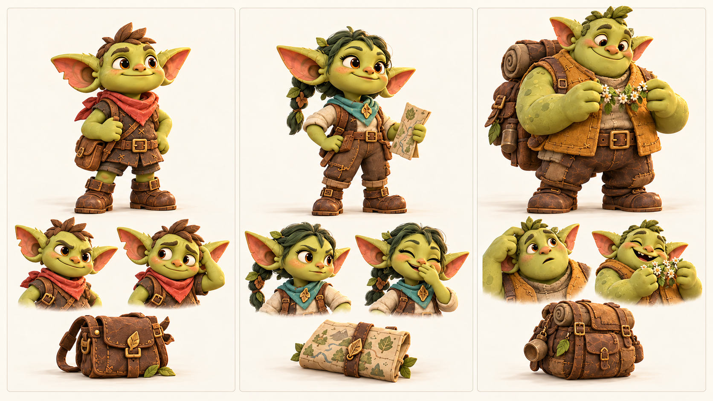

Три управляемых героя. Слева направо: Тиш, Лума, Бум. Полный рост, эмоции и реквизит.

## Корень, Пип и Фика

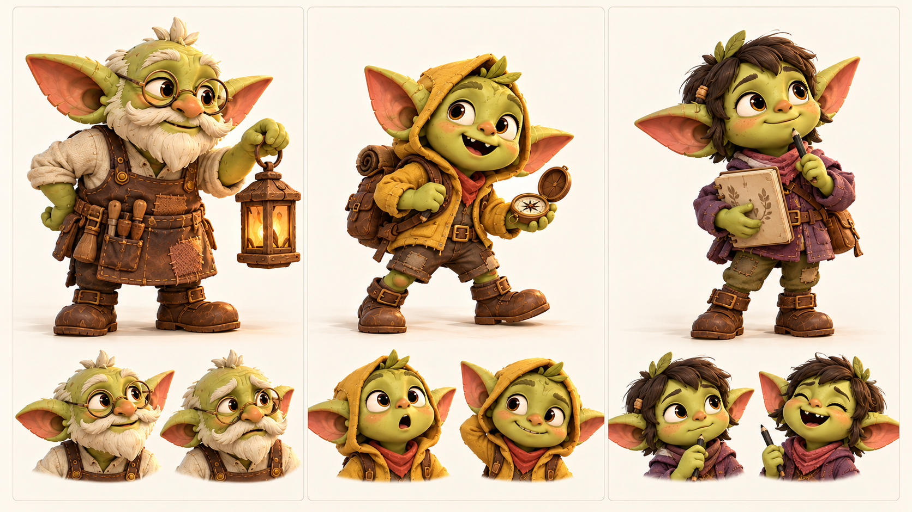

Наставник и маленькие племянники. Корень с фонарём, Пип с компасом, Фика с рисунками.

## Мира, Уна и Шал

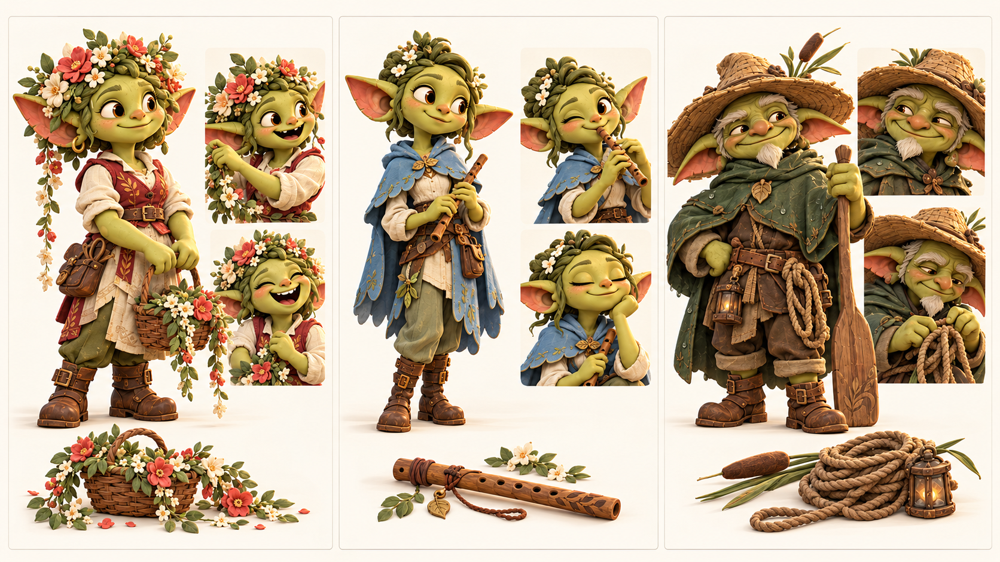

Подружки невесты и проводник. Мира с венком, Уна со свирелью, Шал с веслом.

## Клоч, Рыж и Жук

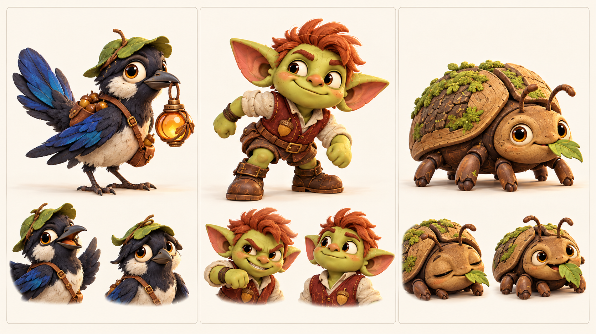

Сюжетный антагонист, дружеский соперник и спокойное препятствие. Оружия и урона в демо нет.

## Локации первого знакомства

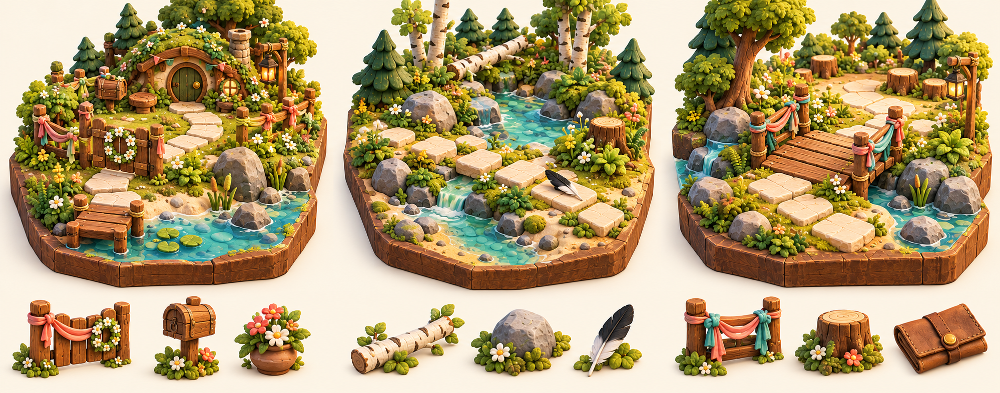

Слева направо: калитка у дома, ручей коротких шагов, мост двух друзей. Геометрия задаётся конфигом, рисунок показывает оформление.

## Локации общей дороги

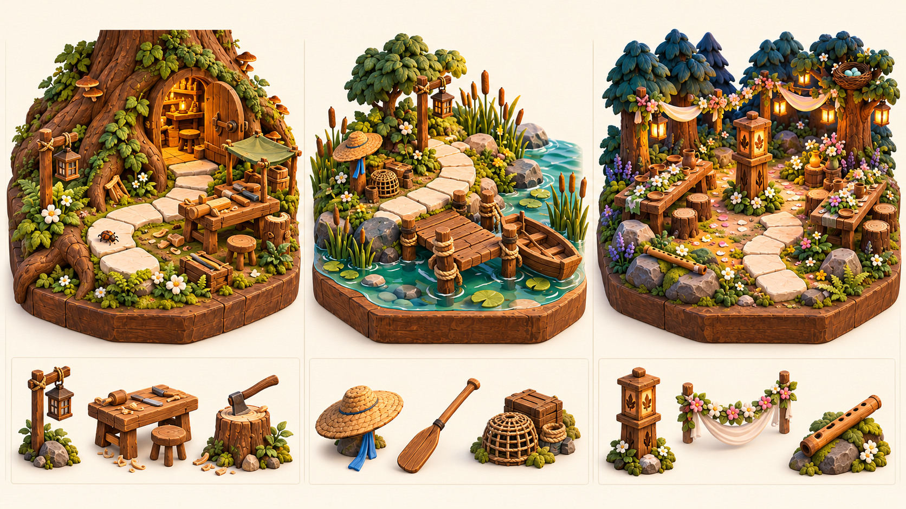

Слева направо: мастерская у корней, старая переправа, поляна общего света. Свет и декор меняют настроение общей восьмиклеточной тропы.

## S00 Подготовка и пропавший свет

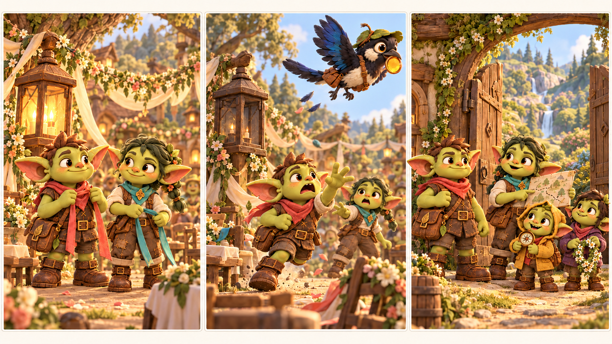

Подготовка к свадьбе → Клоч уносит линзу → Тиш получает рисунок пути и отправляется. Бум присоединяется позже.

## S01 След у ручья

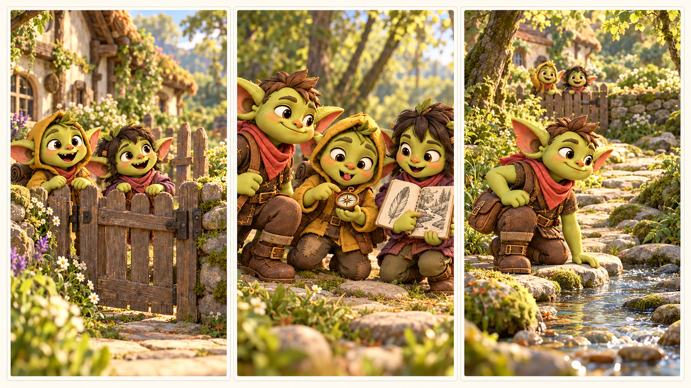

Племянники у безопасной калитки → компас и рисунок пера → самостоятельный путь Тиша к ручью.

## S02 Два друга

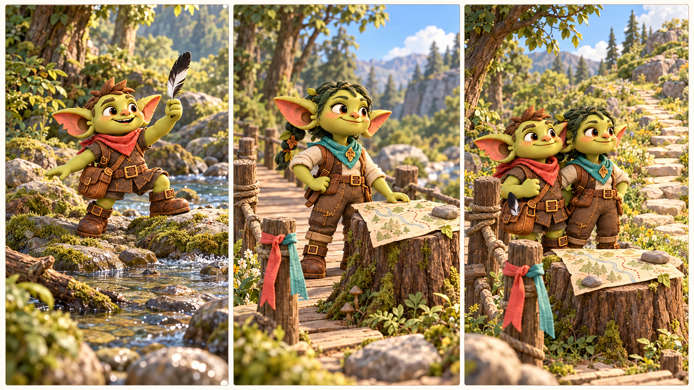

Тиш на дальнем берегу → Лума обследовала мост → равная пара выбирает дорогу вместе.

## S03 Помощь Корня и Бума

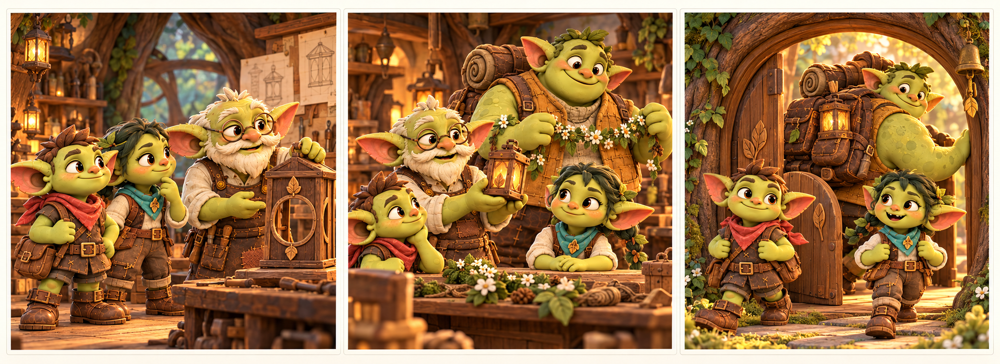

Пустая оправа общего фонаря → готовый запасной фонарик → на тропу выходят трое друзей.

## S04 Переправа и вызов

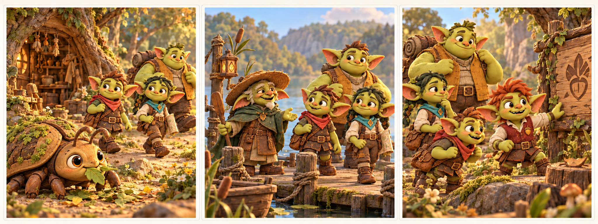

Жук остаётся мирным лесным существом → Шал показывает переправу → Рыж предлагает соревнование.

## S05 Кому нужен свет

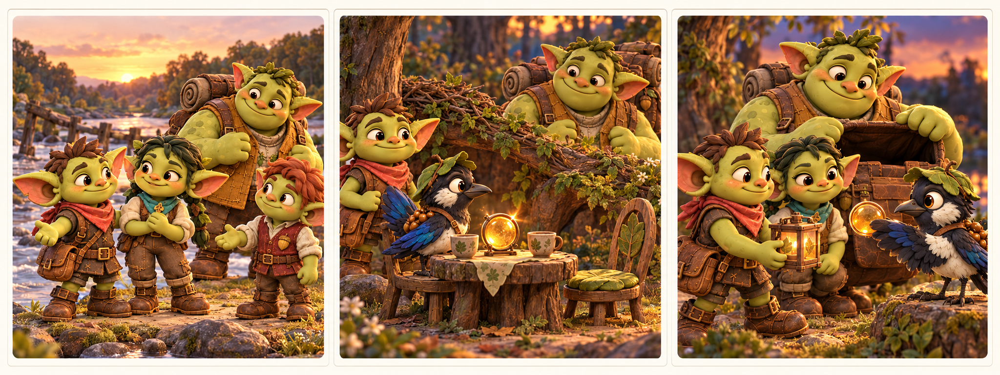

Вместе важнее первого места → у Клоча пустая вторая чашка → запасной фонарь обменян на общую линзу.

## S06 Общий стол

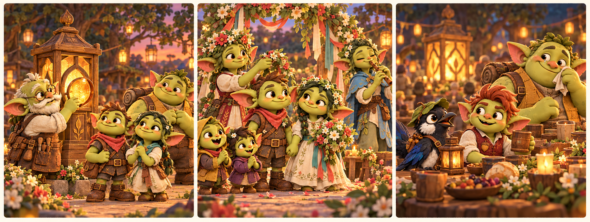

Общий свет восстановлен → свадьба Тиша и Лумы → у Клоча есть гости, Бум счастлив.
