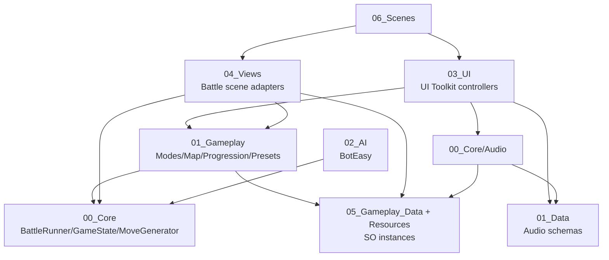
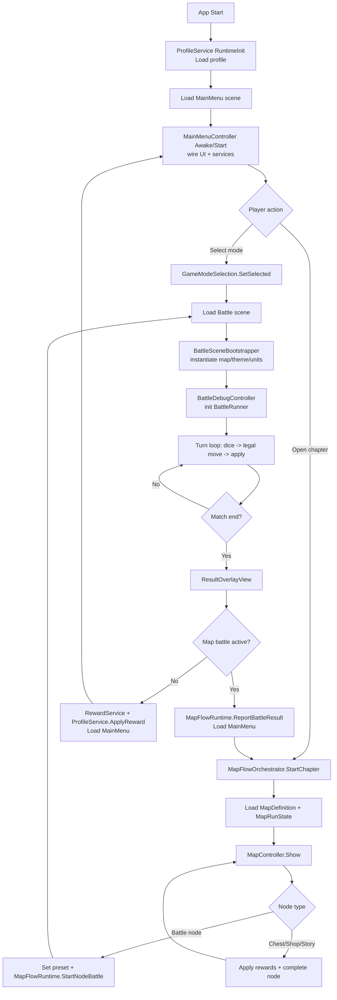

# DiceForge Repository Map

## 1) High-level architecture

DiceForge is a **Unity 6.3** project (URP + UI Toolkit) for a turn-based dice/board battle game with:
- Main menu + meta progression (currencies, upgrades, chests)
- Chapter-map flow that launches battles from map nodes
- Battle scene with gameplay core (`BattleRunner`, `MoveGenerator`, `GameState`) and debug/human controls
- Tutorial scene with dialogue, then a training battle

### Runtime entry points / bootstrap flow
- **Scene entry** is the main startup mechanism:
  - `Assets/_Project/06_Scenes/MainMenu.unity`
  - `Assets/_Project/06_Scenes/Battle.unity`
  - `Assets/_Project/06_Scenes/Tutorial.unity`
- `MainMenuController` (`Assets/_Project/03_UI/MainMenu/MainMenuController.cs`) is the central orchestrator in MainMenu scene.
- `MapFlowOrchestrator` (`Assets/_Project/01_Gameplay/Map/MapFlowOrchestrator.cs`) controls chapter progression and transitions to battle.
- `BattleSceneBootstrapper` (`Assets/_Project/04_Views/Battle/BattleSceneBootstrapper.cs`) instantiates battle visual theme/layout in battle scene.
- `BattleDebugController` (`Assets/_Project/04_Views/Battle/BattleDebugController.cs`) owns battle runtime (`BattleRunner`) and drives turns/UI.
- `ProfileService.RuntimeInit()` (`[RuntimeInitializeOnLoadMethod]`) preloads player profile before scene load.
- `AudioManager` is singleton-like (`DontDestroyOnLoad`) and persists music/SFX state across scenes.

### Important architecture split
- **Core simulation**: `Assets/_Project/00_Core` (mostly pure C# domain logic)
- **Gameplay domain + data definitions**: `Assets/_Project/01_Gameplay`, `Assets/_Project/01_Data`
- **UI (UI Toolkit)**: `Assets/_Project/03_UI`
- **View/scene binding layer**: `Assets/_Project/04_Views`
- **Authoring data assets**: `Assets/_Project/05_Gameplay_Data` + `Assets/_Project/Resources`

---

## 2) Module map (folder-by-folder)

## Top-level

### `Assets/`
**Purpose**: All game content, code, scenes, assets.

Key subfolders:
- `_Project/` (main game implementation)
- `Settings/` (URP render pipeline assets, volume profiles)
- `UI Toolkit/` (panel settings + runtime theme)
- `TextMesh Pro/` (TMP package resources/shaders)
- `Tests/` (edit-mode NUnit tests)

### `Packages/`
**Purpose**: Unity package dependencies.
- `manifest.json` declares package set (URP, Input System, Tilemap, Test Framework, UI Test Framework, etc.)
- `packages-lock.json` lockfile

### `ProjectSettings/`
**Purpose**: Unity editor/project configuration.
- Includes `ProjectVersion.txt`, `EditorBuildSettings.asset`, URP settings, input, physics, quality, etc.

---

## `Assets/_Project/` detailed map

### `00_Core/`
**Purpose**: Core gameplay engine and shared domain types.

**Key files**
1. `00_Core/BattleRunner.cs` – battle state machine, turn lifecycle, dice resolution, move application, match-end events.
2. `00_Core/MoveGenerator.cs` – legal move generation and move application primitives.
3. `00_Core/GameState.cs` – mutable board state, stone/bar/bear-off tracking, turn metadata.
4. `00_Core/BoardPathRules.cs` – board path/home/bear-off geometry helpers.
5. `00_Core/RulesetConfig.cs` – rules config model + validation + conversion from preset.
6. `00_Core/SetupConfig.cs` – setup preset runtime format (unit placements).
7. `00_Core/DiceBagDefinition.cs`, `DiceBagRuntime.cs` – weighted/sequential dice outcome bag definitions + runtime draws.
8. `00_Core/MatchLog.cs`, `MatchResult.cs` – logging and result records.

**Main namespaces/classes**
- `Diceforge.Core`: primary gameplay logic and data contracts.

**Dependencies**
- Consumed by `MatchService`, `BattleDebugController`, battle UI/view controllers.
- Rules/setup typically sourced from ScriptableObject presets in `01_Gameplay/Presets` and `05_Gameplay_Data`.

---

### `00_Core/Audio/`
**Purpose**: Music/SFX runtime service and user preferences.

**Key files**
- `AudioManager.cs` – global audio service, track rotation, history, volume and votes, context-based playback.
- `MusicSelector.cs` – track selection policy.
- `PlayerMusicPrefs.cs`, `PlayerMusicPrefsStorage.cs` – persisted music votes/volume.
- `TrackVote.cs` – vote enum/model.

**Dependencies**
- Depends on `MusicLibrary` / `TrackDef` from `01_Data/Audio`.
- Used by MainMenu/Tutorial/NowPlaying UI and scene bootstrap flows.

---

### `01_Data/Audio/`
**Purpose**: Audio data schema objects.

**Key files**
- `MusicLibrary.cs` – track catalog and context filtering.
- `TrackDef.cs` – track metadata.
- `MusicContext.cs` – context enum (e.g., gameplay/tutorial/menu).

**Dependencies**
- Authored as assets (e.g., `08_Audio/MusicLibrary_Default.asset`), consumed by `AudioManager`.

---

### `01_Gameplay/Battle/` + `01_Gameplay/Battle/MapSystem/`
**Purpose**: Battle map configuration and theme selection abstraction.

**Key files**
- `BattleMapConfig.cs` – ties `GameModePreset`, `BoardLayout`, `MapTheme`, visual mode; validation entry.
- `MapTheme.cs` – tilemap/background/decor/unit prefabs, team colors, optional postprocess profile.
- `BattleMapSelectionService.cs` – static selected map handoff between screens/scenes.
- `BoardVisualMode.cs` – display mode enum.

**Dependencies**
- `BattleSceneBootstrapper` consumes `BattleMapConfig` and instantiates visual prefabs.
- `BoardLayout` in `01_Gameplay/Map` + asset instances in `05_Gameplay_Data/Battle`.

---

### `01_Gameplay/GameModes/`
**Purpose**: Mode selection, tutorial flow, match runtime construction.

**Key files**
- `GameModePreset.cs` (SO): references ruleset/setup/dice bags.
- `GameModeSelection.cs`: static selected mode state.
- `MatchService.cs`: builds runtime rules/bags/setup from `GameModePreset`, owns `BattleRunner` and events.
- `TutorialFlow.cs`: tutorial scene transitions and completion state handling.
- `GameBootstrap.cs`: obsolete legacy bootstrap (`[Obsolete(..., true)]`, not active).

**Dependencies**
- Presets in `05_Gameplay_Data/GameModes`, rulesets in `05_Gameplay_Data/Rulesets`, setups in `05_Gameplay_Data/Setups`.

---

### `01_Gameplay/Map/`
**Purpose**: Chapter-map domain and state progression.

**Key files**
- `MapFlowOrchestrator.cs` + `MapFlowRuntime` – chapter start, node click handling, reward resolution, transition to battle and back.
- `MapDefinitionSO.cs` – chapter graph SO loader from `Resources/Map/*`; contains runtime fallback builder for Chapter1.
- `MapProgressService.cs` – PlayerPrefs persistence for run state.
- `MapRunState.cs` – unlocked/completed/current node state.
- `MapNodeDefinition.cs` – node definition (battle/chest/shop/story).
- `BoardLayout.cs` – ordered cell list used for tilemap-driven board geometry.
- `DevModeConfigSO.cs` – debug/dev mode toggles.

**Dependencies**
- UI presenter in `03_UI/Map/MapController.cs`.
- Rewards/profile via `Progression` services.
- Scene loads to `Battle`.

---

### `01_Gameplay/Match/`
**Purpose**: Thin scene-level match configuration holder.

**Key files**
- `MatchConfig.cs` – immutable runtime match config aggregate.
- `MatchController.cs` – receives and stores `MatchConfig`.

**Dependencies**
- Mostly legacy/lightweight relative to `MatchService` + `BattleDebugController` runtime path.

---

### `01_Gameplay/Presets/`
**Purpose**: ScriptableObject schemas for game rules/setup.

**Key files**
- `RulesetPreset.cs` – authorable rules.
- `SetupPreset.cs` + `UnitPlacement` – initial board placements.

**Dependencies**
- Referenced by `GameModePreset` assets.

---

### `01_Gameplay/Progression/`
**Purpose**: Meta progression models/services (profile, economy, upgrades, chests).

**Key files**
- `ProfileService.cs` – profile load/save, currencies/items/upgrades/chest queue/player name/tutorial flag.
- `RewardService.cs` – match reward computation and upgrade modifiers.
- `UpgradeService.cs` – purchase/level logic using progression database.
- `ChestService.cs` – chest instance creation/opening.
- `ProgressionDatabase.cs` + catalogs (`CurrencyCatalog`, `ItemCatalog`, `UpgradeCatalog`, `ChestCatalog`).
- Definition classes (`CurrencyDefinition`, `ItemDefinition`, `UpgradeDefinition`, `ChestDefinition`).
- `ProgressionIds.cs` – central static IDs.
- `PlayerProfile.cs` – serialized profile DTO.

**Dependencies**
- Loads `Resources/Progression/ProgressionDatabase.asset`.
- Used across MainMenu, Battle results, tutorial dialogue token replacement.

---

### `02_AI/`
**Purpose**: Bot behavior.

**Key files**
- `BotEasy.cs` – simple bot strategy used by `BattleRunner`/debug battle flow.

---

### `03_UI/`
**Purpose**: UI Toolkit controllers, UXML/USS, and editor validation tools.

**Important subfolders**

#### `03_UI/MainMenu/`
- `MainMenuController.cs` – major UI composition root (panel switching, mode buttons, map opening, progression panel wiring, audio sliders, tutorial replay modal).
- `MainMenuPanelSettings.asset`, `MainMenu.uxml`, `MainMenu.uss` – menu layout/style.
- `Audio/MenuAudioBinder.cs` – menu audio binding.

#### `03_UI/Map/`
- `MapController.cs` – renders chapter node graph in UI Toolkit, node interaction/animations, dev buttons (reset/unlock).
- `MapView.uxml`, `MapView.uss`, `MapNodeView.uxml`, `MapNodeView.uss`.

#### `03_UI/Dialogue/`
- `DialogueRunner.cs` – sequence playback orchestrator.
- `DialogueView.cs` – view adapter around UXML.
- `TutorialSceneController.cs` – tutorial scene logic + intro dialogue + transition to battle.
- `DialogueView.uxml`, `DialogueView.uss`.

#### `03_UI/BattleResults/`
- `ResultOverlayView.cs` – match-end overlay, rewards, restart/back behavior.
- `ResultOverlay.uxml`, `ResultOverlay.uss`.

#### `03_UI/Progression/`
- `UpgradeShopController.cs`, `WalletPanelController.cs`, `Chests/ChestOpenController.cs`, `Chests/ChestShopController.cs`.

#### `03_UI/Player/`
- `PlayerInfoController.cs`, `PlayerPanelController.cs`.

#### `03_UI/Audio/NowPlaying/`
- `NowPlayingController.cs` – currently playing track UI and voting actions.

#### `03_UI/Debug/`
- `DebugHudUITK.cs` + `DebugHUD.uxml/.uss` – battle debug overlay and controls.

#### `03_UI/Editor/`
- `UxmlIdAttributeValidator.cs` – editor-time UXML ID checks.

**Dependencies**
- Heavy usage of `UnityEngine.UIElements` (`UIDocument`, UXML, USS).
- Calls into gameplay (`MatchService`, `MapFlowOrchestrator`, `ProfileService`, `AudioManager`).

---

### `04_Views/`
**Purpose**: Scene object views and gameplay-to-visual adapters.

**Key files**
- `Battle/BattleDebugController.cs` – primary runtime battle orchestrator in scene.
- `Battle/BattleSceneBootstrapper.cs` – map/theme prefab instantiation at scene load.
- `Battle/BattleBoardViewController.cs` – binds `BattleRunner` move events to token movers.
- `Battle/BoardLayoutTokenMover.cs` – movement over `BoardLayout` and tilemaps.
- `BoardDebugView.cs`, `CellMarker.cs` – board click/highlight visualization.
- `Battle/TilemapPathBaker.cs`, `TileShadowSync.cs` – tilemap/layout support tooling.
- `Editor/*Editor.cs` – custom inspectors/editor helpers.

**Dependencies**
- Bridges `00_Core` simulation with scene prefabs/tilemap transform data.

---

### `05_Gameplay_Data/`
**Purpose**: Authored ScriptableObject instances and resource data.

**Notable assets**
- `Battle/Configs/Map_IsoTest.asset`
- `Battle/Themes/Theme_IsoTest.asset`
- `Battle/Tilemap/BoardLayout.asset`
- `GameModes/GM_*.asset`
- `Rulesets/Ruleset_*.asset`
- `Setups/Setup_*.asset`
- `DiceBags/*.asset`
- `Progression/Resources/Progression/ProgressionDatabase.asset` + catalog/definition assets

**Dependencies**
- Loaded by services/controllers via serialized references and `Resources.Load`.

---

### `06_Scenes/`
**Purpose**: Unity scenes.
- `MainMenu.unity` – entry menu + progression/map navigation.
- `Battle.unity` – playable battle and result overlay.
- `Tutorial.unity` – tutorial dialogue entry.
- `Battle_Tilemap_Test.unity` – extra test/dev scene (not in build settings).

---

### `07_Art/`, `08_Audio/`, `09_Materials/`, `99_Prefabs/`
**Purpose**: content assets.
- `07_Art/*` – sprites/fonts/UI/characters/story map assets.
- `08_Audio/Music/*` + `SFX/*` + `MusicLibrary_Default.asset`.
- `09_Materials/*` – shared materials.
- `99_Prefabs/Battle/*`, `99_Prefabs/Debug/*` – reusable scene objects.

---

### `Assets/Tests/EditMode/`
**Purpose**: Edit-mode NUnit tests for core move rules.

**Key files**
- `MoveGeneratorBearOffTests.cs`
- `MoveGeneratorHitBarTests.cs`
- `Diceforge.Tests.EditMode.asmdef`

**Dependencies**
- Directly exercises `Diceforge.Core` move/rules logic.

---

## 3) Code map (script-level subsystems)

## A. Gameplay simulation (battle loop)
- **Main classes**:
  - `Diceforge.Core.BattleRunner`
  - `Diceforge.Core.MoveGenerator`
  - `Diceforge.Core.GameState`
  - `Diceforge.Core.BoardPathRules`
- **Interaction**:
  - Runner initializes state/rules/bags/bots.
  - Each turn consumes dice outcomes and legal moves from `MoveGenerator`.
  - Applies move results to `GameState`; emits `OnTurnStarted`, `OnMoveApplied`, `OnMatchEnded`.
- **Configuration/data**:
  - `RulesetPreset` + `SetupPreset` -> runtime `RulesetConfig`/`SetupConfig`.
  - Dice outcomes from `DiceBagDefinition` assets.

## B. Battle scene orchestration + visuals
- **Main classes**:
  - `BattleDebugController`
  - `BattleSceneBootstrapper`
  - `BattleBoardViewController`
  - `BoardLayoutTokenMover`
  - `BoardDebugView`
- **Interaction**:
  - Debug controller creates/binds `BattleRunner`, handles human vs bot modes.
  - Scene bootstrapper spawns theme/tilemap/unit prefabs from `BattleMapConfig`.
  - Board view controller listens to runner events and moves token movers.
- **Configuration/data**:
  - `BattleMapConfig`, `MapTheme`, `BoardLayout` assets.

## C. Map run / chapter progression
- **Main classes**:
  - `MapFlowOrchestrator`, `MapFlowRuntime`
  - `MapDefinitionSO`, `MapNodeDefinition`, `MapRunState`
  - `MapProgressService`
  - `MapController` (UI)
- **Interaction**:
  - Start chapter -> load map definition + run state.
  - Node click either grants rewards or launches battle scene.
  - Return from battle uses `MapFlowRuntime` pending result flags.
- **Configuration/data**:
  - `Resources/Map/Chapter1_MapDefinition.asset`
  - PlayerPrefs key prefix `map_state_`.

## D. Game mode and match construction
- **Main classes**:
  - `GameModePreset`, `GameModeSelection`, `MatchService`, `MatchConfig`
- **Interaction**:
  - UI picks preset -> `GameModeSelection.SetSelected`.
  - Battle startup path builds rules/setup/bag configs and initializes `BattleRunner`.
- **Configuration/data**:
  - `05_Gameplay_Data/GameModes/GM_*.asset`

## E. Progression/economy/profile persistence
- **Main classes**:
  - `ProfileService`, `RewardService`, `UpgradeService`, `ChestService`
  - `ProgressionDatabase` + catalogs/definitions
- **Interaction**:
  - Match end reward calculation -> profile apply.
  - Shops/chests/upgrades mutate profile currencies/items/upgrades.
  - Profile change events notify UI.
- **Configuration/data**:
  - File persistence: `player_profile.json` (under `Application.persistentDataPath`).
  - Database loaded from `Resources/Progression/ProgressionDatabase.asset`.

## F. UI Toolkit presentation layer
- **Main classes**:
  - `MainMenuController`, `MapController`, `DialogueRunner`, `ResultOverlayView`, progression controllers
- **Interaction**:
  - Controllers query UXML by IDs, register button callbacks, call services.
  - `UxmlIdAttributeValidator` supports editor validation.
- **Configuration/data**:
  - UXML/USS under `03_UI/*` and panel settings assets.

## G. Audio subsystem
- **Main classes**:
  - `AudioManager`, `MusicLibrary`, `TrackDef`, `NowPlayingController`, `MenuAudioBinder`
- **Interaction**:
  - Context-aware track selection (`menu/gameplay/tutorial`) with voting and history.
  - Volume and vote preferences persisted via storage object.
- **Configuration/data**:
  - `08_Audio/MusicLibrary_Default.asset`, audio clips in `08_Audio/Music` and `08_Audio/SFX`.

## H. Tutorial flow subsystem
- **Main classes**:
  - `TutorialFlow`, `TutorialSceneController`, `DialogueSequence`, `TutorialPortraitLibrary`
- **Interaction**:
  - Menu enters tutorial scene; dialogue completes -> training battle.
  - Completion toggles profile flag.

## I. AI subsystem
- **Main classes**:
  - `BotEasy`
- **Interaction**:
  - Used by battle runner/controller for non-human turns.

## J. Editor tooling
- **Main classes**:
  - `03_UI/Editor/UxmlIdAttributeValidator.cs`
  - `04_Views/Editor/*Editor.cs`
- **Purpose**:
  - Inspector/editor utility for safer authoring/debug workflows.

---

## 4) Dependency & flow diagrams (text-based)

### Module dependency graph (coarse)

### Runtime flow (initialization + gameplay loop)

---

## 5) Build & runtime notes

- **Unity version**: `6000.3.9f1` (`ProjectSettings/ProjectVersion.txt`)
- **Key packages** (`Packages/manifest.json`):
  - `com.unity.render-pipelines.universal` (17.3.0)
  - `com.unity.inputsystem` (1.18.0)
  - `com.unity.2d.tilemap.extras` (6.0.1)
  - `com.unity.test-framework` (1.6.0)
  - `com.unity.ui.test-framework` (6.3.0)
  - plus standard Unity modules

### Build scenes (EditorBuildSettings)
1. `Assets/_Project/06_Scenes/MainMenu.unity` – enabled
2. `Assets/_Project/06_Scenes/Battle.unity` – enabled
3. `Assets/_Project/06_Scenes/Tutorial.unity` – enabled

Additional discovered scene:
- `Assets/_Project/06_Scenes/Battle_Tilemap_Test.unity` (exists but not in build list)

---

## 6) “Where to start” for a new engineer

Recommended first reading order:
1. `Assets/_Project/03_UI/MainMenu/MainMenuController.cs`  
   Understand top-level user flows (mode select, map, tutorial, progression panels).
2. `Assets/_Project/01_Gameplay/Map/MapFlowOrchestrator.cs`  
   Understand map-run state machine and battle transitions.
3. `Assets/_Project/04_Views/Battle/BattleDebugController.cs`  
   Understand battle scene control loop and UI/runtime interactions.
4. `Assets/_Project/00_Core/BattleRunner.cs` + `MoveGenerator.cs` + `GameState.cs`  
   Understand the actual gameplay rules and turn mechanics.
5. `Assets/_Project/01_Gameplay/GameModes/MatchService.cs` + `GameModePreset.cs`  
   Understand how authored data becomes runtime config.
6. `Assets/_Project/01_Gameplay/Progression/ProfileService.cs` + `RewardService.cs`  
   Understand persistence and reward economy.
7. Data assets under `Assets/_Project/05_Gameplay_Data/` and `Assets/_Project/Resources/Map/`  
   Understand what is authored vs generated at runtime.

---

## 7) Gaps & uncertainties

1. **Potential dual battle bootstrap paths**: `MatchService` and `BattleDebugController` both can own runner setup depending on scene wiring; exact active path is scene-authoring dependent (`Battle.unity` object graph).
2. **Legacy/obsolete bootstrap remnants**: `GameBootstrap` is obsolete and disabled, but references old fallback flow.
3. **Runtime fallback behavior exists** in map loading (`MapDefinitionSO.LoadChapter` can synthesize Chapter1 in memory). If strict fail-fast data policy is desired, this path should be reviewed.
4. Exact prefab bindings (which serialized references are assigned in scenes) require detailed `.unity` YAML inspection per object GUID; this report inferred behavior from scripts + known scene list.

